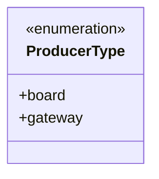
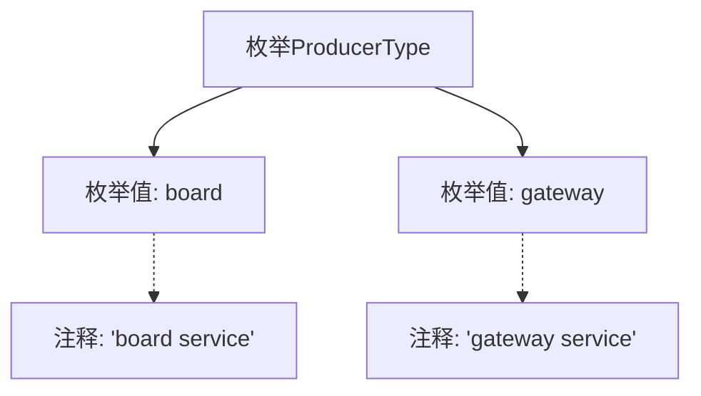

# 基础信息

|      |      |
|------|------|
| 名称 | ProducerType |
| 编码语言 | .java |
| 代码路径 | WeFe/common/java/common-wefe/src/main/java/com/welab/wefe/common/wefe/enums/ProducerType.java |
| 包名 | com.welab.wefe.common.wefe.enums |
| 依赖项 | [] |
| 概述说明 | 枚举ProducerType定义了两个服务类型：board（面板服务）和gateway（网关服务）。 |

# 说明

该内容定义了一个名为ProducerType的公共枚举类型，包含两个枚举常量：board和gateway。board常量代表board service，gateway常量代表gateway service。枚举类型用于表示一组固定的相关常量，此处用于标识不同的服务类型。

# 类列表 Class Summary

| 名称   | 类型  | 说明 |
|-------|------|-------------|
| ProducerType | enum | 枚举ProducerType定义两种服务类型：board（面板服务）和gateway（网关服务）。 |

## 类 ProducerType

|      |      |
|------|------|
| 访问范围 | public |
| 类型 | enum |
| 名称 | ProducerType |
| 说明 | 枚举ProducerType定义两种服务类型：board（面板服务）和gateway（网关服务）。 |

### UML类图

这段代码定义了一个名为`ProducerType`的枚举类型，包含两个枚举常量：`board`和`gateway`，分别表示"board service"和"gateway service"两种生产者类型。枚举类型在类图中用`<<enumeration>>`标记，其成员作为公有属性列出。该枚举结构简单，主要用于标识不同服务来源的类型分类。

### 内部方法调用关系图

这段流程图展示了ProducerType枚举的结构，包含两个枚举值board和gateway，分别对应board service和gateway service两种服务类型。枚举通过注释明确标识了每个值的业务含义，整体结构清晰简洁，适用于需要区分不同生产者类型的场景。

### 字段列表 Field List

| 名称  | 类型  | 说明 |
|-------|-------|------|

### 方法列表

| 名称  | 类型  | 说明 |
|-------|-------|------|

