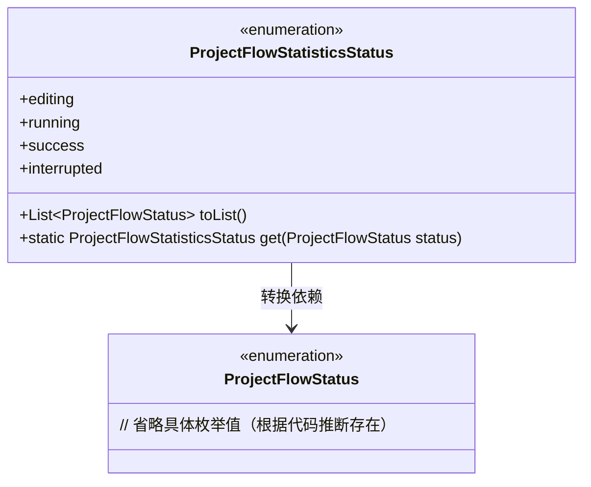
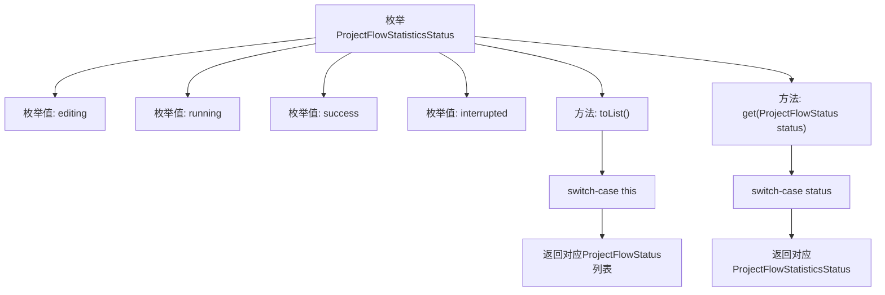

# 基础信息

|      |      |
|------|------|
| 名称 | ProjectFlowStatisticsStatus |
| 编码语言 | .java |
| 代码路径 | WeFe/common/java/common-wefe/src/main/java/com/welab/wefe/common/wefe/enums/ProjectFlowStatisticsStatus.java |
| 包名 | com.welab.wefe.common.wefe.enums |
| 依赖项 | ['java.util.Arrays', 'java.util.List'] |
| 概述说明 | 枚举类定义项目流统计状态，包含编辑中、运行中、成功、中断四种状态，提供状态转换方法。 |

# 说明

该代码定义了一个枚举类ProjectFlowStatisticsStatus，包含四种状态：编辑中、运行中、成功和中断。提供了两个方法：toList将当前枚举值映射为ProjectFlowStatus列表，get方法将ProjectFlowStatus转换为对应的ProjectFlowStatisticsStatus枚举值。各状态之间存在明确的映射关系，如运行中状态对应四种子状态，中断状态对应两种异常情况。未匹配到枚举时会抛出运行时异常。

# 类列表 Class Summary

| 名称   | 类型  | 说明 |
|-------|------|-------------|
| ProjectFlowStatisticsStatus | enum | 枚举类定义项目流统计状态：编辑中、运行中、成功、中断。提供与项目流状态的相互转换方法。 |

## 类 ProjectFlowStatisticsStatus

|      |      |
|------|------|
| 访问范围 | public |
| 类型 | enum |
| 名称 | ProjectFlowStatisticsStatus |
| 说明 | 枚举类定义项目流统计状态：编辑中、运行中、成功、中断。提供与项目流状态的相互转换方法。 |

### UML类图

该图展示了一个枚举类`ProjectFlowStatisticsStatus`与另一个枚举类`ProjectFlowStatus`的转换关系。`ProjectFlowStatisticsStatus`包含4个枚举值和2个核心方法：`toList()`将当前状态映射为`ProjectFlowStatus`列表，`get()`方法实现反向映射。箭头表示前者依赖后者进行状态转换，体现了工作流状态统计与基础状态间的聚合关系。

### 内部方法调用关系图

该流程图展示了ProjectFlowStatisticsStatus枚举的结构和主要方法逻辑。枚举包含4个状态值(editing/running/success/interrupted)和2个核心方法：toList()将当前枚举映射为ProjectFlowStatus列表，get()方法实现反向映射。两个方法均采用switch-case结构处理不同状态分支，最终返回对应类型的集合或枚举实例。流程图清晰呈现了枚举定义与方法间的调用关系。

### 字段列表 Field List

| 名称  | 类型  | 说明 |
|-------|-------|------|

### 方法列表

| 名称  | 类型  | 说明 |
|-------|-------|------|

