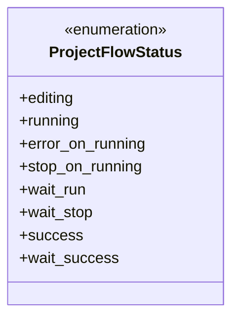
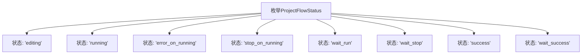

# 基础信息

|      |      |
|------|------|
| 名称 | ProjectFlowStatus |
| 编码语言 | .java |
| 代码路径 | WeFe/common/java/common-wefe/src/main/java/com/welab/wefe/common/wefe/enums/ProjectFlowStatus.java |
| 包名 | com.welab.wefe.common.wefe.enums |
| 依赖项 | [] |
| 概述说明 | 项目流程状态枚举：编辑中、运行中、运行错误、人工暂停、等待运行、等待结束、成功、等待成功。 |

# 说明

这是一个名为ProjectFlowStatus的枚举类型，定义了项目流程的8种状态：编辑中（editing）、运行中（running）、运行错误（error_on_running）、人工暂停（stop_on_running）、等待运行（wait_run）、等待结束（wait_stop）、成功（success）和等待成功（wait_success）。每种状态都有对应的注释说明其含义。

# 类列表 Class Summary

| 名称   | 类型  | 说明 |
|-------|------|-------------|
| ProjectFlowStatus | enum | 项目流程状态枚举：编辑中、运行中、运行错误、人工暂停、等待运行、等待结束、成功、等待成功。 |

## 类 ProjectFlowStatus

|      |      |
|------|------|
| 访问范围 | public |
| 类型 | enum |
| 名称 | ProjectFlowStatus |
| 说明 | 项目流程状态枚举：编辑中、运行中、运行错误、人工暂停、等待运行、等待结束、成功、等待成功。 |

### UML类图

该枚举类定义了项目流程的8种状态，包括编辑中(editing)、运行中(running)、运行错误(error_on_running)、人工暂停(stop_on_running)、等待运行(wait_run)、等待结束(wait_stop)、成功(success)和等待成功(wait_success)。每个状态都有明确的文档注释说明其含义，完整覆盖了项目流程从开始到结束的各种可能状态。枚举类型适合表示这种固定的状态集合，确保类型安全且易于维护。

### 内部方法调用关系图

该流程图展示了ProjectFlowStatus枚举的所有可能状态。枚举定义了项目流程的8种状态，包括编辑中(editing)、运行中(running)、运行错误(error_on_running)、人为暂停(stop_on_running)、等待运行(wait_run)、等待结束(wait_stop)、成功(success)和等待成功(wait_success)。每个状态都通过箭头与枚举类相连，清晰地表示了它们之间的从属关系。

### 字段列表 Field List

| 名称  | 类型  | 说明 |
|-------|-------|------|

### 方法列表

| 名称  | 类型  | 说明 |
|-------|-------|------|

