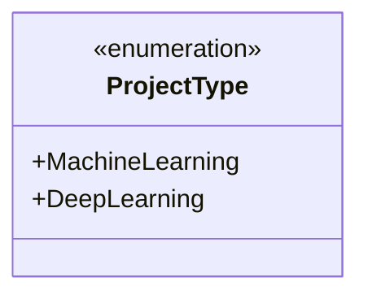
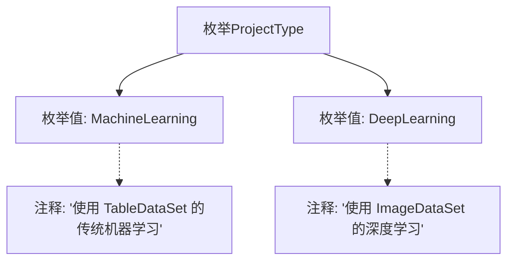

# 基础信息

|      |      |
|------|------|
| 名称 | ProjectType |
| 编码语言 | .java |
| 代码路径 | WeFe/common/java/common-wefe/src/main/java/com/welab/wefe/common/wefe/enums/ProjectType.java |
| 包名 | com.welab.wefe.common.wefe.enums |
| 依赖项 | [] |
| 概述说明 | ProjectType枚举定义两种项目类型：MachineLearning（传统机器学习，使用TableDataSet）和DeepLearning（深度学习，使用ImageDataSet）。 |

# 说明

该内容定义了一个名为ProjectType的枚举类型，包含两个枚举值。MachineLearning表示使用TableDataSet的传统机器学习项目类型，DeepLearning表示使用ImageDataSet的深度学习项目类型。每个枚举值都配有对应的注释说明其用途和关联的数据集类型。

# 类列表 Class Summary

| 名称   | 类型  | 说明 |
|-------|------|-------------|
| ProjectType | enum | ProjectType枚举定义两种项目类型：MachineLearning（传统机器学习，使用TableDataSet）和DeepLearning（深度学习，使用ImageDataSet）。 |

## 类 ProjectType

|      |      |
|------|------|
| 访问范围 | public |
| 类型 | enum |
| 名称 | ProjectType |
| 说明 | ProjectType枚举定义两种项目类型：MachineLearning（传统机器学习，使用TableDataSet）和DeepLearning（深度学习，使用ImageDataSet）。 |

### UML类图

这段代码定义了一个名为ProjectType的枚举类型，包含两个枚举常量：MachineLearning和DeepLearning。MachineLearning表示使用TableDataSet的传统机器学习项目类型，DeepLearning表示使用ImageDataSet的深度学习项目类型。枚举类型通过<<enumeration>>标记明确标识，两个枚举常量均为公有成员。该设计简洁地限定了项目类型的可选范围，便于在代码中明确区分不同类型的项目场景。

### 内部方法调用关系图

该流程图展示了ProjectType枚举的结构，包含两个枚举值MachineLearning和DeepLearning，每个枚举值都附带对应的注释说明。MachineLearning注释指明其使用TableDataSet进行传统机器学习，DeepLearning注释说明其使用ImageDataSet进行深度学习。这种设计清晰地划分了不同项目类型的核心数据结构和应用领域。

### 字段列表 Field List

| 名称  | 类型  | 说明 |
|-------|-------|------|

### 方法列表

| 名称  | 类型  | 说明 |
|-------|-------|------|

