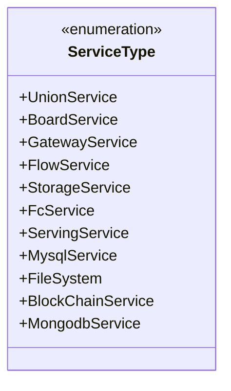
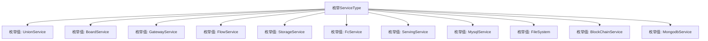

# 基础信息

|      |      |
|------|------|
| 名称 | ServiceType |
| 编码语言 | .java |
| 代码路径 | WeFe/common/java/common-wefe/src/main/java/com/welab/wefe/common/wefe/enums/ServiceType.java |
| 包名 | com.welab.wefe.common.wefe.enums |
| 依赖项 | [] |
| 概述说明 | 枚举ServiceType定义了11种服务类型，包括联合服务、板服务、网关服务、流服务、存储服务、FC服务、服务服务、MySQL服务、文件系统、区块链服务和MongoDB服务。 |

# 说明

该内容定义了一个名为ServiceType的枚举类型，包含11个服务类型常量：UnionService、BoardService、GatewayService、FlowService、StorageService、FcService、ServingService、MysqlService、FileSystem、BlockChainService和MongodbService。每个常量代表一种特定的服务类型，枚举结构简洁明了，无额外注释说明。

# 类列表 Class Summary

| 名称   | 类型  | 说明 |
|-------|------|-------------|
| ServiceType | enum | 枚举ServiceType定义了11种服务类型，包括联合服务、板服务、网关服务等，涵盖存储、数据库和区块链等类别。 |

## 类 ServiceType

|      |      |
|------|------|
| 访问范围 | public |
| 类型 | enum |
| 名称 | ServiceType |
| 说明 | 枚举ServiceType定义了11种服务类型，包括联合服务、板服务、网关服务等，涵盖存储、数据库和区块链等类别。 |

### UML类图

这段代码定义了一个名为`ServiceType`的枚举类型，包含11个预定义的常量值，分别表示不同类型的服务（如联合服务、板载服务、网关服务等）。枚举类型在类图中用`<<enumeration>>`标记，所有枚举值均为公有静态常量。该设计用于在系统中明确区分不同的服务类型，便于类型安全的编程和清晰的业务逻辑表达。

### 内部方法调用关系图

该流程图展示了ServiceType枚举类的结构，包含11个预定义的枚举常量，每个常量代表一种服务类型。这些枚举值之间是平行关系，共同构成该枚举类的完整值集合，适用于需要明确限定服务类型的场景（如服务发现或依赖注入）。

### 字段列表 Field List

| 名称  | 类型  | 说明 |
|-------|-------|------|

### 方法列表

| 名称  | 类型  | 说明 |
|-------|-------|------|

