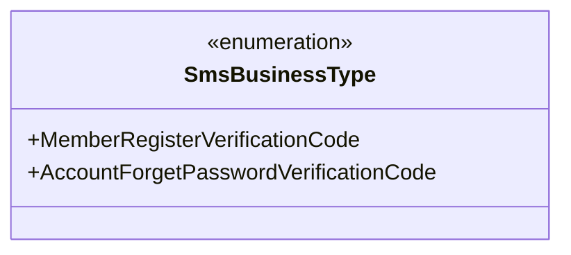
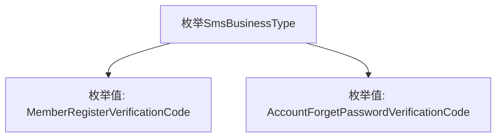

# 基础信息

|      |      |
|------|------|
| 名称 | SmsBusinessType |
| 编码语言 | .java |
| 代码路径 | WeFe/common/java/common-wefe/src/main/java/com/welab/wefe/common/wefe/enums/SmsBusinessType.java |
| 包名 | com.welab.wefe.common.wefe.enums |
| 依赖项 | [] |
| 概述说明 | 枚举SmsBusinessType定义两种短信业务类型：会员注册验证码和账户忘记密码验证码。 |

# 说明

该内容定义了一个名为SmsBusinessType的公共枚举类型，包含两个枚举值：MemberRegisterVerificationCode和AccountForgetPasswordVerificationCode。这两个枚举值分别表示会员注册验证码和账户忘记密码验证码的业务类型，用于区分短信发送的不同业务场景。

# 类列表 Class Summary

| 名称   | 类型  | 说明 |
|-------|------|-------------|
| SmsBusinessType | enum | 枚举SmsBusinessType定义两种短信业务类型：会员注册验证码和账户忘记密码验证码。 |

## 类 SmsBusinessType

|      |      |
|------|------|
| 访问范围 | public |
| 类型 | enum |
| 名称 | SmsBusinessType |
| 说明 | 枚举SmsBusinessType定义两种短信业务类型：会员注册验证码和账户忘记密码验证码。 |

### UML类图

这段代码定义了一个名为SmsBusinessType的枚举类型，包含两个枚举常量：MemberRegisterVerificationCode（会员注册验证码）和AccountForgetPasswordVerificationCode（账户忘记密码验证码）。该枚举用于表示短信业务类型，通常在需要区分不同短信验证场景时使用，如用户注册或密码重置流程。枚举类型通过限定可选值来保证类型安全，避免无效的业务类型传入。

### 内部方法调用关系图

该流程图展示了SmsBusinessType枚举的结构，包含两个枚举值：MemberRegisterVerificationCode（会员注册验证码）和AccountForgetPasswordVerificationCode（账户忘记密码验证码）。枚举类型常用于定义一组固定的常量，此处表示短信业务的两种不同类型，适用于不同场景的身份验证需求。

### 字段列表 Field List

| 名称  | 类型  | 说明 |
|-------|-------|------|

### 方法列表

| 名称  | 类型  | 说明 |
|-------|-------|------|

