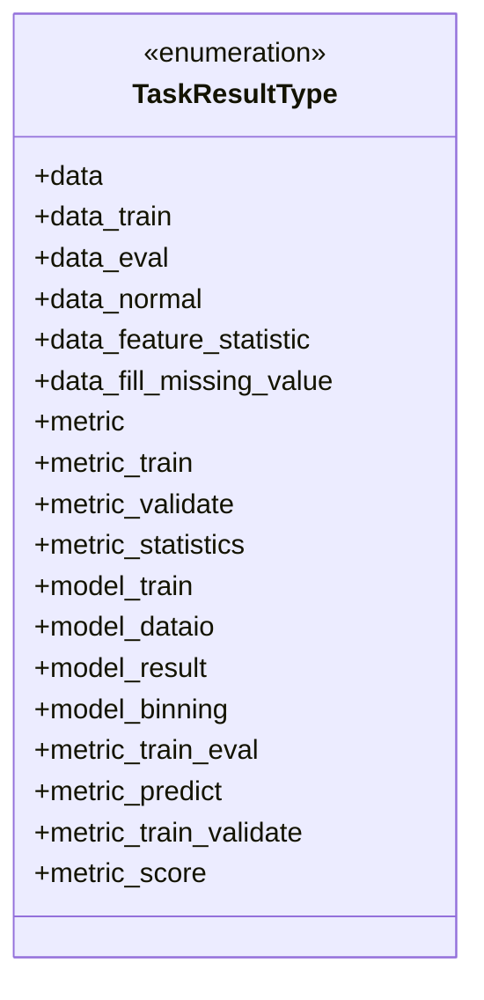

# 基础信息

|      |      |
|------|------|
| 名称 | TaskResultType |
| 编码语言 | .java |
| 代码路径 | WeFe/common/java/common-wefe/src/main/java/com/welab/wefe/common/wefe/enums/TaskResultType.java |
| 包名 | com.welab.wefe.common.wefe.enums |
| 依赖项 | [] |
| 概述说明 | 任务结果类型枚举，包含数据、模型、指标三类，涵盖训练、评估、预测、统计等操作类型。 |

# 说明

该枚举定义了任务结果类型，包含数据处理、模型训练和评估指标三大类。具体类型涵盖原始数据、训练数据、评估数据、常规数据、特征统计、缺失值填充；训练指标、验证指标、统计指标、评分指标；以及模型训练、数据IO、结果输出、分箱处理等子类。完整覆盖机器学习流程中的数据产出与模型评估环节。

# 类列表 Class Summary

| 名称   | 类型  | 说明 |
|-------|------|-------------|
| TaskResultType | enum | 任务结果类型枚举，包含数据、指标、模型相关类型，如训练数据、评估数据、特征统计、缺失值填充、训练指标、验证指标、统计指标、训练模型、数据IO、分箱结果等。 |

## 类 TaskResultType

|      |      |
|------|------|
| 访问范围 | public |
| 类型 | enum |
| 名称 | TaskResultType |
| 说明 | 任务结果类型枚举，包含数据、指标、模型相关类型，如训练数据、评估数据、特征统计、缺失值填充、训练指标、验证指标、统计指标、训练模型、数据IO、分箱结果等。 |

### UML类图

这段代码定义了一个名为TaskResultType的枚举类型，包含了17个预定义的常量值，主要用于标识任务结果的不同类型。这些类型涵盖了数据处理(data前缀)、模型训练(model前缀)和评估指标(metric前缀)三大类别，每个枚举值代表任务流水线中特定阶段的输出结果类型。枚举设计清晰地划分了数据处理、模型训练和评估指标三个主要维度，便于在任务执行过程中对不同类型的中间结果和最终结果进行分类管理。

### 内部方法调用关系图

```mermaid
graph TD
    A["枚举TaskResultType"]
    B["枚举值: data"]
    C["枚举值: data_train"]
    D["枚举值: data_eval"]
    E["枚举值: data_normal"]
    F["枚举值: data_feature_statistic"]
    G["枚举值: data_fill_missing_value"]
    H["枚举值: metric"]
    I["枚举值: metric_train"]
    J["枚举值: metric_validate"]
    K["枚举值: metric_statistics"]
    L["枚举值: model_train"]
    M["枚举值: model_dataio"]
    N["枚举值: model_result"]
    O["枚举值: model_binning"]
    P["枚举值: metric_train_eval"]
    Q["枚举值: metric_predict"]
    R["枚举值: metric_train_validate"]
    S["枚举值: metric_score"]

    A --> B
    A --> C
    A --> D
    A --> E
    A --> F
    A --> G
    A --> H
    A --> I
    A --> J
    A --> K
    A --> L
    A --> M
    A --> N
    A --> O
    A --> P
    A --> Q
    A --> R
    A --> S
```

该流程图展示了TaskResultType枚举的所有可能取值，共包含17个枚举常量，主要分为三类：数据处理类（data前缀）、模型相关类（model前缀）和评估指标类（metric前缀）。这些枚举值用于标识机器学习任务中不同类型的结果输出，每个值对应特定的任务阶段或数据处理类型，形成清晰的分类结构。

### 字段列表 Field List

| 名称  | 类型  | 说明 |
|-------|-------|------|

### 方法列表

| 名称  | 类型  | 说明 |
|-------|-------|------|

