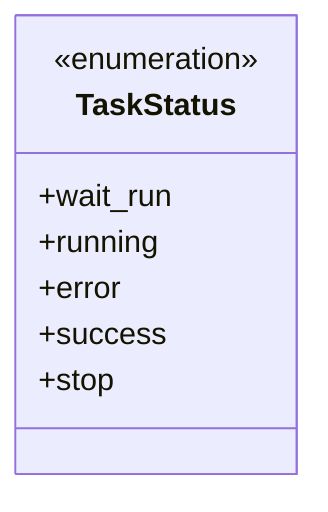
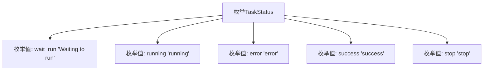

# 基础信息

|      |      |
|------|------|
| 名称 | TaskStatus |
| 编码语言 | .java |
| 代码路径 | WeFe/common/java/common-wefe/src/main/java/com/welab/wefe/common/wefe/enums/TaskStatus.java |
| 包名 | com.welab.wefe.common.wefe.enums |
| 依赖项 | [] |
| 概述说明 | 任务状态枚举：等待运行、运行中、错误、成功、停止。 |

# 说明

该枚举类型定义了任务状态的可能值，包括等待运行、运行中、错误、成功和停止五种状态。每种状态都有对应的注释说明其含义，清晰地描述了任务所处的不同阶段或结果。

# 类列表 Class Summary

| 名称   | 类型  | 说明 |
|-------|------|-------------|
| TaskStatus | enum | 任务状态枚举：等待运行、运行中、错误、成功、停止。 |

## 类 TaskStatus

|      |      |
|------|------|
| 访问范围 | public |
| 类型 | enum |
| 名称 | TaskStatus |
| 说明 | 任务状态枚举：等待运行、运行中、错误、成功、停止。 |

### UML类图

该代码定义了一个名为TaskStatus的枚举类型，用于表示任务的不同状态。枚举包含五个常量值：wait_run（等待运行）、running（运行中）、error（错误）、success（成功）和stop（停止）。每个枚举值都有对应的注释说明其含义。枚举类型通常用于表示一组固定的常量，这些常量在代码中可以作为类型安全的选项使用。在这个例子中，TaskStatus枚举可以用于跟踪和管理任务的生命周期状态。

### 内部方法调用关系图

该流程图展示了TaskStatus枚举的结构，包含五个具有明确语义的枚举值：wait_run表示等待运行状态，running表示运行中状态，error表示错误状态，success表示成功状态，stop表示停止状态。每个枚举值都通过箭头与主枚举类型连接，清晰地呈现了枚举类型的定义和其包含的所有可能状态值。

### 字段列表 Field List

| 名称  | 类型  | 说明 |
|-------|-------|------|

### 方法列表

| 名称  | 类型  | 说明 |
|-------|-------|------|

