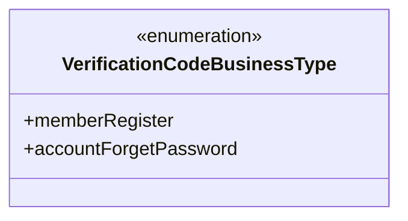
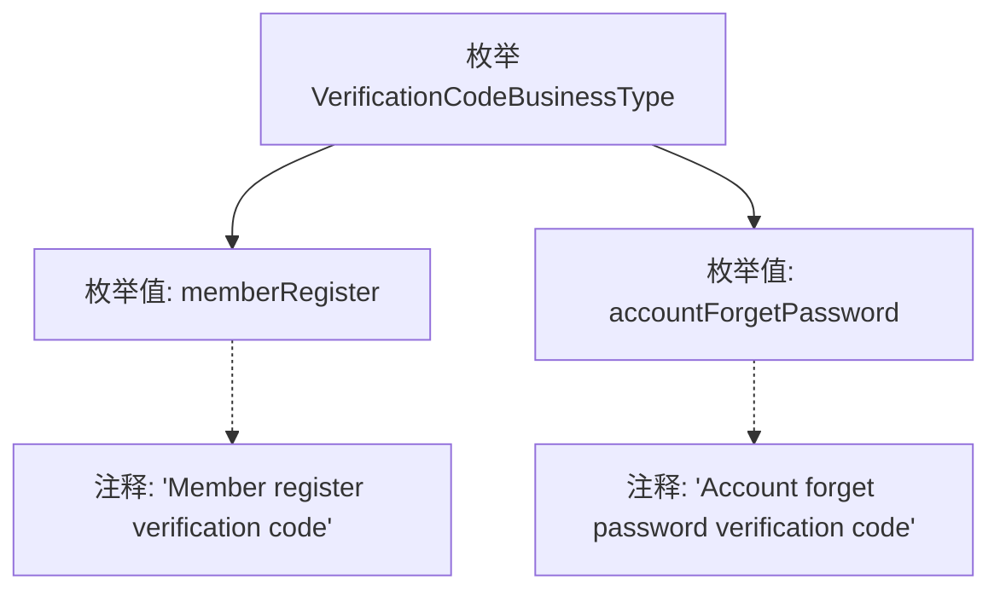

# 基础信息

|      |      |
|------|------|
| 名称 | VerificationCodeBusinessType |
| 编码语言 | .java |
| 代码路径 | WeFe/common/java/common-wefe/src/main/java/com/welab/wefe/common/wefe/enums/VerificationCodeBusinessType.java |
| 包名 | com.welab.wefe.common.wefe.enums |
| 依赖项 | [] |
| 概述说明 | 枚举VerificationCodeBusinessType定义两种验证码业务类型：会员注册和账户找回密码。 |

# 说明

该内容定义了一个名为VerificationCodeBusinessType的枚举类型，包含两个枚举值：memberRegister和accountForgetPassword。前者用于会员注册验证码业务场景，后者用于账户忘记密码验证码业务场景。每个枚举值都配有对应的注释说明其用途。

# 类列表 Class Summary

| 名称   | 类型  | 说明 |
|-------|------|-------------|
| VerificationCodeBusinessType | enum | 枚举VerificationCodeBusinessType定义两种业务类型：会员注册验证码和账户忘记密码验证码。 |

## 类 VerificationCodeBusinessType

|      |      |
|------|------|
| 访问范围 | public |
| 类型 | enum |
| 名称 | VerificationCodeBusinessType |
| 说明 | 枚举VerificationCodeBusinessType定义两种业务类型：会员注册验证码和账户忘记密码验证码。 |

### UML类图

该枚举类定义了两种验证码业务类型：memberRegister表示会员注册验证码，accountForgetPassword表示账户忘记密码验证码。作为枚举类型，它限定了验证码业务类型的取值范围，确保系统只能使用预定义的业务类型，提高了代码的可读性和安全性。枚举项均为公有常量，可直接通过类名访问。

### 内部方法调用关系图

该流程图展示了VerificationCodeBusinessType枚举的结构，包含两个枚举值memberRegister和accountForgetPassword，分别带有描述其用途的注释。memberRegister用于会员注册验证码场景，accountForgetPassword用于账户忘记密码验证码场景。通过层级关系清晰呈现了枚举定义与各值的关联性，注释说明采用虚线连接以区分主从关系。

### 字段列表 Field List

| 名称  | 类型  | 说明 |
|-------|-------|------|

### 方法列表

| 名称  | 类型  | 说明 |
|-------|-------|------|

