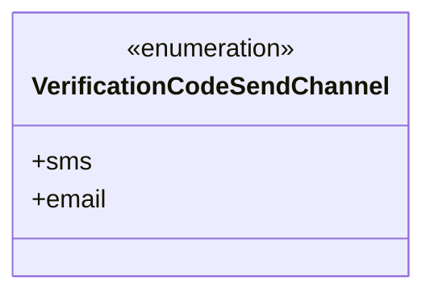
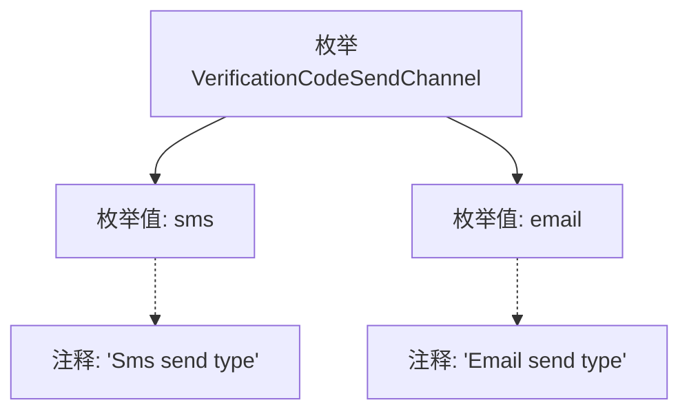

# 基础信息

|      |      |
|------|------|
| 名称 | VerificationCodeSendChannel |
| 编码语言 | .java |
| 代码路径 | WeFe/common/java/common-wefe/src/main/java/com/welab/wefe/common/wefe/enums/VerificationCodeSendChannel.java |
| 包名 | com.welab.wefe.common.wefe.enums |
| 依赖项 | [] |
| 概述说明 | 验证码发送渠道枚举：sms短信发送，email邮件发送。 |

# 说明

这是一个名为VerificationCodeSendChannel的公共枚举类型，定义了两种验证码发送渠道。第一种是sms，表示通过短信方式发送验证码；第二种是email，表示通过电子邮件方式发送验证码。枚举中的每个值都附有注释说明其用途，清晰表明了不同发送渠道的类型和功能。该枚举结构简洁明了，适用于需要区分不同验证码发送方式的场景。

# 类列表 Class Summary

| 名称   | 类型  | 说明 |
|-------|------|-------------|
| VerificationCodeSendChannel | enum | 验证码发送渠道枚举：sms短信和email邮件两种类型。 |

## 类 VerificationCodeSendChannel

|      |      |
|------|------|
| 访问范围 | public |
| 类型 | enum |
| 名称 | VerificationCodeSendChannel |
| 说明 | 验证码发送渠道枚举：sms短信和email邮件两种类型。 |

### UML类图

这段代码定义了一个名为VerificationCodeSendChannel的枚举类型，包含两个枚举常量：sms和email，分别表示通过短信和电子邮件发送验证码的两种渠道。枚举类型在类图中用<<enumeration>>标记，清晰地展示了该类型的结构和使用方式。这种设计常用于需要限定特定选项集合的场景，确保类型安全并提高代码可读性。

### 内部方法调用关系图

这段代码定义了一个名为VerificationCodeSendChannel的枚举类型，包含两个枚举值：sms和email。每个枚举值都有对应的注释说明其用途，sms表示短信发送方式，email表示邮件发送方式。枚举类型常用于表示一组固定的常量，这里清晰地定义了验证码发送的两种渠道类型。

### 字段列表 Field List

| 名称  | 类型  | 说明 |
|-------|-------|------|

### 方法列表

| 名称  | 类型  | 说明 |
|-------|-------|------|

