# 基础信息

|      |      |
|------|------|
| 名称 | enums |
| 编码语言 | .java |
| 代码路径 | WeFe/common/java/common-wefe/src/main/java/com/welab/wefe/common/wefe/enums |
| 包名 | docs.common.java.common-wefe.src.main.java.com.welab.wefe.common.wefe.enums |
| 概述说明 | 枚举类型集合，包含服务类型、环境分支、模型语言、用户来源、任务状态、数据资源类型、验证码渠道、哈希算法、联邦学习模式等40+业务相关枚举定义，用于系统各模块的状态管理和类型标识。 |

# 说明

## 概述  
该模块核心职责是提供联邦学习系统的枚举类型定义，涵盖服务类型、环境配置、任务状态、数据处理等关键领域。接口规范包括环境检测（如EnvName.isTestEnv）、状态判断（如JobStatus.finished）和类型转换（如ModelExportLanguage.getLanguageSuffix）。关键数据结构包含11种ServiceType、7种JobStatus和14种ModelExportLanguage等。无外部依赖项。例如ServiceType标识UnionService网关服务，JobStatus区分任务运行中/成功状态。

## 主要业务场景  
模块支持联邦学习全流程管理，类似状态机模式。通过枚举控制业务分支（如VerificationCodeSendChannel选择短信/邮件渠道），状态流转（如BloomFilterProgressType从Pending到Success）和数据处理（如Binning选择分箱算法）。典型应用包括多环境部署（EnvBranch隔离演示分支）、任务生命周期管理（ProjectFlowStatus跟踪编辑到成功）和权限控制（DataResourcePublicLevel限制资源可见性）。例如横向联邦学习（FederatedLearningType.horizontal）使用XGBoost算法（Algorithm.XGBoost）处理结构化数据（DataResourceType.TableDataSet）。

### 包内部结构视图

```mermaid
graph TD
    enums --> ServiceType.java
    enums --> env
    enums --> ModelExportLanguage.java
    enums --> BoardUserSource.java
    enums --> DeepLearningJobType.java
    enums --> MessageLevel.java
    enums --> Binning.java
    enums --> VerificationCodeSendChannel.java
    enums --> JobStatus.java
    enums --> HashOptions.java
    enums --> ProjectType.java
    enums --> FederatedLearningModel.java
    enums --> DataResourcePublicLevel.java
    enums --> TaskStatus.java
    enums --> DataResourceType.java
    enums --> ContractName.java
    enums --> SmsBusinessType.java
    enums --> PredictFeatureDataSource.java
    enums --> DataResourceStorageType.java
    enums --> ChatListType.java
    enums --> BloomFilterProgressType.java
    enums --> GatewayProcessorType.java
    enums --> ProducerType.java
    enums --> VerificationCodeBusinessType.java
    enums --> TaskResultType.java
    enums --> ProjectFlowStatisticsStatus.java
    enums --> FileRurpose.java
    enums --> JobMemberRole.java
    enums --> MessageEvent.java
    enums --> ColumnDataType.java
    enums --> FcCloudProvider.java
    enums --> ProjectFlowStatus.java
    enums --> Algorithm.java
    enums --> AuditStatus.java
    enums --> ComponentType.java
    enums --> JobBackendType.java
    enums --> DataResourceUploadStatus.java
    enums --> FlowActionType.java
    enums --> FlowLimitStrategyTypeEnum.java
    enums --> BloomFilterPublicLevel.java
    enums --> PredictType.java
    enums --> DataResourceStorageServiceType.java
    enums --> FederatedLearningType.java
    env --> EnvName.java
    env --> EnvBranch.java
```

该流程图展示了WeFe项目中枚举类的层级结构，根节点为"enums"目录，包含35个直接子节点（枚举类文件）和1个子目录"env"。"env"子目录下又包含2个枚举类文件。整个结构清晰地反映了项目中枚举类型的组织方式，涵盖了服务类型、环境配置、任务状态等多种业务枚举。

# 文件列表

| 名称   | 类型  | 说明 |
|-------|------|-------------|
| [ServiceType.java](ServiceType.md) | file | 枚举ServiceType定义了11种服务类型，包括联合服务、板服务、网关服务、流服务、存储服务、FC服务、服务服务、MySQL服务、文件系统、区块链服务和MongoDB服务。 |
| [ModelExportLanguage.java](ModelExportLanguage.md) | file | 枚举类ModelExportLanguage定义了14种编程语言和PMML，提供方法检查语言存在性、获取枚举实例及对应文件后缀。 |
| [BoardUserSource.java](BoardUserSource.md) | file | BoardUserSource枚举定义用户来源：board_register（注册用户）和online_demo（在线演示用户）。 |
| [DeepLearningJobType.java](DeepLearningJobType.md) | file | DeepLearningJobType枚举定义两种深度学习任务类型：分类和目标检测。 |
| [MessageLevel.java](MessageLevel.md) | file | 定义消息级别的枚举，包含四种类型：成功、错误、警告和信息。 |
| [Binning.java](Binning.md) | file | Binning枚举包含三种分箱方法：Optimal（卡方最优分箱）、Bucket（等宽分箱）、Quantile（等频分箱）。 |
| [VerificationCodeSendChannel.java](VerificationCodeSendChannel.md) | file | 验证码发送渠道枚举：sms短信发送，email邮件发送。 |
| [JobStatus.java](JobStatus.md) | file | JobStatus枚举定义任务状态：等待运行、运行中、等待结束、手动停止、异常终止、成功、等待成功。包含检查任务是否结束和是否正在停止的方法。 |
| [HashOptions.java](HashOptions.md) | file | 哈希算法选项枚举：MD5、SHA1、NONE（不处理）。 |
| [ProjectType.java](ProjectType.md) | file | ProjectType枚举定义两种项目类型：MachineLearning（传统机器学习，使用TableDataSet）和DeepLearning（深度学习，使用ImageDataSet）。 |
| [FederatedLearningModel.java](FederatedLearningModel.md) | file | 联邦学习模型枚举包含OOT模式（模型评分）。 |
| [DataResourcePublicLevel.java](DataResourcePublicLevel.md) | file | 数据资源公开级别枚举：Public（所有人可见）、PublicWithMemberList（指定成员可见）、OnlyMyself（仅自己可见）。 |
| [TaskStatus.java](TaskStatus.md) | file | 任务状态枚举：等待运行、运行中、错误、成功、停止。 |
| [DataResourceType.java](DataResourceType.md) | file | DataResourceType枚举定义三种数据类型：结构化数据集（常规机器学习）、图像数据集（深度学习）、过滤器数据（布隆过滤器）。 |
| [ContractName.java](ContractName.md) | file | ContractName类包含多个静态字符串常量，定义不同合约名称，如成员、数据集、权限、实名认证、数据源等。 |
| [SmsBusinessType.java](SmsBusinessType.md) | file | 枚举SmsBusinessType定义两种短信业务类型：会员注册验证码和账户忘记密码验证码。 |
| [PredictFeatureDataSource.java](PredictFeatureDataSource.md) | file | PredictFeatureDataSource枚举定义了三种数据来源：api、code和sql。 |
| [DataResourceStorageType.java](DataResourceStorageType.md) | file | 数据资源存储类型枚举：支持CLICKHOUSE、MYSQL、LMDB数据库。 |
| [ChatListType.java](ChatListType.md) | file | 聊天列表类型枚举：notice表示系统通知消息，chat表示成员聊天消息。 |
| [BloomFilterProgressType.java](BloomFilterProgressType.md) | file | 枚举BloomFilterProgressType定义了布隆过滤器的进度状态：待处理、等待、就绪、运行中、成功、失败。 |
| [GatewayProcessorType.java](GatewayProcessorType.md) | file | GatewayProcessorType枚举定义了多种网关处理器类型，包括HTTP推送、数据库存储、缓存刷新、网关检查和外部服务管理等关键功能模块。 |
| [ProducerType.java](ProducerType.md) | file | 枚举ProducerType定义了两个服务类型：board（面板服务）和gateway（网关服务）。 |
| [VerificationCodeBusinessType.java](VerificationCodeBusinessType.md) | file | 枚举VerificationCodeBusinessType定义两种验证码业务类型：会员注册和账户找回密码。 |
| [TaskResultType.java](TaskResultType.md) | file | 任务结果类型枚举，包含数据、模型、指标三类，涵盖训练、评估、预测、统计等操作类型。 |
| [ProjectFlowStatisticsStatus.java](ProjectFlowStatisticsStatus.md) | file | 枚举类定义项目流统计状态，包含编辑中、运行中、成功、中断四种状态，提供状态转换方法。 |
| [FileRurpose.java](FileRurpose.md) | file | 枚举类型FileRurpose定义了一个值RealnameAuth，用于实名认证场景。 |
| [JobMemberRole.java](JobMemberRole.md) | file | 枚举JobMemberRole定义任务成员角色：发起者(promoter)、协作者(provider)、仲裁者(arbiter)，各角色有对应序号index。 |
| [MessageEvent.java](MessageEvent.md) | file | 消息事件枚举，包含项目加入、数据资源申请及处理结果，网关错误和邮件发送失败事件。根据事件类型返回不同级别和待办状态。 |
| [ColumnDataType.java](ColumnDataType.md) | file | 枚举类型ColumnDataType定义了七种数据类型：Integer、Long、Double、Boolean、Enum、String和DateTime。 |
| [FcCloudProvider.java](FcCloudProvider.md) | file | 枚举FcCloudProvider定义两种云服务提供商：阿里云和腾讯云。 |
| [ProjectFlowStatus.java](ProjectFlowStatus.md) | file | 项目流程状态枚举：编辑中、运行中、运行错误、人工暂停、等待运行、等待结束、成功、等待成功。 |
| [Algorithm.java](Algorithm.md) | file | 定义了一个枚举类型Algorithm，包含两种算法：LogisticRegression和XGBoost。 |
| [AuditStatus.java](AuditStatus.md) | file | 枚举AuditStatus定义三种状态：审核中auditing、同意agree、拒绝disagree。 |
| [ComponentType.java](ComponentType.md) | file | 联邦学习组件枚举，包含数据加载、特征处理、统计分析、建模算法（逻辑回归/XGBoost/深度学习）及评估等类型，支持横向、纵向和混合联邦学习模式。 |
| [JobBackendType.java](JobBackendType.md) | file | JobBackendType枚举定义了三种作业后端类型：独立本地模式LOCAL、Spark计算框架SPARK和函数计算FC。 |
| [DataResourceUploadStatus.java](DataResourceUploadStatus.md) | file | 数据资源上传状态枚举：上传中、完成、失败。 |
| [FlowActionType.java](FlowActionType.md) | file | FlowActionType枚举定义了三种任务操作：run_job启动任务，stop_job停止任务，resume_job继续任务。 |
| [FlowLimitStrategyTypeEnum.java](FlowLimitStrategyTypeEnum.md) | file | FlowLimitStrategyTypeEnum枚举定义了两种限流策略类型：IP和Mobile。 |
| [BloomFilterPublicLevel.java](BloomFilterPublicLevel.md) | file | BloomFilterPublicLevel枚举定义了三种公开级别：所有人可见、指定成员可见和仅自己可见。 |
| [PredictType.java](PredictType.md) | file | 枚举PredictType定义三种类型：promoter（模型发起者）、provider（模型提供者）、debug（调试模型）。 |
| [DataResourceStorageServiceType.java](DataResourceStorageServiceType.md) | file | 枚举DataResourceStorageServiceType定义两种存储类型：本地文件系统和存储服务。 |
| [FederatedLearningType.java](FederatedLearningType.md) | file | 枚举FederatedLearningType定义了三种联邦学习类型：horizontal（横向）、vertical（纵向）和mix（混合）。 |
| [env](env/_module.md) | package | EnvName枚举定义dev、fat、prod、none四个环境，提供isTestEnv和isProductionEnv方法判断环境类型。EnvBranch枚举包含master和online_demo两个分支类型。 |

