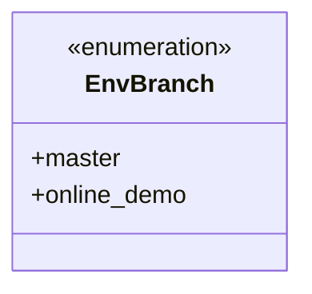
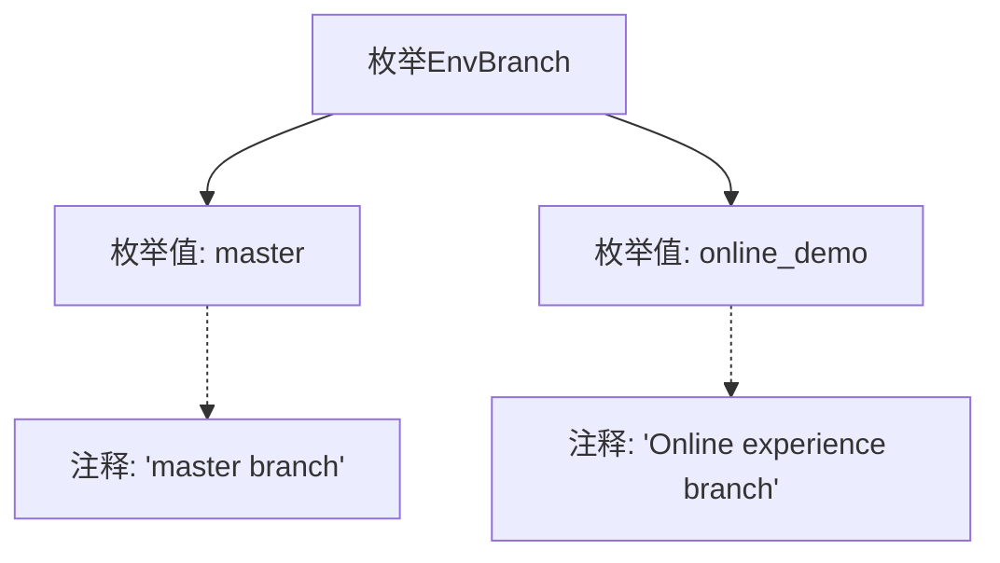

# 基础信息

|      |      |
|------|------|
| 名称 | EnvBranch |
| 编码语言 | .java |
| 代码路径 | WeFe/common/java/common-wefe/src/main/java/com/welab/wefe/common/wefe/enums/env/EnvBranch.java |
| 包名 | com.welab.wefe.common.wefe.enums.env |
| 依赖项 | [] |
| 概述说明 | EnvBranch枚举定义了两个分支：master主分支和online_demo线上体验分支。 |

# 说明

EnvBranch是一个枚举类型，包含两个枚举值：master和online_demo。master表示主分支，online_demo表示在线体验分支。该枚举用于区分不同环境或用途的分支类型。

# 类列表 Class Summary

| 名称   | 类型  | 说明 |
|-------|------|-------------|
| EnvBranch | enum | EnvBranch枚举定义了两个分支：master主分支和online_demo线上体验分支。 |

## 类 EnvBranch

|      |      |
|------|------|
| 访问范围 | public |
| 类型 | enum |
| 名称 | EnvBranch |
| 说明 | EnvBranch枚举定义了两个分支：master主分支和online_demo线上体验分支。 |

### UML类图

这段代码定义了一个名为`EnvBranch`的枚举类型，包含两个枚举常量：`master`和`online_demo`。`master`表示主分支，`online_demo`表示在线体验分支。枚举类型用于表示一组固定的常量，这里用于区分不同的环境分支类型。类图清晰地展示了枚举的结构，没有复杂的依赖关系，仅包含两个公开的枚举值。

### 内部方法调用关系图

该流程图展示了EnvBranch枚举的结构，包含两个枚举值master和online_demo，分别带有对应的注释说明。master表示主分支，online_demo表示在线体验分支。通过箭头连接清晰地呈现了枚举类与其成员之间的从属关系，以及注释与枚举值的关联性。整个结构简洁明了，便于理解枚举的定义和用途。

### 字段列表 Field List

| 名称  | 类型  | 说明 |
|-------|-------|------|

### 方法列表

| 名称  | 类型  | 说明 |
|-------|-------|------|

