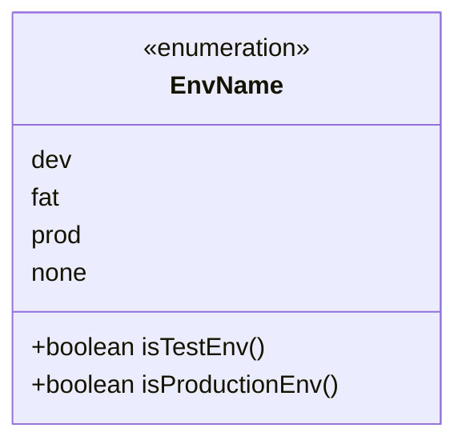
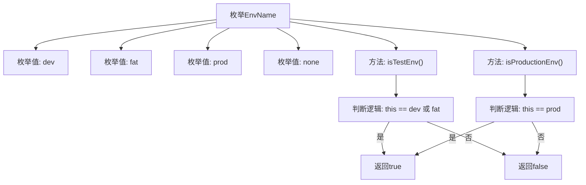

# 基础信息

|      |      |
|------|------|
| 名称 | EnvName |
| 编码语言 | .java |
| 代码路径 | WeFe/common/java/common-wefe/src/main/java/com/welab/wefe/common/wefe/enums/env/EnvName.java |
| 包名 | com.welab.wefe.common.wefe.enums.env |
| 依赖项 | [] |
| 概述说明 | EnvName枚举定义了dev、fat、prod、none四种环境，提供isTestEnv和isProductionEnv方法判断是否为测试或生产环境。 |

# 说明

该代码定义了一个枚举类型EnvName，包含四个枚举值：dev（开发环境）、fat（测试环境）、prod（生产环境）和none（无环境）。提供了两个方法：isTestEnv用于判断当前环境是否为测试环境（dev或fat），isProductionEnv用于判断是否为生产环境（prod）。其他情况均返回false。

# 类列表 Class Summary

| 名称   | 类型  | 说明 |
|-------|------|-------------|
| EnvName | enum | EnvName枚举定义了dev、fat、prod和none四种环境，提供isTestEnv和isProductionEnv方法判断是否为测试或生产环境。 |

## 类 EnvName

|      |      |
|------|------|
| 访问范围 | public |
| 类型 | enum |
| 名称 | EnvName |
| 说明 | EnvName枚举定义了dev、fat、prod和none四种环境，提供isTestEnv和isProductionEnv方法判断是否为测试或生产环境。 |

### UML类图

这段代码定义了一个名为`EnvName`的枚举类，包含四个枚举常量：`dev`、`fat`、`prod`和`none`。该类提供了两个方法：`isTestEnv()`用于判断当前环境是否为测试环境（`dev`或`fat`），`isProductionEnv()`用于判断是否为生产环境（`prod`）。枚举类通过简单的switch-case逻辑实现环境类型判断，适用于需要区分不同运行环境的场景，如配置加载或功能开关控制。

### 内部方法调用关系图

这段代码定义了一个EnvName枚举类，包含dev、fat、prod和none四个枚举值，并提供了isTestEnv()和isProductionEnv()两个方法。isTestEnv()方法在枚举值为dev或fat时返回true，表示测试环境；isProductionEnv()方法仅在枚举值为prod时返回true，表示生产环境。流程图清晰地展示了枚举结构与两个判断方法的逻辑流程，通过条件分支实现不同环境类型的识别。

### 字段列表 Field List

| 名称  | 类型  | 说明 |
|-------|-------|------|

### 方法列表

| 名称  | 类型  | 说明 |
|-------|-------|------|

