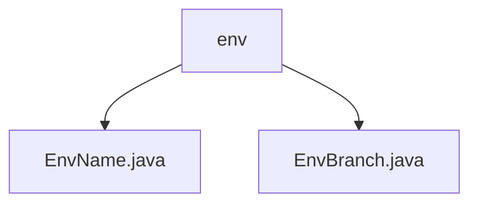

# 基础信息

|      |      |
|------|------|
| 名称 | env |
| 编码语言 | .java |
| 代码路径 | WeFe/common/java/common-wefe/src/main/java/com/welab/wefe/common/wefe/enums/env |
| 包名 | docs.common.java.common-wefe.src.main.java.com.welab.wefe.common.wefe.enums.env |
| 概述说明 | EnvName枚举定义dev、fat、prod、none四个环境，提供isTestEnv和isProductionEnv方法判断环境类型。EnvBranch枚举包含master和online_demo两个分支类型。 |

# 说明

## 概述  
该模块核心职责是管理环境和分支枚举类型，提供环境检测和分支区分功能。接口规范包括EnvName的isTestEnv/isProductionEnv方法，以及EnvBranch的master/online_demo枚举值。关键数据结构为EnvName（dev/fat/prod/none）和EnvBranch（master/online_demo）。无外部依赖项。例如EnvName可检测测试环境，EnvBranch区分主分支和演示分支。

## 主要业务场景  
模块支持多环境配置管理，类似功能开关模式。通过EnvName判断运行环境类型（例如fat返回测试状态），EnvBranch控制分支流向（例如online_demo启用演示功能）。典型应用包括环境隔离部署和分支差异化处理，例如生产环境禁用调试功能，演示分支加载样例数据。

### 包内部结构视图

该流程图展示了WeFe项目中环境枚举类的层级结构。根节点"env"包含两个枚举类文件：EnvName.java和EnvBranch.java，这两个文件都位于相同的包路径下，用于定义与环境相关的枚举类型。整个结构简洁明了，体现了Java项目中典型的包与类文件的包含关系。

# 文件列表

| 名称   | 类型  | 说明 |
|-------|------|-------------|
| [EnvName.java](EnvName.md) | file | EnvName枚举定义了dev、fat、prod、none四种环境，提供isTestEnv和isProductionEnv方法判断是否为测试或生产环境。 |
| [EnvBranch.java](EnvBranch.md) | file | EnvBranch枚举定义了两个分支：master主分支和online_demo线上体验分支。 |

