# 基础信息

|      |      |
|------|------|
| 名称 | fusion |
| 编码语言 | .java |
| 代码路径 | WeFe/fusion/fusion-core/src/main/java/com/welab/wefe/fusion |
| 包名 | docs.fusion.fusion-core.src.main.java.com.welab.wefe.fusion |
| 概述说明 | 模块实现隐私保护集合交集(PSI)协议，含Server/Client基类、数据转换和元数据处理，依赖RSA-PSI算法和JObject序列化。布隆过滤器模块支持高效操作与持久化，集成密码学工具和线程池管理。枚举模块定义联邦学习关键维度如任务状态和算法类型。DTO模块封装布隆过滤器及元数据，支持PSI协议组件序列化传输。 |

# 说明

## 概述  
该模块实现隐私保护集合交集(PSI)协议的双端逻辑与联邦学习支持组件，核心职责包括安全数据对齐（类似盲签名流程）、布隆过滤器操作及任务状态管理。接口规范涵盖Server/Client抽象基类、枚举定义和DTO传输模型，例如dataTransform数据转换和generateBlindingFactor元数据下载。关键数据结构含BigInteger加密参数、BitSet位集、BloomFilterDto传输对象及PSIActuatorRole等枚举。外部依赖涉及JObject序列化框架、RSA-PSI算法和Java密码学组件。例如ActuatorCache管理执行器映射，BloomFilterUtils简化IO操作。

## 主要业务场景  
典型流程遵循Client初始化→元数据交换→分桶加密→Server匹配→结果回传，采用类似MapReduce的多线程分页处理。完整功能覆盖数据预处理（如parseAndMatch）、加密转换（RSA/DH算法）、状态协调（FusionTaskStatus枚举）和过滤器持久化（writeTo/readFrom）。交互模式基于角色（server/client）和状态驱动（如Progress.Ready触发执行），API类型包括基础操作（add/contains）、密码学功能（generateKeys）和线程池任务提交。例如MD5哈希确保数据一致性，AlgorithmType.DH支持密钥交换，DTO模式实现跨节点传输。

### 包内部结构视图

```mermaid
graph TD
    fusion --> core
    core --> actuator
    core --> utils
    core --> enums
    core --> dto
    actuator --> psi
    actuator --> ActuatorCache.java
    actuator --> AbstractActuator.java
    psi --> AbstractPsiServerActuator.java
    psi --> PsiClientInterface.java
    psi --> AbstractPsiActuator.java
    psi --> AbstractPsiClientActuator.java
    psi --> PsiServerInterface.java
    utils --> bf
    utils --> CryptoUtils.java
    utils --> PSIUtils.java
    utils --> FusionThreadPool.java
    bf --> BloomFilterUtils.java
    bf --> BloomFilters.java
    enums --> Options.java
    enums --> DBType.java
    enums --> ActionType.java
    enums --> PSIActuatorRole.java
    enums --> CallbackType.java
    enums --> Progress.java
    enums --> FusionTaskStatus.java
    enums --> DataResourceSource.java
    enums --> AlgorithmType.java
    enums --> PSIActuatorStatus.java
    dto --> BloomFilterDto.java
    dto --> PsiActuatorMeta.java
```

该流程图展示了WeFe融合核心模块的代码结构，从顶层fusion目录开始，逐级展开到具体的Java文件。核心包含actuator执行器、utils工具类、enums枚举和dto数据传输对象四大模块，其中psi子模块包含PSI协议相关实现类，utils下包含布隆过滤器等工具类，enums定义了系统各类枚举类型。

# 文件列表

| 名称   | 类型  | 说明 |
|-------|------|-------------|
| [core](core/_module.md) | package | 模块实现隐私保护集合交集(PSI)协议，含Server/Client基类、数据转换和元数据处理，依赖RSA-PSI算法和JObject序列化。布隆过滤器模块支持高效操作与持久化，集成密码学工具和线程池管理。枚举模块定义联邦学习关键维度如任务状态和算法类型。DTO模块封装布隆过滤器及元数据，支持PSI协议组件序列化传输。 |

