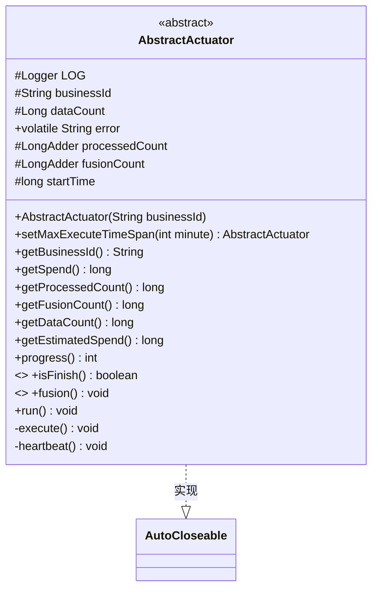

# 基础信息

|      |      |
|------|------|
| 名称 | AbstractActuator |
| 编码语言 | .java |
| 代码路径 | WeFe/fusion/fusion-core/src/main/java/com/welab/wefe/fusion/core/actuator/AbstractActuator.java |
| 包名 | com.welab.wefe.fusion.core.actuator |
| 依赖项 | ['com.welab.wefe.common.TimeSpan', 'com.welab.wefe.common.exception.StatusCodeWithException', 'com.welab.wefe.common.util.StringUtil', 'com.welab.wefe.fusion.core.utils.FusionThreadPool', 'org.slf4j.Logger', 'org.slf4j.LoggerFactory', 'java.util.concurrent.atomic.LongAdder', 'com.welab.wefe.common.util.ThreadUtil.sleep'] |
| 概述说明 | 抽象类AbstractActuator实现AutoCloseable，包含任务执行、进度跟踪和心跳检测功能，支持业务ID、数据处理计数、错误记录和耗时计算。 |

# 说明

AbstractActuator是一个抽象类，实现了AutoCloseable接口，用于任务执行和管理。类中包含业务ID、数据计数、错误信息、处理计数和融合计数等关键属性。提供了设置最大执行时间、获取业务ID、耗时、处理计数、融合计数、数据计数、预估剩余时间和当前进度等方法。核心功能包括任务执行方法fusion和运行方法run，后者通过线程池执行任务和心跳检测。心跳检测会持续检查任务是否完成或出错，完成后关闭任务并清理缓存。类中还包含日志记录和异常处理机制，确保任务执行的可靠性和可追踪性。

# 类列表 Class Summary

| 名称   | 类型  | 说明 |
|-------|------|-------------|
| AbstractActuator | class | 抽象类AbstractActuator实现AutoCloseable，包含任务执行、进度跟踪、错误处理和心跳检测功能，支持多线程运行和自动关闭。 |

## 类 AbstractActuator

|      |      |
|------|------|
| 访问范围 | public abstract |
| 类型 | class |
| 名称 | AbstractActuator |
| 说明 | 抽象类AbstractActuator实现AutoCloseable，包含任务执行、进度跟踪、错误处理和心跳检测功能，支持多线程运行和自动关闭。 |

### UML类图

类图描述：
AbstractActuator是一个抽象类，实现了AutoCloseable接口，主要用于任务执行和监控。它包含核心属性如businessId、dataCount、processedCount等用于任务跟踪，提供了进度计算(progress)、耗时统计(getSpend)等方法。抽象方法isFinish和fusion需要子类实现，分别用于判断任务完成状态和执行具体任务。私有方法execute和heartbeat处理任务执行和心跳检测，run方法通过线程池启动这两个过程。该类设计考虑了任务监控、异常处理和资源清理。

### 内部方法调用关系图

```mermaid
graph TD
    A["抽象类AbstractActuator"]
    B["属性: Logger LOG"]
    C["属性: String businessId"]
    D["属性: Long dataCount"]
    E["属性: volatile String error"]
    F["属性: LongAdder processedCount"]
    G["属性: LongAdder fusionCount"]
    H["属性: final long startTime"]
    I["构造方法: AbstractActuator(String businessId)"]
    J["方法: setMaxExecuteTimeSpan(int minute)"]
    K["方法: getBusinessId()"]
    L["方法: getSpend()"]
    M["方法: getProcessedCount()"]
    N["方法: getFusionCount()"]
    O["方法: getDataCount()"]
    P["方法: getEstimatedSpend()"]
    Q["方法: progress()"]
    R["抽象方法: isFinish()"]
    S["抽象方法: fusion()"]
    T["方法: run()"]
    U["私有方法: execute()"]
    V["私有方法: heartbeat()"]
    W["调用: ActuatorCache.set(this)"]
    X["调用: FusionThreadPool.run"]
    Y["日志操作"]
    Z["调用: ActuatorCache.remove"]

    A --> B
    A --> C
    A --> D
    A --> E
    A --> F
    A --> G
    A --> H
    A --> I
    A --> J
    A --> K
    A --> L
    A --> M
    A --> N
    A --> O
    A --> P
    A --> Q
    A --> R
    A --> S
    A --> T
    T --> X
    X --> U
    X --> V
    U --> Y
    U --> S
    V --> Y
    V --> R
    V --> Z
    I --> W
```

该流程图展示了AbstractActuator抽象类的完整结构，包含11个属性和14个方法。核心流程通过run()方法启动，分两条线程执行execute()和heartbeat()方法：execute()负责核心业务逻辑并调用抽象方法fusion()，heartbeat()持续监控任务状态并在完成后清理资源。所有方法通过日志系统记录运行状态，并通过ActuatorCache实现实例缓存管理，体现了任务执行、状态监控和资源清理的完整生命周期。

### 字段列表 Field List

| 名称  | 类型  | 说明 |
|-------|-------|------|
| LOG = LoggerFactory.getLogger(getClass()) | Logger | 声明一个受保护的final日志对象，使用当前类名初始化。 |
| businessId | String | 保护的业务ID字符串变量。 |
| fusionCount = new LongAdder() | LongAdder | 并发计数变量，使用LongAdder实现高效累加。 |
| dataCount | Long | 受保护的长整型数据计数变量。 |
| processedCount = new LongAdder() | LongAdder | 声明一个受保护的LongAdder变量processedCount，用于线程安全地累加计数。 |
| startTime = System.currentTimeMillis() | long | 定义了一个受保护的final长整型变量startTime，初始值为当前系统时间的毫秒值。 |
| error | String | 声明一个易变的字符串变量error，多线程可见。 |

### 方法列表

| 名称  | 类型  | 说明 |
|-------|-------|------|
| getFusionCount | long | 获取融合计数的长整型值。 |
| isFinish | boolean | 抽象方法isFinish，返回布尔值表示是否完成。 |
| getEstimatedSpend | long | 计算预估花费：若已处理数为零，返回总花费乘以数据总数；否则返回单位处理花费乘以剩余未处理数。 |
| progress | int | 该方法计算处理进度百分比，通过已处理数量除以总数乘以100并取整返回。 |
| execute | void | 方法execute执行任务，调用fusion()，记录开始和结束日志，捕获异常时记录错误信息并保存错误消息。 |
| setMaxExecuteTimeSpan | AbstractActuator | 方法setMaxExecuteTimeSpan设置最大执行时间（分钟），返回当前对象。 |
| getBusinessId | String | 方法返回businessId字符串。 |
| fusion | void | 抽象方法fusion，可能抛出异常。 |
| run | void | 该方法启动两个并行线程，分别执行任务和心跳检测。 |
| getProcessedCount | long | 获取已处理数量的长整型值。 |
| getSpend | long | 该方法返回当前时间与startTime的毫秒差值，用于计算耗时。 |
| heartbeat | void | 心跳检测方法，循环检查任务状态，无错误则继续，否则关闭任务并记录耗时，最后移除执行器。异常时记录错误。 |
| getDataCount | long | 获取数据计数值，返回长整型结果。 |

