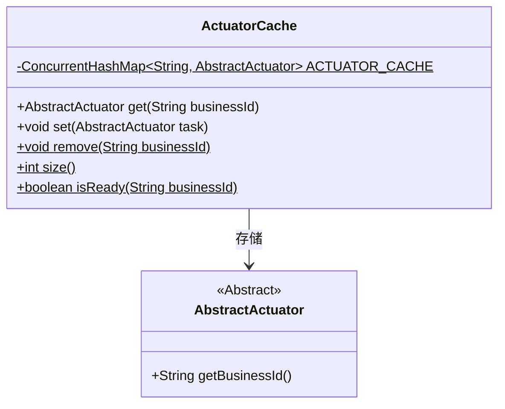
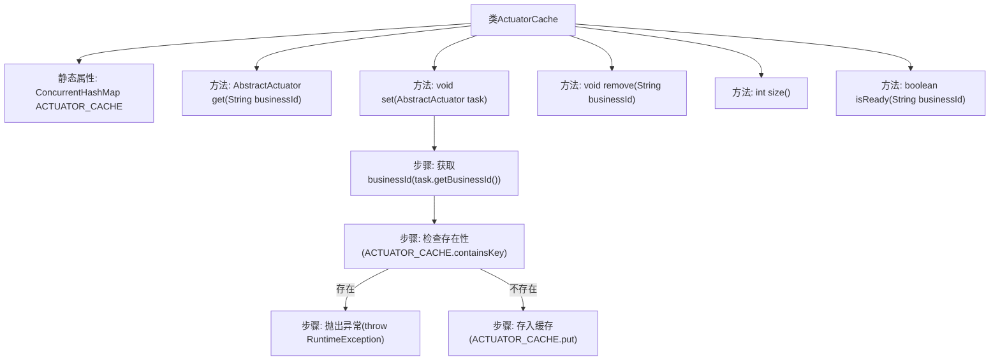

# 基础信息

|      |      |
|------|------|
| 名称 | ActuatorCache |
| 编码语言 | .java |
| 代码路径 | WeFe/fusion/fusion-core/src/main/java/com/welab/wefe/fusion/core/actuator/ActuatorCache.java |
| 包名 | com.welab.wefe.fusion.core.actuator |
| 依赖项 | ['java.util.concurrent.ConcurrentHashMap'] |
| 概述说明 | ActuatorCache类使用ConcurrentHashMap缓存AbstractActuator实例，提供获取、添加、删除和查询功能，确保线程安全且业务ID唯一。 |

# 说明

ActuatorCache类是一个线程安全的执行器缓存管理类，使用ConcurrentHashMap存储业务ID与执行器的映射关系。提供获取执行器方法get，通过业务ID查询。添加执行器方法set会检查重复ID并抛出异常。移除方法remove可删除指定ID的执行器。size方法返回缓存数量。isReady方法检查指定ID的执行器是否存在。该类确保执行器操作的线程安全性和唯一性。

# 类列表 Class Summary

| 名称   | 类型  | 说明 |
|-------|------|-------------|
| ActuatorCache | class | ActuatorCache类使用ConcurrentHashMap缓存AbstractActuator实例，提供获取、添加、删除和查询功能，确保线程安全。 |

## 类 ActuatorCache

|      |      |
|------|------|
| 访问范围 | public |
| 类型 | class |
| 名称 | ActuatorCache |
| 说明 | ActuatorCache类使用ConcurrentHashMap缓存AbstractActuator实例，提供获取、添加、删除和查询功能，确保线程安全。 |

### UML类图

这段代码展示了一个执行器缓存系统ActuatorCache，它使用线程安全的ConcurrentHashMap来存储和管理AbstractActuator实例。类图中包含两个主要部分：ActuatorCache作为工具类提供对执行器的缓存管理功能，包括获取(get)、添加(set)、删除(remove)等操作；AbstractActuator作为抽象基类，要求子类必须实现getBusinessId方法。ActuatorCache通过依赖关系使用AbstractActuator，所有方法都是静态的，表明这是一个单例式的工具类，其中ACTUATOR_CACHE作为静态final成员确保线程安全。

### 内部方法调用关系图

这段代码实现了一个线程安全的执行器缓存系统，使用ConcurrentHashMap存储AbstractActuator实例。核心功能包括通过businessId获取执行器(get)、添加执行器(set，包含重复校验)、移除执行器(remove)、获取缓存数量(size)和检查执行器是否就绪(isReady)。流程图展示了类结构和set方法的关键流程：先获取businessId，检查是否已存在，存在则抛异常，否则存入缓存。所有操作都通过静态方法实现线程安全访问。

### 字段列表 Field List

| 名称  | 类型  | 说明 |
|-------|-------|------|
| ACTUATOR_CACHE = new ConcurrentHashMap<>() | ConcurrentHashMap<String, AbstractActuator> | 定义一个线程安全的静态常量哈希表，键为字符串，值为抽象执行器对象，用于缓存执行器实例。 |

### 方法列表

| 名称  | 类型  | 说明 |
|-------|-------|------|
| size | int | 该方法返回ACTUATOR_CACHE缓存的大小。 |
| get | AbstractActuator | 获取指定业务ID的执行器实例。 |
| set | void | 静态方法`set`用于缓存执行器任务，检查业务ID是否已存在，若存在则抛出异常，否则将任务存入缓存。 |
| remove | void | 同步静态方法，移除指定业务ID的缓存项。 |
| isReady | boolean | 检查指定业务ID是否已准备就绪，若存在则返回true，否则返回false。 |

