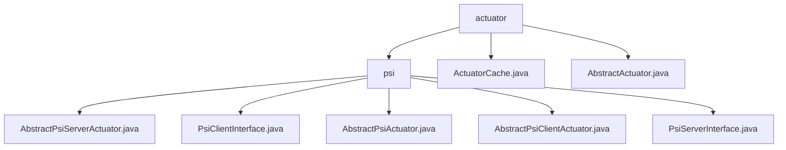

# 基础信息

|      |      |
|------|------|
| 名称 | actuator |
| 编码语言 | .java |
| 代码路径 | WeFe/fusion/fusion-core/src/main/java/com/welab/wefe/fusion/core/actuator |
| 包名 | docs.fusion.fusion-core.src.main.java.com.welab.wefe.fusion.core.actuator |
| 概述说明 | 该模块实现PSI协议的双端逻辑，包含Server和Client基类及接口，支持加密数据对齐。核心流程包括Client初始化、分桶加密、Server转换匹配和结果回传。依赖RSA-PSI算法和JObject序列化，确保线程安全和数据一致性。 |

# 说明

## 概述  
该模块实现隐私保护集合交集(PSI)协议的双端逻辑，核心职责是安全执行加密数据对齐，类似安全两方计算中的盲签名流程。提供Server和Client抽象基类及接口规范，包括数据转换(如dataTransform)、元数据下载(如generateBlindingFactor)等操作。关键数据结构涉及BigInteger加密参数、BloomFilters和PsiActuatorMeta，依赖JObject序列化框架和RSA-PSI算法。例如ActuatorCache通过ConcurrentHashMap管理线程安全的执行器映射，AbstractActuator则实现任务生命周期管理。

## 主要业务场景  
典型流程遵循Client初始化→元数据获取→分桶加密→Server匹配→结果回传的交互模式，采用类似MapReduce的多线程分页处理。完整功能涵盖数据预处理(parseAndMatch)、加密转换(RSA-PSI)、状态协调(volatile字段)和结果持久化。例如Client端execute方法处理数据桶，Server端receiveResult接收对齐结果，AbstractActuator通过心跳检测和线程池管理任务执行。典型集成案例包括fusion方法协调PSI全流程，ActuatorCache确保执行器操作的线程安全性与唯一性。

### 包内部结构视图

该流程图展示了WeFe项目中fusion-core模块的actuator包结构。顶层是actuator目录，包含psi子目录和两个抽象类文件。psi目录下包含5个与PSI(Private Set Intersection)协议相关的接口和抽象类文件，形成了清晰的层级关系。整个结构体现了PSI功能模块的代码组织方式。

# 文件列表

| 名称   | 类型  | 说明 |
|-------|------|-------------|
| [ActuatorCache.java](ActuatorCache.md) | file | ActuatorCache类使用ConcurrentHashMap缓存AbstractActuator实例，提供获取、添加、删除和查询功能，确保线程安全且业务ID唯一。 |
| [AbstractActuator.java](AbstractActuator.md) | file | 抽象类AbstractActuator实现AutoCloseable，包含任务执行、进度跟踪和心跳检测功能，支持业务ID、数据处理计数、错误记录和耗时计算。 |
| [psi](psi/_module.md) | package | AbstractPsiServerActuator是PSI协议服务端抽象类，处理加密参数和数据转换。PsiClientInterface定义客户端功能如数据对齐和加密。AbstractPsiActuator是基础抽象类，管理状态。AbstractPsiClientActuator实现客户端逻辑，处理数据匹配和加密。PsiServerInterface定义服务端方法如数据转换和结果接收。 |

