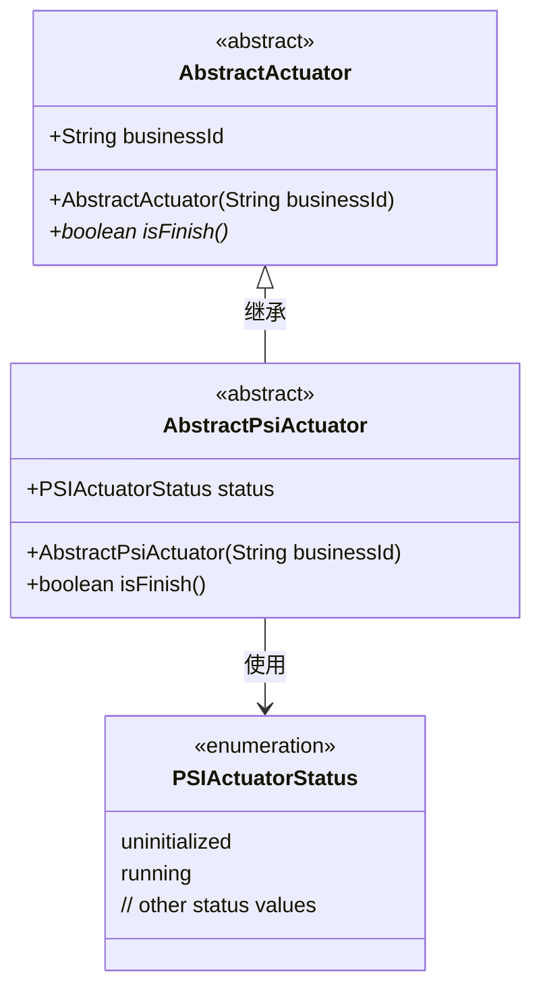
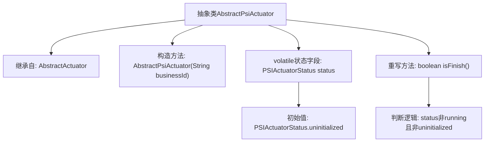

# 基础信息

|      |      |
|------|------|
| 名称 | AbstractPsiActuator |
| 编码语言 | .java |
| 代码路径 | WeFe/fusion/fusion-core/src/main/java/com/welab/wefe/fusion/core/actuator/psi/AbstractPsiActuator.java |
| 包名 | com.welab.wefe.fusion.core.actuator.psi |
| 依赖项 | ['com.welab.wefe.fusion.core.actuator.AbstractActuator', 'com.welab.wefe.fusion.core.enums.PSIActuatorStatus'] |
| 概述说明 | 抽象类AbstractPsiActuator继承AbstractActuator，包含状态变量status和检查是否完成的isFinish方法。 |

# 说明

AbstractPsiActuator是一个抽象类，继承自AbstractActuator。它通过构造函数接收businessId参数并传递给父类。该类包含一个volatile修饰的status字段，默认值为PSIActuatorStatus.uninitialized。重写了isFinish方法，判断当前状态是否非running且非uninitialized。

# 类列表 Class Summary

| 名称   | 类型  | 说明 |
|-------|------|-------------|
| AbstractPsiActuator | class | 抽象类AbstractPsiActuator继承AbstractActuator，包含状态变量status和检查是否完成的isFinish方法。 |

## 类 AbstractPsiActuator

|      |      |
|------|------|
| 访问范围 | public abstract |
| 类型 | class |
| 名称 | AbstractPsiActuator |
| 说明 | 抽象类AbstractPsiActuator继承AbstractActuator，包含状态变量status和检查是否完成的isFinish方法。 |

### UML类图

这段类图展示了AbstractPsiActuator继承自AbstractActuator抽象类，并包含一个PSIActuatorStatus枚举类型的status字段。AbstractPsiActuator重写了isFinish()方法，通过检查status状态值来判断是否完成。PSIActuatorStatus枚举至少包含uninitialized和running两个状态值，用于表示执行器的不同状态。整个设计体现了状态模式的思想，通过状态枚举来控制执行器的行为。

### 内部方法调用关系图

这段代码展示了一个抽象类AbstractPsiActuator的结构，它继承自AbstractActuator并包含一个volatile状态字段。流程图清晰地呈现了类的继承关系、构造方法、状态字段初始化以及重写的isFinish()方法逻辑，该方法通过检查status字段的值来确定执行器是否完成。状态管理采用volatile保证多线程可见性，判断逻辑排除了running和uninitialized两种状态。

### 字段列表 Field List

| 名称  | 类型  | 说明 |
|-------|-------|------|
| status = PSIActuatorStatus.uninitialized | PSIActuatorStatus | 公共易变变量status，类型为PSIActuatorStatus，初始值为uninitialized。 |

### 方法列表

| 名称  | 类型  | 说明 |
|-------|-------|------|
| isFinish | boolean | 检查状态是否完成：非运行中且非未初始化时返回真。 |

