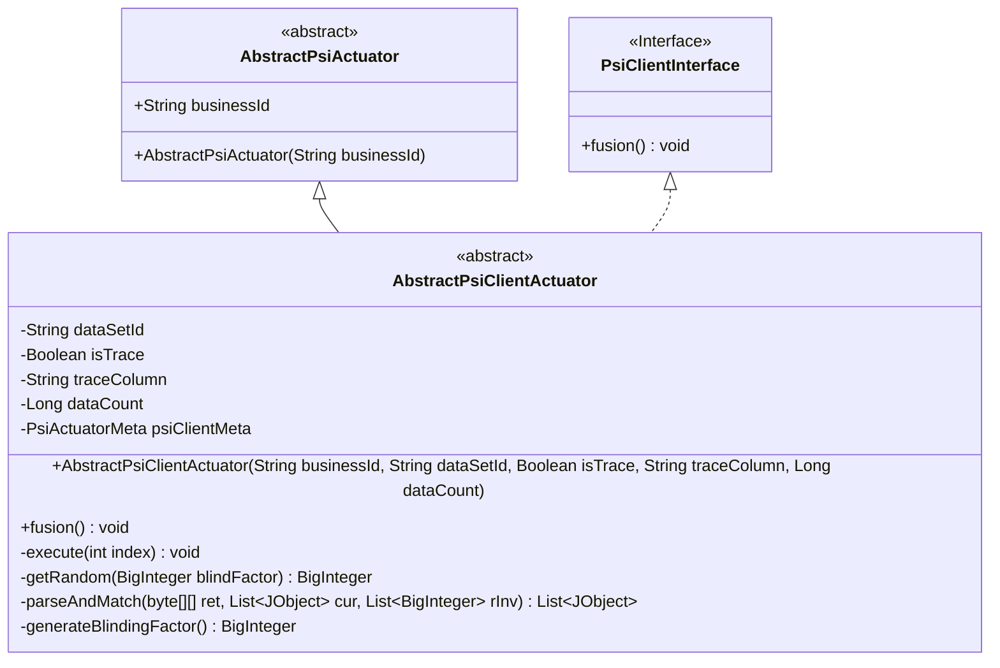
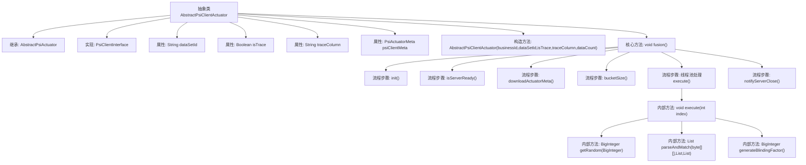
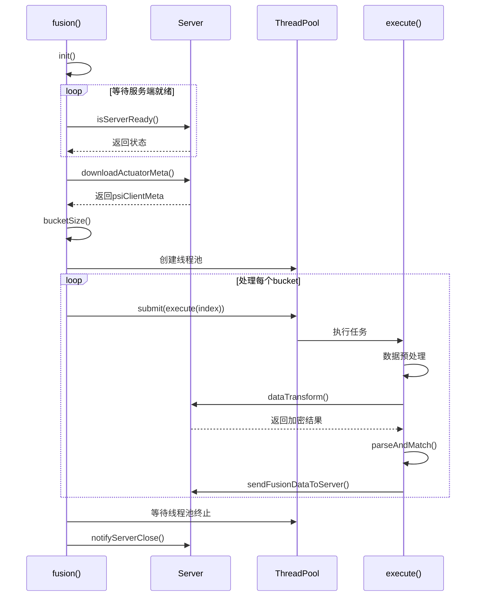

# 基础信息

|      |      |
|------|------|
| 名称 | AbstractPsiClientActuator |
| 编码语言 | .java |
| 代码路径 | WeFe/fusion/fusion-core/src/main/java/com/welab/wefe/fusion/core/actuator/psi/AbstractPsiClientActuator.java |
| 包名 | com.welab.wefe.fusion.core.actuator.psi |
| 依赖项 | ['java.math.BigInteger', 'java.security.SecureRandom', 'java.util.ArrayList', 'java.util.List', 'java.util.concurrent.ExecutorService', 'java.util.concurrent.Executors', 'java.util.concurrent.TimeUnit', 'com.welab.wefe.common.exception.StatusCodeWithException', 'com.welab.wefe.common.util.JObject', 'com.welab.wefe.common.util.ThreadUtil', 'com.welab.wefe.fusion.core.dto.PsiActuatorMeta', 'com.welab.wefe.fusion.core.enums.PSIActuatorStatus', 'com.welab.wefe.fusion.core.utils.PSIUtils'] |
| 概述说明 | 抽象类AbstractPsiClientActuator实现PSI客户端逻辑，包含数据融合、加密处理及匹配功能，使用多线程处理数据桶，支持盲化因子生成与数据转换，最终将匹配结果发送至服务器。 |

# 说明

AbstractPsiClientActuator是一个抽象类，继承自AbstractPsiActuator并实现PsiClientInterface接口。它包含数据集ID、跟踪标志和跟踪列等属性，以及PSI客户端元数据。构造函数初始化业务ID、数据集ID、跟踪标志、跟踪列和数据计数。主要方法fusion负责初始化、等待服务器就绪、下载元数据、并行执行数据处理任务。execute方法处理数据桶，包括数据预处理、转换、匹配和结果发送。parseAndMatch方法解析加密数据并进行匹配，记录内存使用情况。generateBlindingFactor生成盲化因子用于数据加密。整个过程涉及多线程处理、数据转换和匹配，最终将融合数据发送到服务器。

# 类列表 Class Summary

| 名称   | 类型  | 说明 |
|-------|------|-------------|
| AbstractPsiClientActuator | class | 抽象类AbstractPsiClientActuator实现PSI客户端逻辑，包含数据预处理、加密传输、匹配处理和多线程执行功能，用于安全多方计算中的隐私集合求交。 |

## 类 AbstractPsiClientActuator

|      |      |
|------|------|
| 访问范围 | public abstract |
| 类型 | class |
| 名称 | AbstractPsiClientActuator |
| 说明 | 抽象类AbstractPsiClientActuator实现PSI客户端逻辑，包含数据预处理、加密传输、匹配处理和多线程执行功能，用于安全多方计算中的隐私集合求交。 |

### UML类图

类图描述：该图展示了一个抽象类AbstractPsiClientActuator继承自AbstractPsiActuator并实现PsiClientInterface接口的结构。AbstractPsiClientActuator包含私有字段如dataSetId、isTrace等，以及核心方法fusion()用于数据融合处理，内部通过线程池并行执行execute()方法完成数据转换和匹配。类中还定义了多个私有辅助方法如parseAndMatch()用于数据解析匹配，generateBlindingFactor()生成随机因子等，共同实现PSI（私有集合交集）协议客户端功能。

### 内部方法调用关系图

该流程图展示了PSI（隐私保护集合交集）客户端的核心处理逻辑。抽象类AbstractPsiClientActuator通过多线程方式执行隐私计算任务，主要流程包括：初始化参数、等待服务端就绪、下载元数据、创建线程池并行处理数据桶、执行盲化/加密/匹配等隐私计算操作、最后通知服务端关闭。时序图详细描述了fusion()方法与其他组件的交互过程，特别是线程池管理和服务端通信的关键步骤，体现了高性能隐私计算任务的典型处理模式。

### 字段列表 Field List

| 名称  | 类型  | 说明 |
|-------|-------|------|
| psiClientMeta | PsiActuatorMeta | 私有变量psiClientMeta，类型为PsiActuatorMeta。 |
| traceColumn | String | 声明一个受保护的字符串变量traceColumn。 |
| dataSetId | String | 数据集ID字符串保护字段 |
| isTrace | Boolean | 布尔型变量isTrace，用于控制是否启用跟踪功能。 |

### 方法列表

| 名称  | 类型  | 说明 |
|-------|-------|------|
| fusion | void | 方法fusion初始化后等待服务就绪，下载元数据并获取桶大小。使用线程池并行执行任务，完成后更新状态并通知服务关闭。 |
| generateBlindingFactor | BigInteger | 生成随机盲化因子，确保与N互质且非0或1。 |
| execute | void | 方法execute处理数据：获取数据，生成盲因子和随机数，预处理后转换数据格式，匹配结果并发送到服务器。 |
| parseAndMatch | List<JObject> | 解析字节数组并与当前列表匹配，生成新列表。记录内存和处理器信息。返回匹配结果。 |
| getRandom | BigInteger | 生成随机数方法：使用盲因子blindFactor的e次方模n计算，e和n来自psiClientMeta。 |

