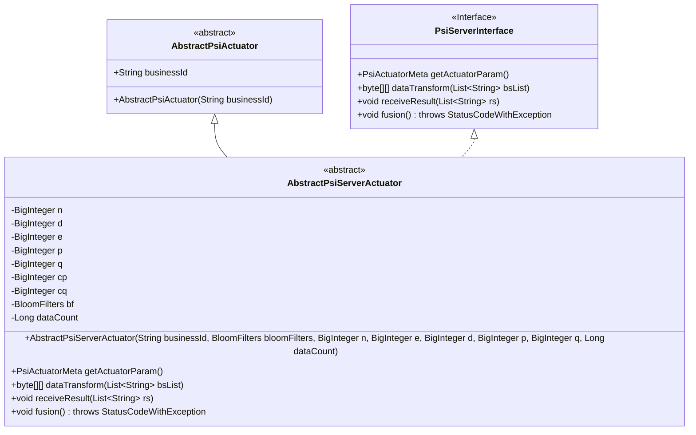
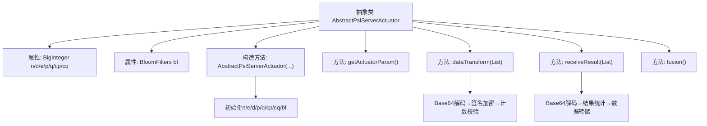

# 基础信息

|      |      |
|------|------|
| 名称 | AbstractPsiServerActuator |
| 编码语言 | .java |
| 代码路径 | WeFe/fusion/fusion-core/src/main/java/com/welab/wefe/fusion/core/actuator/psi/AbstractPsiServerActuator.java |
| 包名 | com.welab.wefe.fusion.core.actuator.psi |
| 依赖项 | ['java.math.BigInteger', 'java.util.ArrayList', 'java.util.List', 'com.welab.wefe.common.exception.StatusCodeWithException', 'com.welab.wefe.common.util.Base64Util', 'com.welab.wefe.common.util.JObject', 'com.welab.wefe.fusion.core.dto.PsiActuatorMeta', 'com.welab.wefe.fusion.core.utils.CryptoUtils', 'com.welab.wefe.fusion.core.utils.bf.BloomFilters'] |
| 概述说明 | 抽象类AbstractPsiServerActuator实现PSI服务端逻辑，包含RSA参数和布隆过滤器，提供数据加密转换和结果接收功能，处理网关重试机制。 |

# 说明

AbstractPsiServerActuator是一个抽象类，继承自AbstractPsiActuator并实现PsiServerInterface接口。该类主要用于PSI（隐私保护集合交集）协议的服务器端操作，包含多个BigInteger类型的加密参数（n,d,e,p,q,cp,cq）和BloomFilters对象。构造函数初始化这些参数并计算cp和cq的值。提供了getActuatorParam方法获取执行器元数据，dataTransform方法对输入数据进行加密转换，并处理重试机制导致的计数问题。receiveResult方法接收并处理结果数据，同样处理计数问题。fusion方法为空实现。整个类涉及加密操作、数据转换和结果处理，用于实现PSI协议的服务端功能。

# 类列表 Class Summary

| 名称   | 类型  | 说明 |
|-------|------|-------------|
| AbstractPsiServerActuator | class | 抽象类AbstractPsiServerActuator实现PSI服务端逻辑，包含RSA加密参数和布隆过滤器，提供数据转换和结果接收功能，处理网关重试机制。 |

## 类 AbstractPsiServerActuator

|      |      |
|------|------|
| 访问范围 | public abstract |
| 类型 | class |
| 名称 | AbstractPsiServerActuator |
| 说明 | 抽象类AbstractPsiServerActuator实现PSI服务端逻辑，包含RSA加密参数和布隆过滤器，提供数据转换和结果接收功能，处理网关重试机制。 |

### UML类图

这段代码展示了一个抽象类`AbstractPsiServerActuator`的类图结构，该类继承自`AbstractPsiActuator`并实现了`PsiServerInterface`接口。主要功能涉及PSI（Private Set Intersection）协议的服务器端实现，包含加密参数管理(n/d/e/p/q等大整数)、数据转换(dataTransform)和结果处理(receiveResult)等核心方法。类中使用了Bloom过滤器进行数据校验，通过Base64和加密工具类处理数据，并包含防重试机制的数据计数保护。该设计体现了密码学运算与业务逻辑的结合，适用于隐私计算场景下的安全多方计算需求。

### 内部方法调用关系图

该流程图展示了PSI服务执行器的核心结构，包含加密参数初始化、数据转换和结果接收三个关键流程。构造方法完成RSA参数和布隆过滤器的初始化，dataTransform方法实现Base64解码和加密签名，receiveResult处理结果数据并统计匹配数量。所有流程都包含防重试机制的数据计数校验，确保在网关重试场景下的数据准确性。

### 字段列表 Field List

| 名称  | 类型  | 说明 |
|-------|-------|------|
| d | BigInteger | 声明了一个受保护的BigInteger类型变量d。 |
| cq | BigInteger | 受保护的大整数变量cq。 |
| e | BigInteger | 受保护的BigInteger类型变量e。 |
| p | BigInteger | 声明一个受保护的BigInteger类型变量p。 |
| bf | BloomFilters | 声明一个受保护的布隆过滤器变量bf。 |
| n | BigInteger | 声明一个受保护的BigInteger类型变量n。 |
| q | BigInteger | 受保护的大整数变量q。 |
| cp | BigInteger | 保护性声明的大整数变量cp。 |

### 方法列表

| 名称  | 类型  | 说明 |
|-------|-------|------|
| getActuatorParam | PsiActuatorMeta | 方法getActuatorParam返回PsiActuatorMeta对象，使用参数e、n、bf构造。 |
| dataTransform | byte[][] | 方法将字符串列表转换为字节数组并进行加密处理，记录处理数量并检查是否超过限制，最后再次加密返回结果。 |
| receiveResult | void | 方法接收结果列表，记录大小并更新计数。若计数超过数据量则重置。将结果解码为JObject后存储。 |
| fusion | void | 方法覆写fusion，可能抛出StatusCodeWithException异常，当前为空实现。 |

