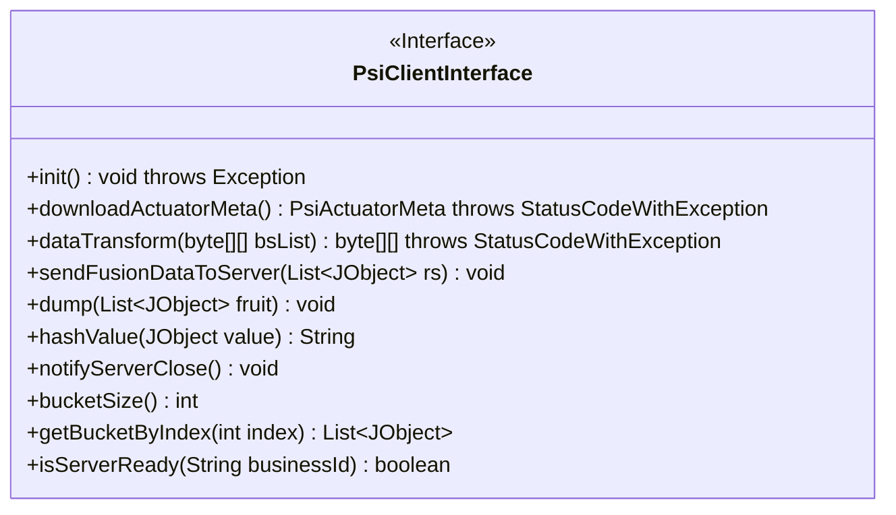
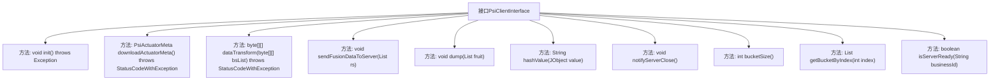

# 基础信息

|      |      |
|------|------|
| 名称 | PsiClientInterface |
| 编码语言 | .java |
| 代码路径 | WeFe/fusion/fusion-core/src/main/java/com/welab/wefe/fusion/core/actuator/psi/PsiClientInterface.java |
| 包名 | com.welab.wefe.fusion.core.actuator.psi |
| 依赖项 | ['com.welab.wefe.common.exception.StatusCodeWithException', 'com.welab.wefe.common.util.JObject', 'com.welab.wefe.fusion.core.dto.PsiActuatorMeta', 'java.util.List'] |
| 概述说明 | PsiClientInterface接口定义了PSI客户端功能，包括初始化、下载元数据、数据转换、发送对齐数据、主键哈希、通知关闭、分页获取数据及服务状态检查。 |

# 说明

该接口定义了PSI（隐私保护集合求交）客户端功能，包含初始化、元数据下载、数据转换、对齐数据传输、数据入库、主键哈希、任务关闭通知、分桶操作及服务状态检查等方法。核心功能涉及RSA-PSI加密转换、布隆过滤器参数获取、分页数据获取及服务协调，适用于隐私计算场景下的安全数据对齐。

# 类列表 Class Summary

| 名称   | 类型  | 说明 |
|-------|------|-------------|
| PsiClientInterface | interface | PsiClientInterface接口定义了PSI（隐私保护集合交集）客户端功能，包括初始化、下载参数、数据转换、数据对齐、主键哈希、通知关闭、分页获取数据及服务状态检查等核心操作。 |

## 类 PsiClientInterface

|      |      |
|------|------|
| 访问范围 | public |
| 类型 | interface |
| 名称 | PsiClientInterface |
| 说明 | PsiClientInterface接口定义了PSI（隐私保护集合交集）客户端功能，包括初始化、下载参数、数据转换、数据对齐、主键哈希、通知关闭、分页获取数据及服务状态检查等核心操作。 |

### UML类图

该图展示了一个名为`PsiClientInterface`的接口，定义了隐私集合求交(PSI)客户端所需的核心功能。接口包含10个方法，主要功能包括：初始化连接、下载元数据、数据转换、数据传输、数据存储、哈希计算、服务状态检查等。方法涉及异常处理(`throws`)、泛型集合(`List~JObject~`)和特定返回值类型，体现了PSI协议实现所需的客户端服务契约。接口标记为`<<Interface>>`，所有方法均为公开抽象方法，符合接口设计规范。

### 内部方法调用关系图

这段流程图展示了PsiClientInterface接口的所有方法定义及其关系。该接口定义了PSI（Private Set Intersection）客户端所需的核心功能，包括初始化、元数据下载、数据转换、数据发送、哈希计算、状态检查等11个方法。每个方法都通过箭头与接口主体连接，清晰地呈现了接口的方法结构。这些方法共同构成了一个完整的PSI客户端协议，用于实现隐私集合求交的安全计算流程。

### 字段列表 Field List

| 名称  | 类型  | 说明 |
|-------|-------|------|

### 方法列表

| 名称  | 类型  | 说明 |
|-------|-------|------|
| dataTransform | byte[][] | 将二维字节数组bsList进行数据转换，可能抛出StatusCodeWithException异常。 |
| sendFusionDataToServer | void | 将JSON对象列表发送到服务器的函数。 |
| getBucketByIndex | List<JObject> | 获取指定索引处的存储桶数据，返回JObject列表。 |
| hashValue | String | 方法hashValue接收JObject参数，返回其哈希值的字符串形式。 |
| dump | void | 函数dump接收一个JObject类型的列表参数fruit，用于处理或输出列表内容。 |
| bucketSize | int | 获取桶的大小。 |
| notifyServerClose | void | 通知服务器关闭 |
| init | void | 初始化方法，可能抛出异常。 |
| downloadActuatorMeta | PsiActuatorMeta | 获取执行器元数据方法，可能抛出状态码异常。 |
| isServerReady | boolean | 检查指定业务ID的服务器是否就绪。 |

