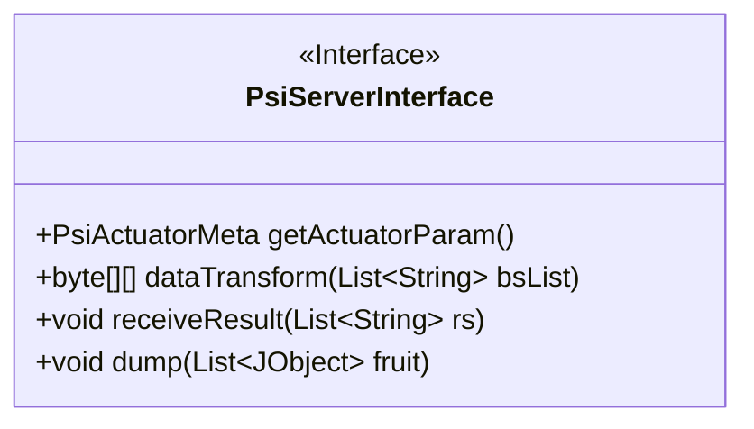
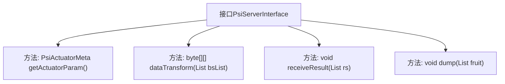

# 基础信息

|      |      |
|------|------|
| 名称 | PsiServerInterface |
| 编码语言 | .java |
| 代码路径 | WeFe/fusion/fusion-core/src/main/java/com/welab/wefe/fusion/core/actuator/psi/PsiServerInterface.java |
| 包名 | com.welab.wefe.fusion.core.actuator.psi |
| 依赖项 | ['com.welab.wefe.common.util.JObject', 'com.welab.wefe.fusion.core.dto.PsiActuatorMeta', 'java.util.List'] |
| 概述说明 | PsiServerInterface接口定义：获取执行参数getActuatorParam，数据转换dataTransform，接收结果receiveResult，数据入库dump。 |

# 说明

该内容定义了一个名为PsiServerInterface的Java接口，包含四个核心方法。getActuatorParam方法返回PsiActuatorMeta类型对象用于获取执行器参数。dataTransform方法接收字符串列表并返回二维字节数组实现数据转换。receiveResult方法用于接收融合结果，参数为字符串列表。dump方法实现数据对齐功能，接收JObject对象列表参数。注释说明各方法用途，包括接收结果和对齐数据的具体操作。

# 类列表 Class Summary

| 名称   | 类型  | 说明 |
|-------|------|-------------|
| PsiServerInterface | interface | PsiServerInterface接口定义：获取执行器参数getActuatorParam，数据转换dataTransform，接收结果receiveResult，数据入库dump。 |

## 类 PsiServerInterface

|      |      |
|------|------|
| 访问范围 | public |
| 类型 | interface |
| 名称 | PsiServerInterface |
| 说明 | PsiServerInterface接口定义：获取执行器参数getActuatorParam，数据转换dataTransform，接收结果receiveResult，数据入库dump。 |

### UML类图

这段类图描述了一个名为PsiServerInterface的接口，该接口定义了四个公共方法：getActuatorParam()用于获取执行器元数据，dataTransform()用于数据转换，receiveResult()用于接收融合结果，dump()用于将对齐数据存入库中。接口使用了泛型参数List来接收不同类型的数据，体现了数据处理和通信的核心功能。

### 内部方法调用关系图

该流程图展示了PsiServerInterface接口的结构，包含四个核心方法：getActuatorParam用于获取执行器元数据，dataTransform处理字符串列表的数据转换，receiveResult接收融合结果，dump实现数据对齐入库功能。所有方法均通过单向箭头与接口主体连接，清晰呈现了接口的契约式设计模式，强调实现类必须遵守的方法规范。

### 字段列表 Field List

| 名称  | 类型  | 说明 |
|-------|-------|------|

### 方法列表

| 名称  | 类型  | 说明 |
|-------|-------|------|
| getActuatorParam | PsiActuatorMeta | 获取执行器参数的方法。 |
| dataTransform | byte[][] | 将字符串列表转换为二维字节数组的函数。 |
| receiveResult | void | 接收字符串列表结果的方法。 |
| dump | void | 函数dump接收一个JObject对象列表参数fruit，用于处理或输出数据。 |

