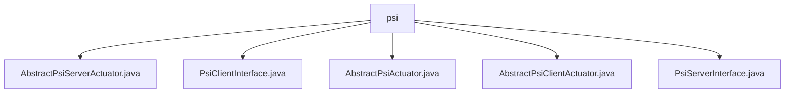

# 基础信息

|      |      |
|------|------|
| 名称 | psi |
| 编码语言 | .java |
| 代码路径 | WeFe/fusion/fusion-core/src/main/java/com/welab/wefe/fusion/core/actuator/psi |
| 包名 | docs.fusion.fusion-core.src.main.java.com.welab.wefe.fusion.core.actuator.psi |
| 概述说明 | AbstractPsiServerActuator是PSI协议服务端抽象类，处理加密参数和数据转换。PsiClientInterface定义客户端功能如数据对齐和加密。AbstractPsiActuator是基础抽象类，管理状态。AbstractPsiClientActuator实现客户端逻辑，处理数据匹配和加密。PsiServerInterface定义服务端方法如数据转换和结果接收。 |

# 说明

## 概述  
该模块实现PSI（隐私保护集合交集）协议的双端逻辑，包含Server和Client抽象基类及接口。核心职责是安全执行加密数据对齐，类似安全两方计算中的盲签名流程。接口规范包括PsiServerInterface的数据转换/结果接收方法，以及PsiClientInterface的元数据下载/分桶操作等。关键数据结构涉及BigInteger加密参数(n,d,e等)、BloomFilters和PsiActuatorMeta。外部依赖包括JObject序列化框架和RSA-PSI加密算法。例如Server端通过dataTransform方法处理加密转换，Client端用generateBlindingFactor生成盲化因子。

## 主要业务场景  
典型流程为Client初始化→下载元数据→分桶加密→Server转换匹配→结果回传。采用多线程分页处理模式，类似MapReduce的分布式计算。完整功能涵盖数据预处理（如parseAndMatch）、加密转换（如RSA-PSI）、状态协调（通过volatile status字段）和结果持久化。API集成案例包括Client端execute方法处理数据桶，Server端receiveResult接收对齐结果。例如Client通过fusion方法协调整个PSI流程，涉及元数据获取和并行任务派发。

### 包内部结构视图

该流程图展示了PSI执行器模块的类结构关系，所有类文件都位于psi目录下。包含5个关键类文件：2个抽象基类(AbstractPsiServerActuator和AbstractPsiClientActuator)、1个公共抽象类(AbstractPsiActuator)以及2个接口文件(PsiClientInterface和PsiServerInterface)，这些类共同构成了PSI功能的核心实现框架。

# 文件列表

| 名称   | 类型  | 说明 |
|-------|------|-------------|
| [AbstractPsiServerActuator.java](AbstractPsiServerActuator.md) | file | 抽象类AbstractPsiServerActuator实现PSI服务端逻辑，包含RSA参数和布隆过滤器，提供数据加密转换和结果接收功能，处理网关重试机制。 |
| [PsiClientInterface.java](PsiClientInterface.md) | file | PsiClientInterface接口定义了PSI客户端功能，包括初始化、下载元数据、数据转换、发送对齐数据、主键哈希、通知关闭、分页获取数据及服务状态检查。 |
| [AbstractPsiActuator.java](AbstractPsiActuator.md) | file | 抽象类AbstractPsiActuator继承AbstractActuator，包含状态变量status和检查是否完成的isFinish方法。 |
| [AbstractPsiClientActuator.java](AbstractPsiClientActuator.md) | file | 抽象类AbstractPsiClientActuator实现PSI客户端逻辑，包含数据融合、加密处理及匹配功能，使用多线程处理数据桶，支持盲化因子生成与数据转换，最终将匹配结果发送至服务器。 |
| [PsiServerInterface.java](PsiServerInterface.md) | file | PsiServerInterface接口定义：获取执行参数getActuatorParam，数据转换dataTransform，接收结果receiveResult，数据入库dump。 |

