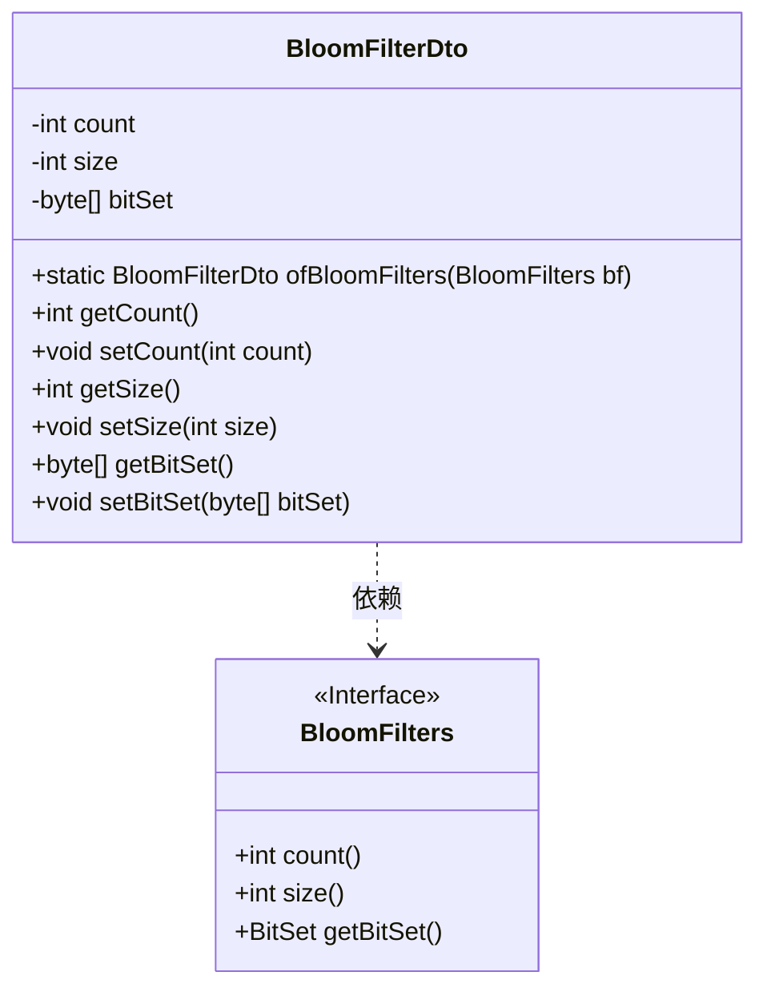
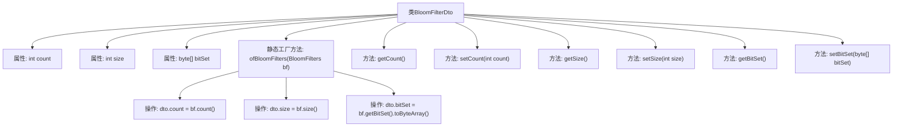

# 基础信息

|      |      |
|------|------|
| 名称 | BloomFilterDto |
| 编码语言 | .java |
| 代码路径 | WeFe/fusion/fusion-core/src/main/java/com/welab/wefe/fusion/core/dto/BloomFilterDto.java |
| 包名 | com.welab.wefe.fusion.core.dto |
| 依赖项 | ['com.welab.wefe.fusion.core.utils.bf.BloomFilters'] |
| 概述说明 | BloomFilterDto类封装布隆过滤器数据，包含计数、大小和位集字节数组，提供转换和访问方法。 |

# 说明

BloomFilterDto是一个数据传输对象类，用于封装布隆过滤器的相关数据。该类包含三个主要属性：count表示元素数量，size表示过滤器大小，bitSet是存储位集的字节数组。提供了静态方法ofBloomFilters，用于从BloomFilters对象创建DTO实例。同时为每个属性提供了对应的getter和setter方法，以便访问和修改这些属性值。

# 类列表 Class Summary

| 名称   | 类型  | 说明 |
|-------|------|-------------|
| BloomFilterDto | class | BloomFilterDto类封装布隆过滤器数据，包含元素数量、位集大小和位集字节数组，提供转换和访问方法。 |

## 类 BloomFilterDto

|      |      |
|------|------|
| 访问范围 | public |
| 类型 | class |
| 名称 | BloomFilterDto |
| 说明 | BloomFilterDto类封装布隆过滤器数据，包含元素数量、位集大小和位集字节数组，提供转换和访问方法。 |

### UML类图

这段代码展示了一个数据传输对象BloomFilterDto，用于封装布隆过滤器的状态数据（元素数量、位数组大小和位集字节数组）。它通过静态工厂方法ofBloomFilters从BloomFilters接口实例转换数据，提供标准的getter/setter方法。类图清晰地反映了DTO与BloomFilters接口的依赖关系，以及各自的数据结构和操作。

### 内部方法调用关系图

该流程图展示了BloomFilterDto类的结构和关键方法。类包含三个私有属性(count/size/bitSet)和对应的getter/setter方法，核心是通过静态工厂方法ofBloomFilters将BloomFilters对象转换为DTO对象。转换过程包含三个关键操作：获取源对象的count值、size值以及将bitSet转换为字节数组，完整呈现了数据转换的数据流和类成员关系。

### 字段列表 Field List

| 名称  | 类型  | 说明 |
|-------|-------|------|
| count | int | 私有整型变量count。 |
| size | int | 私有整型变量size |
| bitSet | byte[] | 私有字节数组bitSet，用于存储位集合数据。 |

### 方法列表

| 名称  | 类型  | 说明 |
|-------|-------|------|
| getCount | int | 获取计数值的方法，返回整型变量count。 |
| setCount | void | 设置count属性的方法，将参数count赋值给类的count成员变量。 |
| ofBloomFilters | BloomFilterDto | 将BloomFilters对象转换为BloomFilterDto对象，包含count、size和bitSet属性。 |
| getSize | int | 获取对象大小的方法，返回整型变量size的值。 |
| setSize | void | 这是一个Java方法，用于设置对象的size属性，接受一个整数参数size并将其赋值给对象的成员变量size。 |
| setBitSet | void | 设置位集数组的方法，将输入字节数组赋值给类的bitSet成员变量。 |
| getBitSet | byte[] | 该方法返回一个字节数组bitSet，无参数，直接返回成员变量bitSet的值。 |

