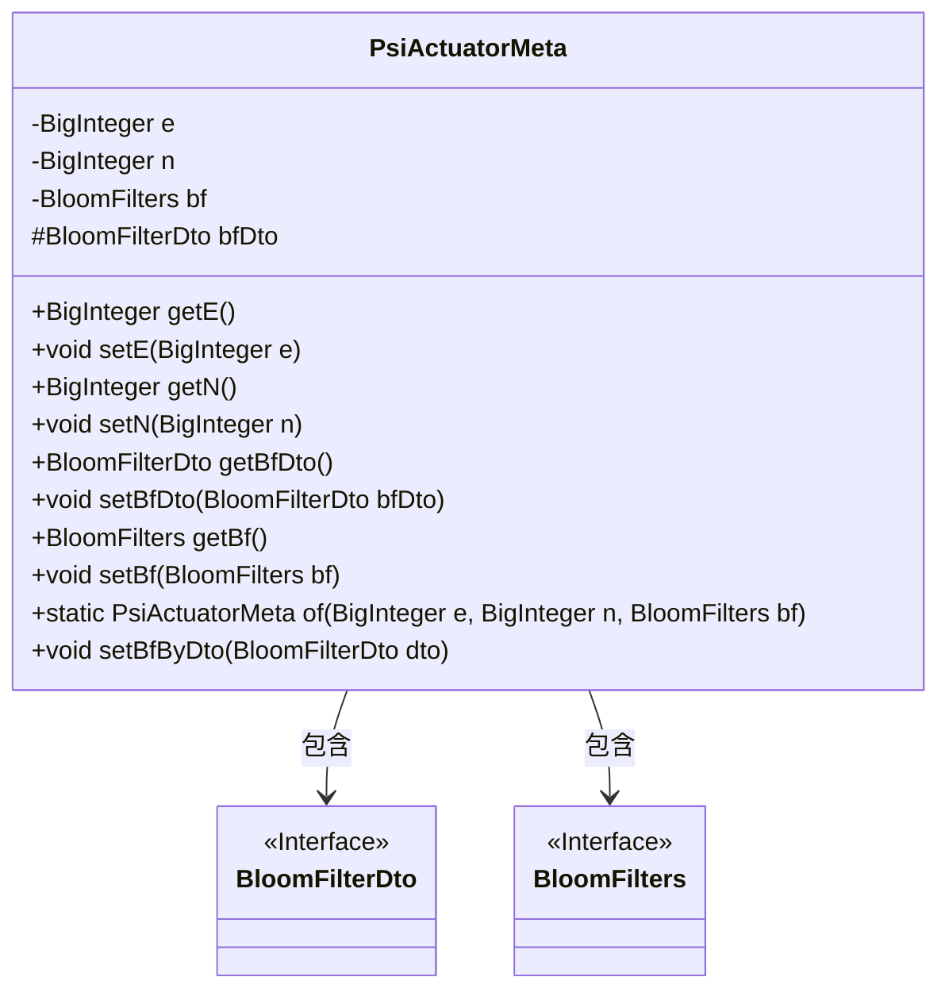
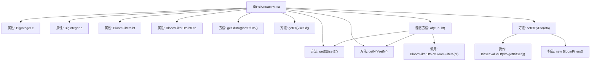

# 基础信息

|      |      |
|------|------|
| 名称 | PsiActuatorMeta |
| 编码语言 | .java |
| 代码路径 | WeFe/fusion/fusion-core/src/main/java/com/welab/wefe/fusion/core/dto/PsiActuatorMeta.java |
| 包名 | com.welab.wefe.fusion.core.dto |
| 依赖项 | ['com.welab.wefe.fusion.core.utils.bf.BloomFilters', 'java.math.BigInteger', 'java.util.BitSet'] |
| 概述说明 | PsiActuatorMeta类包含BigInteger类型变量e和n，BloomFilters类型变量bf及BloomFilterDto类型变量bfDto，提供getter/setter方法，支持通过of方法创建实例，并可通过setBfByDto方法设置bf。 |

# 说明

PsiActuatorMeta类封装了PSI执行器的元数据，包含两个BigInteger类型属性e和n，以及BloomFilters对象bf和BloomFilterDto对象bfDto。提供getter和setter方法操作这些属性。静态方法of用于创建实例并初始化bfDto、e和n。setBfByDto方法通过BloomFilterDto对象设置bf属性，基于dto的bitSet、size和count参数构建新的BloomFilters实例。

# 类列表 Class Summary

| 名称   | 类型  | 说明 |
|-------|------|-------------|
| PsiActuatorMeta | class | PsiActuatorMeta类包含BigInteger类型e和n，BloomFilters类型bf及BloomFilterDto类型bfDto，提供getter/setter方法，支持通过of方法创建实例，并可通过setBfByDto方法设置bf。 |

## 类 PsiActuatorMeta

|      |      |
|------|------|
| 访问范围 | public |
| 类型 | class |
| 名称 | PsiActuatorMeta |
| 说明 | PsiActuatorMeta类包含BigInteger类型e和n，BloomFilters类型bf及BloomFilterDto类型bfDto，提供getter/setter方法，支持通过of方法创建实例，并可通过setBfByDto方法设置bf。 |

### UML类图

这段类图展示了PsiActuatorMeta类的结构，该类包含两个BigInteger类型的私有属性e和n，一个BloomFilters类型的私有属性bf，以及一个受保护的BloomFilterDto类型属性bfDto。类中提供了这些属性的getter和setter方法，以及两个关键方法：静态工厂方法of用于创建实例，setBfByDto用于通过BloomFilterDto设置bf属性。PsiActuatorMeta与BloomFilterDto和BloomFilters之间存在依赖关系，表明它使用了这两个接口的功能。

### 内部方法调用关系图

这段代码描述了一个名为PsiActuatorMeta的类，主要用于管理PSI（Private Set Intersection）执行器的元数据。类包含四个私有属性：两个大整数e和n、一个布隆过滤器对象bf以及其数据传输对象bfDto。提供了标准的getter/setter方法，核心功能是通过静态工厂方法of()创建实例并初始化数据，以及通过setBfByDto()方法从DTO重建布隆过滤器。流程图清晰展示了类结构、方法调用关系和关键数据转换过程，特别是布隆过滤器与DTO之间的双向转换逻辑。

### 字段列表 Field List

| 名称  | 类型  | 说明 |
|-------|-------|------|
| e | BigInteger | 私有的大整数变量e。 |
| n | BigInteger | 声明一个私有的大整数变量n。 |
| bfDto | BloomFilterDto | 保护类型的布隆过滤器数据传输对象实例。 |
| bf | BloomFilters | 声明了一个私有BloomFilters类型变量bf。 |

### 方法列表

| 名称  | 类型  | 说明 |
|-------|-------|------|
| setE | void | 设置公钥指数e的值。 |
| setN | void | 设置BigInteger类型变量n的值。 |
| setBf | void | 方法setBf用于设置BloomFilters对象到当前实例的bf属性。 |
| setBfByDto | void | 方法setBfByDto接收BloomFilterDto对象，从中提取bitSet、size和count参数，创建新的BloomFilters实例并赋值给bf。 |
| getBf | BloomFilters | 获取BloomFilters对象的方法，返回成员变量bf。 |
| getN | BigInteger | 方法getN返回BigInteger类型的变量n。 |
| of | PsiActuatorMeta | 静态方法of接收大整数e、n和布隆过滤器bf，创建PsiActuatorMeta对象并设置其属性后返回。 |
| getE | BigInteger | 方法getE返回BigInteger类型的私有变量e的值。 |
| setBfDto | void | 设置布隆过滤器数据传输对象。 |
| getBfDto | BloomFilterDto | 获取BloomFilterDto对象的方法，返回成员变量bfDto。 |

