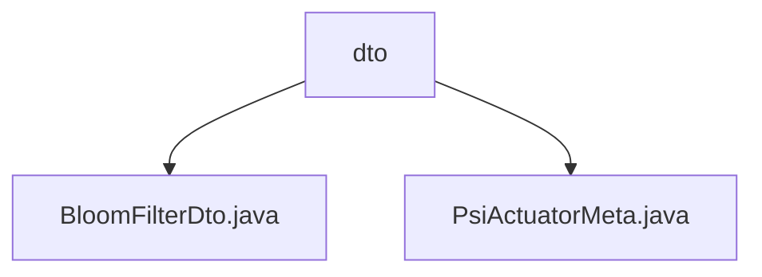

# 基础信息

|      |      |
|------|------|
| 名称 | dto |
| 编码语言 | .java |
| 代码路径 | WeFe/fusion/fusion-core/src/main/java/com/welab/wefe/fusion/core/dto |
| 包名 | docs.fusion.fusion-core.src.main.java.com.welab.wefe.fusion.core.dto |
| 概述说明 | BloomFilterDto类封装布隆过滤器数据，含count、size、bitSet属性及操作方法。PsiActuatorMeta类包含e、n、bf、bfDto属性，提供初始化和设置方法。 |

# 说明

## 概述  
该模块核心职责是封装布隆过滤器数据结构及其执行器元数据，实现PSI（Private Set Intersection）协议中关键组件的序列化传输。接口规范统一采用DTO模式，提供静态工厂方法（例如`ofBloomFilters`和`of`）和标准getter/setter。关键数据结构包括BloomFilterDto（含bitSet字节数组、size和count）和PsiActuatorMeta（含e/n参数及BloomFilters实例）。外部依赖仅涉及Java基础库和BigInteger数学运算。例如通过BloomFilterDto的bitSet重建BloomFilters实例。

## 主要业务场景  
模块支撑PSI协议中布隆过滤器的跨节点传输与元数据装配，类似配置中心模式。典型流程为：1) 通过DTO传输位集数据；2) 使用PsiActuatorMeta组装加密参数（如RSA的e/n）和过滤器实例。例如setBfByDto方法实现DTO到BloomFilters的逆向构造。交互模式统一采用Builder风格，API类型均为纯数据容器，集成案例包括过滤器状态快照和加密执行器初始化。

### 包内部结构视图

该流程图展示了fusion-core项目中dto目录下的两个Java文件结构。顶层节点为dto目录，包含BloomFilterDto.java和PsiActuatorMeta.java两个数据转换对象类文件，体现了核心数据传输对象在项目中的简单层级关系。

# 文件列表

| 名称   | 类型  | 说明 |
|-------|------|-------------|
| [BloomFilterDto.java](BloomFilterDto.md) | file | BloomFilterDto类封装布隆过滤器数据，包含计数、大小和位集字节数组，提供转换和访问方法。 |
| [PsiActuatorMeta.java](PsiActuatorMeta.md) | file | PsiActuatorMeta类包含BigInteger类型变量e和n，BloomFilters类型变量bf及BloomFilterDto类型变量bfDto，提供getter/setter方法，支持通过of方法创建实例，并可通过setBfByDto方法设置bf。 |

