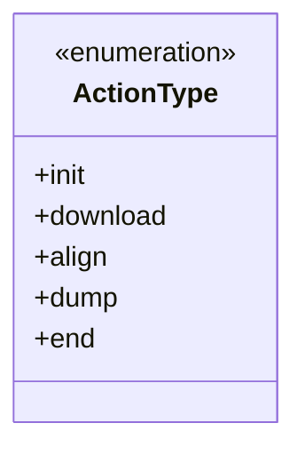
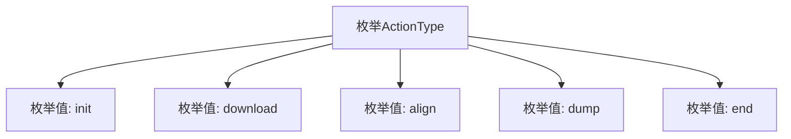

# 基础信息

|      |      |
|------|------|
| 名称 | ActionType |
| 编码语言 | .java |
| 代码路径 | WeFe/fusion/fusion-core/src/main/java/com/welab/wefe/fusion/core/enums/ActionType.java |
| 包名 | com.welab.wefe.fusion.core.enums |
| 依赖项 | [] |
| 概述说明 | 这是一个枚举类型ActionType，定义了五种动作：初始化、下载、对齐、转储和结束。 |

# 说明

该内容定义了一个名为ActionType的公共枚举类型，包含五个枚举值：init表示初始化操作，download表示下载操作，align表示对齐操作，dump表示转储操作，end表示结束操作。每个枚举值代表一种特定的动作类型，可用于程序中的状态标识或流程控制。

# 类列表 Class Summary

| 名称   | 类型  | 说明 |
|-------|------|-------------|
| ActionType | enum | ActionType枚举定义了五种操作类型：初始化、下载、对齐、转储和结束。 |

## 类 ActionType

|      |      |
|------|------|
| 访问范围 | public |
| 类型 | enum |
| 名称 | ActionType |
| 说明 | ActionType枚举定义了五种操作类型：初始化、下载、对齐、转储和结束。 |

### UML类图

该代码定义了一个名为ActionType的枚举类型，包含五个固定常量：init、download、align、dump和end。枚举用于表示一组有限的预定义值，常用于状态机或流程控制场景。此枚举可能用于标识数据处理流程中的不同阶段，如初始化(init)、数据下载(download)、数据对齐(align)、结果导出(dump)和流程结束(end)。枚举成员均为公有静态常量，通过ActionType.XXX方式直接访问。

### 内部方法调用关系图

该流程图展示了ActionType枚举的结构，包含五个枚举值：init、download、align、dump和end。每个枚举值都是ActionType的直接实例，用于表示不同的操作类型。这种枚举设计常用于状态机或工作流系统中，通过预定义的常量来确保类型安全并避免魔法字符串的使用。

### 字段列表 Field List

| 名称  | 类型  | 说明 |
|-------|-------|------|

### 方法列表

| 名称  | 类型  | 说明 |
|-------|-------|------|

