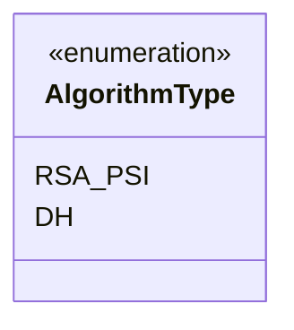
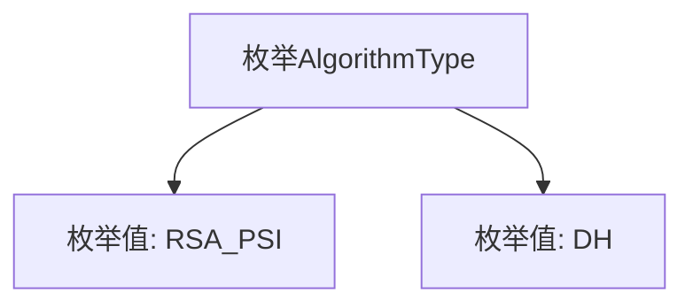

# 基础信息

|      |      |
|------|------|
| 名称 | AlgorithmType |
| 编码语言 | .java |
| 代码路径 | WeFe/fusion/fusion-core/src/main/java/com/welab/wefe/fusion/core/enums/AlgorithmType.java |
| 包名 | com.welab.wefe.fusion.core.enums |
| 依赖项 | [] |
| 概述说明 | 算法类型枚举包含两种：RSA_PSI和DH。 |

# 说明

该内容定义了一个名为AlgorithmType的公共枚举类型，包含两个枚举值：RSA_PSI和DH。这表示算法类型可选的两种具体实现方式，RSA_PSI可能指基于RSA加密的隐私保护交集算法，DH可能指Diffie-Hellman密钥交换算法。枚举类型常用于限定变量的可选范围，此处明确规定了算法类型的两种选择方案。

# 类列表 Class Summary

| 名称   | 类型  | 说明 |
|-------|------|-------------|
| AlgorithmType | enum | 定义了一个枚举类型AlgorithmType，包含两种算法：RSA_PSI和DH。 |

## 类 AlgorithmType

|      |      |
|------|------|
| 访问范围 | public |
| 类型 | enum |
| 名称 | AlgorithmType |
| 说明 | 定义了一个枚举类型AlgorithmType，包含两种算法：RSA_PSI和DH。 |

### UML类图

这段代码定义了一个名为AlgorithmType的枚举类型，包含两个枚举常量RSA_PSI和DH。枚举类型用于表示一组固定的常量值，这里可能用于标识不同的算法类型，如RSA-based Private Set Intersection（RSA_PSI）和Diffie-Hellman（DH）。枚举类型在类图中用<<enumeration>>标记，清晰地展示了其有限的、预定义的实例集合。

### 内部方法调用关系图

这段代码定义了一个名为AlgorithmType的枚举类型，包含两个枚举值RSA_PSI和DH。流程图展示了枚举类型与其常量值之间的层级关系，其中AlgorithmType作为父节点，RSA_PSI和DH作为其直接子节点。这种结构常用于表示固定集合的算法类型或模式选择，每个枚举值代表一种特定的算法实现方式。

### 字段列表 Field List

| 名称  | 类型  | 说明 |
|-------|-------|------|

### 方法列表

| 名称  | 类型  | 说明 |
|-------|-------|------|

