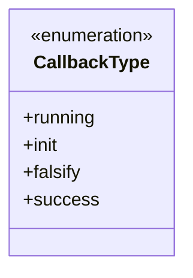
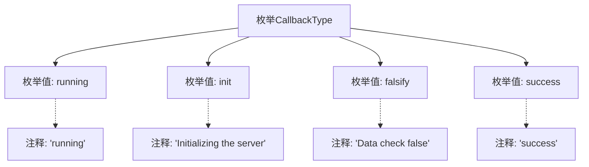

# 基础信息

|      |      |
|------|------|
| 名称 | CallbackType |
| 编码语言 | .java |
| 代码路径 | WeFe/fusion/fusion-core/src/main/java/com/welab/wefe/fusion/core/enums/CallbackType.java |
| 包名 | com.welab.wefe.fusion.core.enums |
| 依赖项 | [] |
| 概述说明 | 枚举CallbackType定义四种回调类型：运行中、初始化服务器、数据检查失败、成功。 |

# 说明

该枚举定义了四种回调类型：running表示运行中，init表示服务器初始化阶段，falsify表示数据检查未通过，success表示操作成功完成。每种类型都通过注释说明了其具体含义。

# 类列表 Class Summary

| 名称   | 类型  | 说明 |
|-------|------|-------------|
| CallbackType | enum | CallbackType枚举定义四种状态：运行中、初始化服务器、数据校验失败、成功。 |

## 类 CallbackType

|      |      |
|------|------|
| 访问范围 | public |
| 类型 | enum |
| 名称 | CallbackType |
| 说明 | CallbackType枚举定义四种状态：运行中、初始化服务器、数据校验失败、成功。 |

### UML类图

该代码定义了一个名为CallbackType的枚举类型，包含四个枚举常量：running（运行中）、init（初始化服务器）、falsify（数据校验失败）和success（成功）。枚举用于表示程序执行过程中的不同回调状态，每个状态都有明确的语义注释说明其用途。这种设计常用于状态机或异步操作的状态跟踪场景。

### 内部方法调用关系图

该流程图展示了CallbackType枚举的结构，包含四个枚举值：running（运行中）、init（服务器初始化）、falsify（数据校验失败）和success（成功）。每个枚举值都关联了对应的注释说明，清晰地描述了各个状态的具体含义。这种设计常用于表示异步操作的不同回调状态，便于在代码中通过枚举值明确区分和处理不同阶段的业务逻辑。

### 字段列表 Field List

| 名称  | 类型  | 说明 |
|-------|-------|------|

### 方法列表

| 名称  | 类型  | 说明 |
|-------|-------|------|

