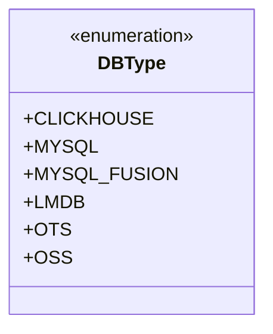
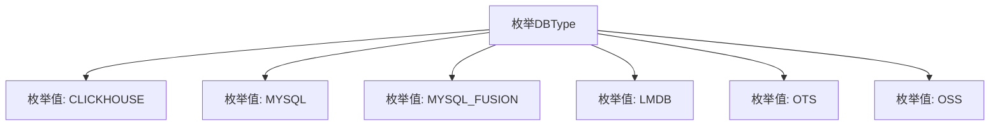

# 基础信息

|      |      |
|------|------|
| 名称 | DBType |
| 编码语言 | .java |
| 代码路径 | WeFe/fusion/fusion-core/src/main/java/com/welab/wefe/fusion/core/enums/DBType.java |
| 包名 | com.welab.wefe.fusion.core.enums |
| 依赖项 | [] |
| 概述说明 | DBType枚举定义了六种数据库类型：CLICKHOUSE、MYSQL、MYSQL_FUSION、LMDB、OTS和OSS。 |

# 说明

该代码定义了一个名为DBType的公共枚举类型，包含六个枚举常量：CLICKHOUSE、MYSQL、MYSQL_FUSION、LMDB、OTS和OSS，分别代表不同类型的数据库系统。

# 类列表 Class Summary

| 名称   | 类型  | 说明 |
|-------|------|-------------|
| DBType | enum | DBType枚举定义了六种数据库类型：CLICKHOUSE、MYSQL、MYSQL_FUSION、LMDB、OTS和OSS。 |

## 类 DBType

|      |      |
|------|------|
| 访问范围 | public |
| 类型 | enum |
| 名称 | DBType |
| 说明 | DBType枚举定义了六种数据库类型：CLICKHOUSE、MYSQL、MYSQL_FUSION、LMDB、OTS和OSS。 |

### UML类图

这段代码定义了一个名为DBType的枚举类型，用于表示不同类型的数据库系统。枚举包含六个常量值：CLICKHOUSE、MYSQL、MYSQL_FUSION、LMDB、OTS和OSS，分别对应不同的数据库技术。这种设计常用于需要明确限定数据库类型选择的场景，如数据库连接配置或多数据库兼容的系统架构中。枚举类型的使用确保了类型安全，避免了无效的数据库类型被传入系统。

### 内部方法调用关系图

该流程图展示了DBType枚举类的结构，包含6个预定义的数据库类型常量：CLICKHOUSE、MYSQL、MYSQL_FUSION、LMDB、OTS和OSS。每个枚举值通过独立节点表示，并与父节点DBType建立关联关系，清晰地呈现了该枚举类的完整成员集合。这种设计通常用于统一管理不同类型的数据库标识符，便于在代码中进行类型安全的比较和使用。

### 字段列表 Field List

| 名称  | 类型  | 说明 |
|-------|-------|------|

### 方法列表

| 名称  | 类型  | 说明 |
|-------|-------|------|

