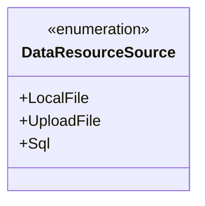
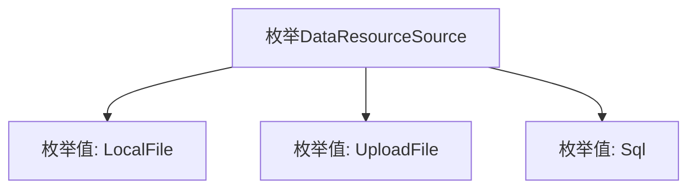

# 基础信息

|      |      |
|------|------|
| 名称 | DataResourceSource |
| 编码语言 | .java |
| 代码路径 | WeFe/fusion/fusion-core/src/main/java/com/welab/wefe/fusion/core/enums/DataResourceSource.java |
| 包名 | com.welab.wefe.fusion.core.enums |
| 依赖项 | [] |
| 概述说明 | 数据资源来源枚举：本地文件、上传文件、SQL数据库。 |

# 说明

这是一个名为DataResourceSource的枚举类型，定义了三种数据资源来源：LocalFile表示本地文件，UploadFile表示上传文件，Sql表示数据库。枚举类型用于表示一组固定的常量值，这里明确区分了三种不同的数据来源方式。

# 类列表 Class Summary

| 名称   | 类型  | 说明 |
|-------|------|-------------|
| DataResourceSource | enum | DataResourceSource枚举定义了三种数据来源：本地文件、上传文件和SQL数据库。 |

## 类 DataResourceSource

|      |      |
|------|------|
| 访问范围 | public |
| 类型 | enum |
| 名称 | DataResourceSource |
| 说明 | DataResourceSource枚举定义了三种数据来源：本地文件、上传文件和SQL数据库。 |

### UML类图

该代码定义了一个名为DataResourceSource的枚举类型，包含三个枚举常量：LocalFile、UploadFile和Sql。枚举类型用于表示一组固定的常量值，常用于定义有限且明确的选项集合。在此例中，DataResourceSource可能用于标识数据来源的不同类型，如本地文件、上传文件或SQL数据库。枚举类型在类图中用<<enumeration>>标记，其常量值以公有成员形式列出。

### 内部方法调用关系图

该流程图展示了DataResourceSource枚举的结构，包含三个枚举值：LocalFile、UploadFile和Sql。枚举作为一种特殊的数据类型，用于定义一组固定的常量，此处表示数据资源的三种来源方式。每个枚举值都是该类型的实例，可直接通过枚举类名访问，常用于替代魔法数字或字符串常量，提高代码可读性和类型安全性。

### 字段列表 Field List

| 名称  | 类型  | 说明 |
|-------|-------|------|

### 方法列表

| 名称  | 类型  | 说明 |
|-------|-------|------|

