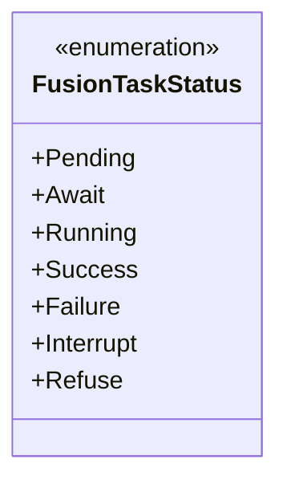
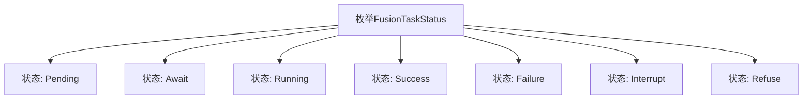

# 基础信息

|      |      |
|------|------|
| 名称 | FusionTaskStatus |
| 编码语言 | .java |
| 代码路径 | WeFe/fusion/fusion-core/src/main/java/com/welab/wefe/fusion/core/enums/FusionTaskStatus.java |
| 包名 | com.welab.wefe.fusion.core.enums |
| 依赖项 | [] |
| 概述说明 | FusionTaskStatus枚举定义了任务状态：Pending待处理、Await等待、Running进行中、Success成功、Failure失败、Interrupt中断、Refuse拒绝。 |

# 说明

该枚举类型定义了任务状态的可能值，包括待处理、等待、运行中、成功、失败、中断和拒绝。注释说明了各状态的含义：待处理表示对齐前，等待表示挂起或待对齐，运行中表示准备或进行中，成功、失败和中断表示对齐完成的不同结果。拒绝状态未在注释中说明。

# 类列表 Class Summary

| 名称   | 类型  | 说明 |
|-------|------|-------------|
| FusionTaskStatus | enum | FusionTaskStatus枚举定义了任务状态：Pending待处理、Await等待、Running进行中、Success成功、Failure失败、Interrupt中断、Refuse拒绝。 |

## 类 FusionTaskStatus

|      |      |
|------|------|
| 访问范围 | public |
| 类型 | enum |
| 名称 | FusionTaskStatus |
| 说明 | FusionTaskStatus枚举定义了任务状态：Pending待处理、Await等待、Running进行中、Success成功、Failure失败、Interrupt中断、Refuse拒绝。 |

### UML类图

该代码定义了一个名为`FusionTaskStatus`的枚举类型，用于表示任务的不同状态。枚举包含7个常量值：`Pending`（待处理）、`Await`（等待中）、`Running`（运行中）、`Success`（成功）、`Failure`（失败）、`Interrupt`（中断）和`Refuse`（拒绝）。每个常量对应任务生命周期中的一个特定阶段，从初始等待状态到最终完成或异常状态。枚举类型通过预定义常量集提供了类型安全的任务状态管理机制。

### 内部方法调用关系图

该流程图展示了FusionTaskStatus枚举的所有可能状态。枚举定义了任务生命周期的7个阶段：Pending（待处理）、Await（等待中）、Running（运行中）、Success（成功）、Failure（失败）、Interrupt（中断）和Refuse（拒绝）。每个状态通过箭头与枚举主体连接，清晰地呈现了状态机的完整结构。这种设计常用于需要明确跟踪任务进展状态的系统，如分布式计算或工作流引擎。

### 字段列表 Field List

| 名称  | 类型  | 说明 |
|-------|-------|------|

### 方法列表

| 名称  | 类型  | 说明 |
|-------|-------|------|

