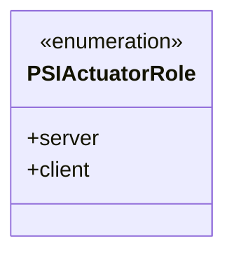
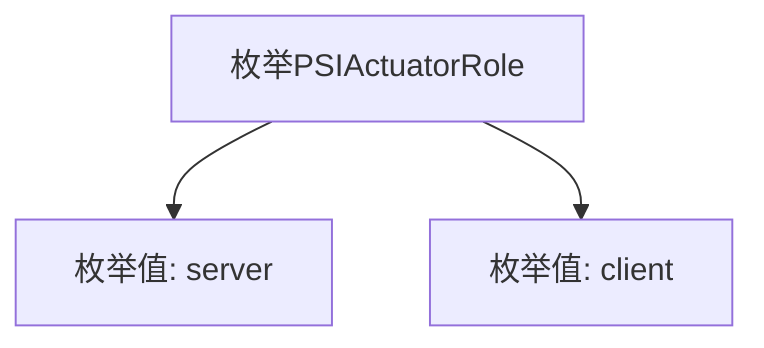

# 基础信息

|      |      |
|------|------|
| 名称 | PSIActuatorRole |
| 编码语言 | .java |
| 代码路径 | WeFe/fusion/fusion-core/src/main/java/com/welab/wefe/fusion/core/enums/PSIActuatorRole.java |
| 包名 | com.welab.wefe.fusion.core.enums |
| 依赖项 | [] |
| 概述说明 | PSIActuatorRole枚举定义了两个角色：server和client。 |

# 说明

该内容定义了一个名为PSIActuatorRole的公共枚举类型，包含两个枚举值：server和client。枚举用于表示执行器的角色，server代表服务器端角色，client代表客户端角色。这种设计常用于区分系统中不同组件的功能定位或通信模式。

# 类列表 Class Summary

| 名称   | 类型  | 说明 |
|-------|------|-------------|
| PSIActuatorRole | enum | PSIActuatorRole枚举定义两种角色：server和client。 |

## 类 PSIActuatorRole

|      |      |
|------|------|
| 访问范围 | public |
| 类型 | enum |
| 名称 | PSIActuatorRole |
| 说明 | PSIActuatorRole枚举定义两种角色：server和client。 |

### UML类图

这段类图描述了一个名为PSIActuatorRole的枚举类型，包含两个枚举常量：server和client。枚举类型在类图中用<<enumeration>>标记，表示这是一个有限的预定义值集合。该枚举可能用于表示PSI（Private Set Intersection）协议中执行器的角色类型，server代表服务端角色，client代表客户端角色。这种设计常用于明确区分系统中不同组件的职责和行为模式。

### 内部方法调用关系图

这段代码定义了一个名为PSIActuatorRole的枚举类型，包含两个枚举值：server和client。流程图清晰地展示了枚举类型与其值之间的层级关系，server和client作为PSIActuatorRole的直接成员存在。这种结构常用于表示固定集合的角色或状态，例如在网络通信中区分服务端和客户端角色。

### 字段列表 Field List

| 名称  | 类型  | 说明 |
|-------|-------|------|

### 方法列表

| 名称  | 类型  | 说明 |
|-------|-------|------|

