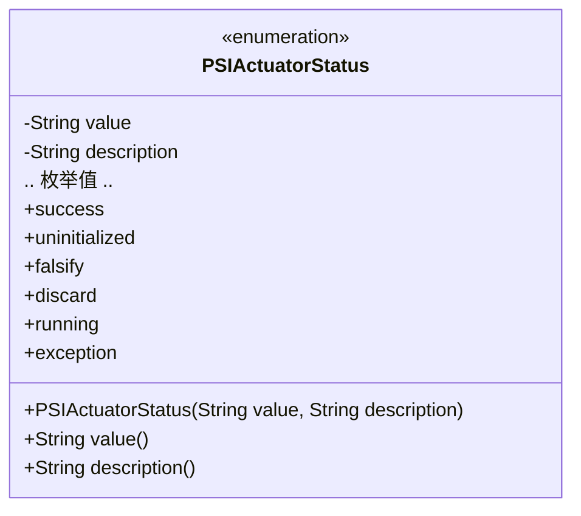
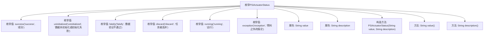

# 基础信息

|      |      |
|------|------|
| 名称 | PSIActuatorStatus |
| 编码语言 | .java |
| 代码路径 | WeFe/fusion/fusion-core/src/main/java/com/welab/wefe/fusion/core/enums/PSIActuatorStatus.java |
| 包名 | com.welab.wefe.fusion.core.enums |
| 依赖项 | [] |
| 概述说明 | 枚举PSIActuatorStatus定义了执行器状态，包含成功、未初始化、验证失败、丢弃、运行中及异常6种状态，每种状态有值和描述。 |

# 说明

这是一个枚举类型PSIActuatorStatus，定义了六种执行器状态及其描述。包含成功、未初始化、验证失败、任务丢弃、运行中和异常六种状态。每种状态都有对应的英文值和中文描述。枚举类提供了获取值和描述的方法。该枚举用于表示执行器的不同运行状态和结果。

# 类列表 Class Summary

| 名称   | 类型  | 说明 |
|-------|------|-------------|
| PSIActuatorStatus | enum | PSIActuatorStatus枚举定义了六种状态：成功、未初始化、验证失败、任务丢弃、运行中及异常，每种状态包含值和描述。 |

## 类 PSIActuatorStatus

|      |      |
|------|------|
| 访问范围 | public |
| 类型 | enum |
| 名称 | PSIActuatorStatus |
| 说明 | PSIActuatorStatus枚举定义了六种状态：成功、未初始化、验证失败、任务丢弃、运行中及异常，每种状态包含值和描述。 |

### UML类图

该枚举类PSIActuatorStatus定义了六种状态常量，每种状态包含value和description两个属性，分别表示状态值和描述信息。通过构造函数初始化枚举值，并提供value()和description()方法获取属性值。枚举类型常用于表示一组固定的常量，此处用于描述执行器状态及其含义。

### 内部方法调用关系图

该流程图展示了PSIActuatorStatus枚举的结构，包含6个预定义枚举值（success、uninitialized等），每个枚举值通过构造方法绑定value和description属性。枚举类提供value()和description()方法用于获取这两个属性的值。流程图清晰地呈现了枚举定义、属性声明、构造方法以及对外暴露的方法之间的层级关系，体现了枚举作为特殊类的特性。

### 字段列表 Field List

| 名称  | 类型  | 说明 |
|-------|-------|------|

### 方法列表

| 名称  | 类型  | 说明 |
|-------|-------|------|

