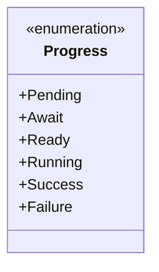
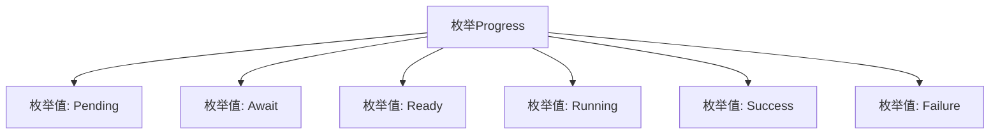

# 基础信息

|      |      |
|------|------|
| 名称 | Progress |
| 编码语言 | .java |
| 代码路径 | WeFe/fusion/fusion-core/src/main/java/com/welab/wefe/fusion/core/enums/Progress.java |
| 包名 | com.welab.wefe.fusion.core.enums |
| 依赖项 | [] |
| 概述说明 | 进度状态枚举：待处理、等待、就绪、运行中、成功、失败。 |

# 说明

这是一个名为Progress的枚举类型，定义了六个不同的状态值：Pending表示待处理，Await表示等待中，Ready表示准备就绪，Running表示运行中，Success表示成功完成，Failure表示执行失败。这些状态可用于描述任务或流程的不同阶段。

# 类列表 Class Summary

| 名称   | 类型  | 说明 |
|-------|------|-------------|
| Progress | enum | 这是一个表示进度的枚举类，包含待处理、等待、就绪、运行中、成功和失败六种状态。 |

## 类 Progress

|      |      |
|------|------|
| 访问范围 | public |
| 类型 | enum |
| 名称 | Progress |
| 说明 | 这是一个表示进度的枚举类，包含待处理、等待、就绪、运行中、成功和失败六种状态。 |

### UML类图

这段代码定义了一个名为Progress的枚举类型，包含6个枚举常量：Pending、Await、Ready、Running、Success和Failure。枚举通常用于表示一组固定的状态或选项，这里Progress可能用于表示某个任务或流程的不同阶段状态。Pending表示初始等待状态，Await表示等待某些条件满足，Ready表示准备就绪，Running表示正在执行中，Success表示成功完成，Failure表示执行失败。枚举类型的使用可以增强代码的可读性和类型安全性。

### 内部方法调用关系图

该流程图展示了Progress枚举的结构，包含6个有序状态值：Pending（待处理）、Await（等待中）、Ready（就绪）、Running（运行中）、Success（成功）和Failure（失败）。每个枚举值作为独立节点与主枚举类连接，清晰呈现了状态机的所有可能状态，适用于需要跟踪任务进度的场景。

### 字段列表 Field List

| 名称  | 类型  | 说明 |
|-------|-------|------|

### 方法列表

| 名称  | 类型  | 说明 |
|-------|-------|------|

