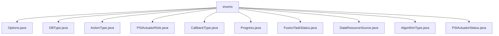

# 基础信息

|      |      |
|------|------|
| 名称 | enums |
| 编码语言 | .java |
| 代码路径 | WeFe/fusion/fusion-core/src/main/java/com/welab/wefe/fusion/core/enums |
| 包名 | docs.fusion.fusion-core.src.main.java.com.welab.wefe.fusion.core.enums |
| 概述说明 | 代码定义了多个枚举类型：DBType包含六种数据库类型；ActionType有五种操作类型；PSIActuatorRole区分服务端和客户端；CallbackType描述四种回调状态；Progress和FusionTaskStatus分别定义任务进度和状态；DataResourceSource列出三种数据来源；AlgorithmType提供两种算法选择；PSIActuatorStatus包含六种执行器状态。 |

# 说明

## 概述  
该模块核心职责是提供联邦学习融合过程中的枚举定义，涵盖数据库类型、任务状态、算法选择等关键维度。接口规范通过枚举类实现，例如DBType定义六种数据库类型（如CLICKHOUSE、OSS），AlgorithmType限定RSA_PSI和DH两种算法。  

关键数据结构包括任务状态（如FusionTaskStatus含Pending/Success）、执行器角色（PSIActuatorRole分server/client）、数据来源（DataResourceSource含LocalFile/Sql）。外部依赖仅涉及基础Java环境。例如Progress枚举通过Running/Success等六状态描述任务生命周期。  

## 主要业务场景  
模块支持联邦学习全流程控制，类似状态机模式。典型场景如：初始化阶段使用ActionType.init，数据对齐阶段触发CallbackType.falsify检查，最终通过PSIActuatorStatus.Success标记完成。  

交互模式基于角色区分（server/client）和状态驱动（如Progress.Ready触发任务执行）。API类型集中为枚举常量，例如AlgorithmType.DH用于密钥交换，DataResourceSource.Sql标识数据库来源。完整流程可组合多个枚举，例如从Pending状态开始，经Running最终到达Success或Failure。

### 包内部结构视图

该流程图展示了WeFe项目中fusion-core模块的枚举类结构。根节点为enums目录，其下包含11个具体的枚举类文件，涵盖了数据库类型、动作类型、任务状态等多种枚举类型。所有枚举类均直接隶属于enums目录，没有更深层级的嵌套关系。

# 文件列表

| 名称   | 类型  | 说明 |
|-------|------|-------------|
| [Options.java](Options.md) | file | 输入内容为空，无法生成概要描述。 |
| [DBType.java](DBType.md) | file | DBType枚举定义了六种数据库类型：CLICKHOUSE、MYSQL、MYSQL_FUSION、LMDB、OTS和OSS。 |
| [ActionType.java](ActionType.md) | file | 这是一个枚举类型ActionType，定义了五种动作：初始化、下载、对齐、转储和结束。 |
| [PSIActuatorRole.java](PSIActuatorRole.md) | file | PSIActuatorRole枚举定义了两个角色：server和client。 |
| [CallbackType.java](CallbackType.md) | file | 枚举CallbackType定义四种回调类型：运行中、初始化服务器、数据检查失败、成功。 |
| [Progress.java](Progress.md) | file | 进度状态枚举：待处理、等待、就绪、运行中、成功、失败。 |
| [FusionTaskStatus.java](FusionTaskStatus.md) | file | FusionTaskStatus枚举定义了任务状态：Pending待处理、Await等待、Running进行中、Success成功、Failure失败、Interrupt中断、Refuse拒绝。 |
| [DataResourceSource.java](DataResourceSource.md) | file | 数据资源来源枚举：本地文件、上传文件、SQL数据库。 |
| [AlgorithmType.java](AlgorithmType.md) | file | 算法类型枚举包含两种：RSA_PSI和DH。 |
| [PSIActuatorStatus.java](PSIActuatorStatus.md) | file | 枚举PSIActuatorStatus定义了执行器状态，包含成功、未初始化、验证失败、丢弃、运行中及异常6种状态，每种状态有值和描述。 |

