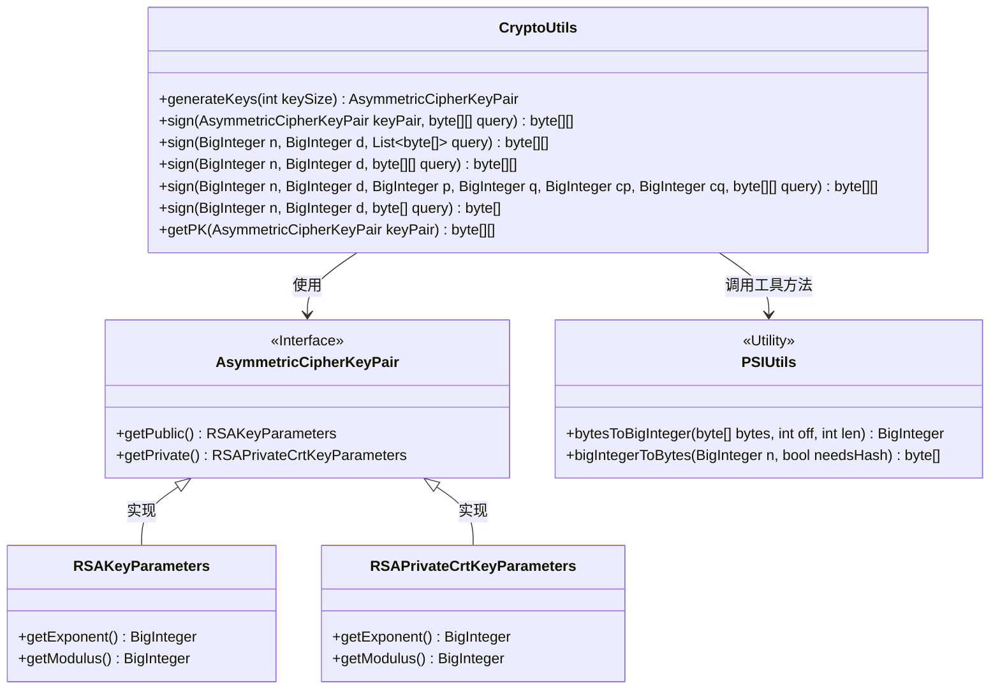
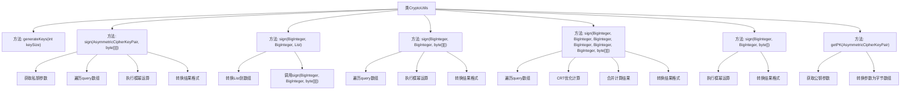

# 基础信息

|      |      |
|------|------|
| 名称 | CryptoUtils |
| 编码语言 | .java |
| 代码路径 | WeFe/fusion/fusion-core/src/main/java/com/welab/wefe/fusion/core/utils/CryptoUtils.java |
| 包名 | com.welab.wefe.fusion.core.utils |
| 依赖项 | ['org.bouncycastle.crypto.AsymmetricCipherKeyPair', 'org.bouncycastle.crypto.generators.RSAKeyPairGenerator', 'org.bouncycastle.crypto.params.RSAKeyGenerationParameters', 'org.bouncycastle.crypto.params.RSAKeyParameters', 'org.bouncycastle.crypto.params.RSAPrivateCrtKeyParameters', 'java.math.BigInteger', 'java.security.SecureRandom', 'java.util.List'] |
| 概述说明 | CryptoUtils类提供RSA密钥生成、签名及公钥提取功能，支持多种参数输入和CRT优化签名。 |

# 说明

CryptoUtils类提供RSA密钥生成与签名功能。generateKeys方法生成指定长度的RSA密钥对。sign方法提供多种重载形式，支持使用密钥对或单独参数进行签名，包括普通模幂运算和CRT优化实现。getPK方法提取公钥的指数和模数。所有方法均处理异常并返回默认值。签名过程涉及字节数组与BigInteger转换，使用PSIUtils工具类完成。

# 类列表 Class Summary

| 名称   | 类型  | 说明 |
|-------|------|-------------|
| CryptoUtils | class | CryptoUtils类提供RSA密钥生成和签名功能，包括生成密钥对、多种签名方法及获取公钥。支持普通签名和CRT优化签名，处理单数据或批量数据。 |

## 类 CryptoUtils

|      |      |
|------|------|
| 访问范围 | public |
| 类型 | class |
| 名称 | CryptoUtils |
| 说明 | CryptoUtils类提供RSA密钥生成和签名功能，包括生成密钥对、多种签名方法及获取公钥。支持普通签名和CRT优化签名，处理单数据或批量数据。 |

### UML类图

类图描述：CryptoUtils是一个提供加密功能的工具类，主要包含密钥生成(generateKeys)、数据签名(sign)和公钥提取(getPK)方法。它依赖AsymmetricCipherKeyPair接口及其实现类RSAKeyParameters/RSAPrivateCrtKeyParameters来管理RSA密钥对，并通过PSIUtils工具类进行字节数组与BigInteger的转换。类图中展示了5个重载的sign方法，支持不同参数形式的签名操作，其中包含使用中国剩余定理(CRT)优化的实现。

### 内部方法调用关系图

流程图描述：该流程图展示了CryptoUtils类的结构，包含密钥生成(generateKeys)、多种签名方法(sign)和公钥获取(getPK)功能。签名方法通过不同参数重载实现，核心流程包括参数转换、模幂运算和结果格式化。特别展示了带CRT优化的签名方法的分步计算过程，以及各方法间的调用关系。所有方法均包含异常处理机制。

### 字段列表 Field List

| 名称  | 类型  | 说明 |
|-------|-------|------|

### 方法列表

| 名称  | 类型  | 说明 |
|-------|-------|------|
| sign | byte[][] | 使用CRT优化的RSA签名方法，输入参数包括模数n、私钥d、素数p和q、系数cp和cq，以及待签名数据query。通过模幂运算和CRT计算签名结果，返回签名后的字节数组。异常时返回空数组。 |
| sign | byte[] | 该方法使用RSA私钥对输入数据进行签名，将字节数组转换为大整数后计算模幂，再将结果转回字节数组返回。异常时返回单字节数组。 |
| getPK | byte[][] | 提取RSA公钥的指数和模数，转换为字节数组并返回。 |
| sign | byte[][] | 该方法使用RSA私钥对输入的字节数组进行签名，通过模幂运算生成签名结果数组。处理异常时返回空数组。 |
| generateKeys | AsymmetricCipherKeyPair | 该方法生成RSA密钥对，指定密钥长度和公共指数，使用安全随机数生成器，返回非对称密钥对。 |
| sign | byte[][] | 静态方法sign接收大整数n、d和字节数组列表query，将列表转为二维数组后调用同名方法签名，异常时返回空数组。 |
| sign | byte[][] | 静态方法sign使用私钥d和模数n对输入的字节数组query进行签名，返回签名后的字节数组。处理异常时打印错误并返回空数组。 |

