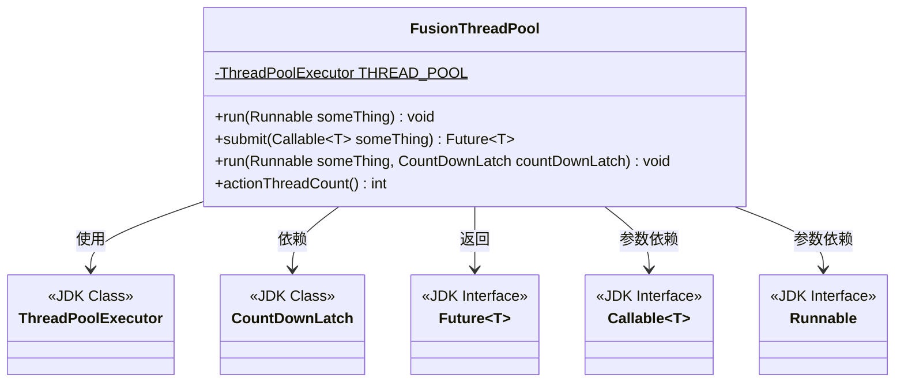
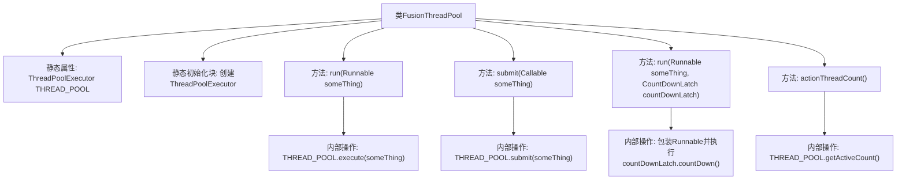

# 基础信息

|      |      |
|------|------|
| 名称 | FusionThreadPool |
| 编码语言 | .java |
| 代码路径 | WeFe/fusion/fusion-core/src/main/java/com/welab/wefe/fusion/core/utils/FusionThreadPool.java |
| 包名 | com.welab.wefe.fusion.core.utils |
| 依赖项 | ['java.util.concurrent'] |
| 概述说明 | FusionThreadPool类实现了一个静态线程池，支持执行Runnable任务、提交Callable任务及带计数器的异步任务，并能获取活跃线程数。线程池大小基于处理器核心数动态设置。 |

# 说明

FusionThreadPool是一个静态线程池工具类，采用单例模式初始化。线程池核心线程数设为CPU核心数，最大线程数为核心数两倍，使用100毫秒保活时间和无界阻塞队列。提供三种任务执行方式：直接执行Runnable任务、提交Callable任务返回Future，以及支持CountDownLatch的异步任务执行（完成后自动减少计数器）。此外，可通过actionThreadCount方法获取当前活跃线程数。

# 类列表 Class Summary

| 名称   | 类型  | 说明 |
|-------|------|-------------|
| FusionThreadPool | class | FusionThreadPool类实现了一个静态线程池，核心线程数为CPU核心数，最大线程数为两倍核心数。提供执行Runnable任务、提交Callable任务及带CountDownLatch的异步任务方法，并支持获取活跃线程数。 |

## 类 FusionThreadPool

|      |      |
|------|------|
| 访问范围 | public |
| 类型 | class |
| 名称 | FusionThreadPool |
| 说明 | FusionThreadPool类实现了一个静态线程池，核心线程数为CPU核心数，最大线程数为两倍核心数。提供执行Runnable任务、提交Callable任务及带CountDownLatch的异步任务方法，并支持获取活跃线程数。 |

### UML类图

该类图展示了FusionThreadPool线程池工具类的结构，它封装了JDK的ThreadPoolExecutor，提供静态方法执行Runnable任务、提交Callable任务（返回Future）、带CountDownLatch的异步任务执行，以及获取活跃线程数功能。通过泛型支持多种返回类型，依赖JDK的线程相关接口和类实现核心功能，是一个典型的线程池工具类封装设计。

### 内部方法调用关系图

这段代码定义了一个名为FusionThreadPool的线程池工具类，包含静态初始化块创建ThreadPoolExecutor实例，并提供了四种操作方法：执行Runnable任务、提交Callable任务、带CountDownLatch的异步任务执行以及获取活跃线程数。流程图清晰地展示了类结构、初始化过程和方法调用关系，其中特别突出了带CountDownLatch的任务执行时会自动触发计数器减一的特性。

### 字段列表 Field List

| 名称  | 类型  | 说明 |
|-------|-------|------|
| THREAD_POOL | ThreadPoolExecutor | 私有静态线程池执行器THREAD_POOL。 |

### 方法列表

| 名称  | 类型  | 说明 |
|-------|-------|------|
| run | void | 该方法使用线程池执行Runnable任务，并在任务完成后调用CountDownLatch的countDown方法。确保任务执行后计数器减一。 |
| actionThreadCount | int | 该方法返回线程池中当前活跃线程的数量。 |
| run | void | 静态方法run接收Runnable参数，使用线程池THREAD_POOL执行任务。 |
| submit | Future<T> | Java方法：使用线程池提交Callable任务并返回Future对象。 |

