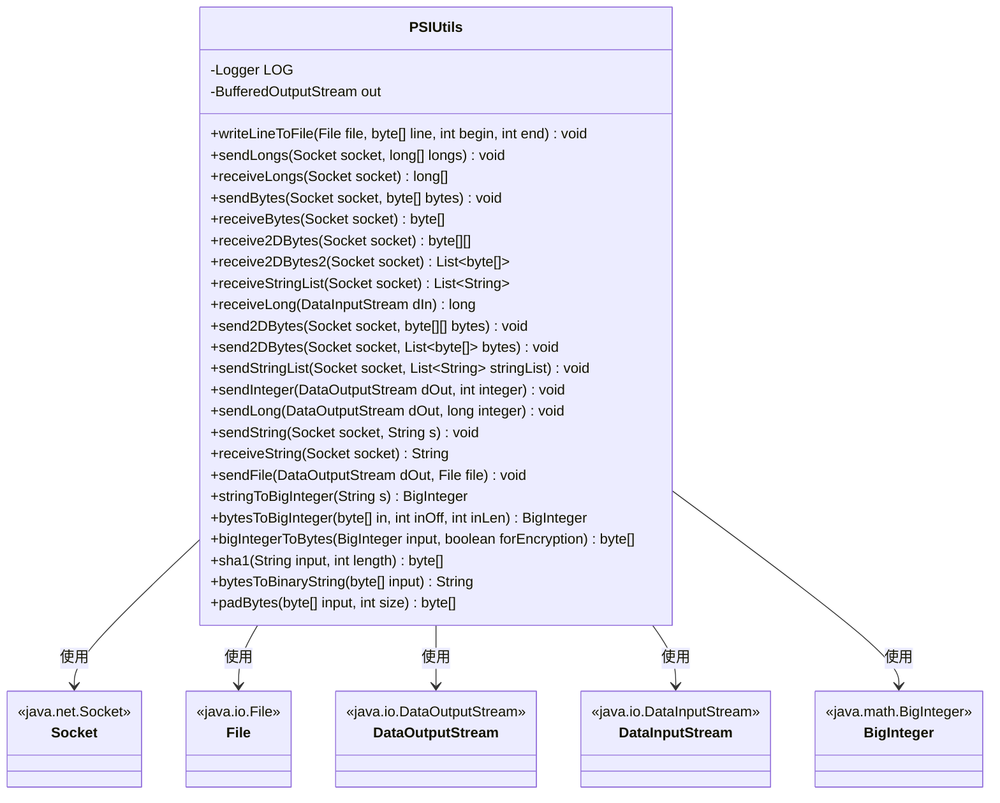

# 基础信息

|      |      |
|------|------|
| 名称 | PSIUtils |
| 编码语言 | .java |
| 代码路径 | WeFe/fusion/fusion-core/src/main/java/com/welab/wefe/fusion/core/utils/PSIUtils.java |
| 包名 | com.welab.wefe.fusion.core.utils |
| 依赖项 | ['com.welab.wefe.common.StatusCode', 'com.welab.wefe.common.exception.StatusCodeWithException', 'org.slf4j.Logger', 'org.slf4j.LoggerFactory', 'java.io', 'java.math.BigInteger', 'java.net.Socket', 'java.security.MessageDigest', 'java.security.NoSuchAlgorithmException', 'java.util.Arrays', 'java.util.List'] |
| 概述说明 | PSIUtils工具类提供文件写入、Socket数据传输（long数组、字节数组、字符串列表等）、大整数转换及SHA1哈希等功能。 |

# 说明

PSIUtils是一个工具类，提供多种数据操作功能。主要包括文件写入方法writeLineToFile，通过socket传输和接收long数组、字节数组、二维字节数组、字符串列表的方法，如sendLongs、receiveLongs、sendBytes、receiveBytes等。还支持发送和接收字符串、整数、长整型数据，以及文件传输功能sendFile。类中提供了BigInteger与字符串、字节数组的相互转换方法，如stringToBigInteger、bytesToBigInteger等。此外，包含SHA1哈希计算、字节数组填充和二进制字符串转换等辅助功能。所有方法均包含异常处理，使用日志记录错误信息。

# 类列表 Class Summary

| 名称   | 类型  | 说明 |
|-------|------|-------------|
| PSIUtils | class | PSIUtils类提供文件写入、Socket数据传输（long数组、字节数组、字符串列表等）、BigInteger转换及SHA1哈希等功能，封装常用工具方法。 |

## 类 PSIUtils

|      |      |
|------|------|
| 访问范围 | public |
| 类型 | class |
| 名称 | PSIUtils |
| 说明 | PSIUtils类提供文件写入、Socket数据传输（long数组、字节数组、字符串列表等）、BigInteger转换及SHA1哈希等功能，封装常用工具方法。 |

### UML类图

该代码是一个工具类PSIUtils，主要提供文件写入、Socket数据传输、大整数转换等功能。类中包含静态方法用于处理字节数组、长整型数组、字符串列表等多种数据类型的发送和接收，同时支持文件操作和加密相关功能。通过Socket实现高效数据传输，并处理各种异常情况。类图展示了PSIUtils与Java标准库中Socket、File等类的依赖关系。

### 内部方法调用关系图

```mermaid
graph TD
    A["类PSIUtils"]
    B["属性: Logger LOG"]
    C["属性: BufferedOutputStream out"]
    D["方法: writeLineToFile(File, byte[], int, int)"]
    E["方法: sendLongs(Socket, long[])"]
    F["方法: receiveLongs(Socket)"]
    G["方法: sendBytes(Socket, byte[])"]
    H["方法: receiveBytes(Socket)"]
    I["方法: receive2DBytes(Socket)"]
    J["方法: receive2DBytes2(Socket)"]
    K["方法: receiveStringList(Socket)"]
    L["方法: receiveLong(DataInputStream)"]
    M["方法: send2DBytes(Socket, byte[][])"]
    N["方法: send2DBytes(Socket, List<byte[]>)"]
    O["方法: sendStringList(Socket, List<String>)"]
    P["方法: sendInteger(DataOutputStream, int)"]
    Q["方法: sendLong(DataOutputStream, long)"]
    R["方法: sendString(Socket, String)"]
    S["方法: receiveString(Socket)"]
    T["方法: sendFile(DataOutputStream, File)"]
    U["方法: stringToBigInteger(String)"]
    V["方法: bytesToBigInteger(byte[], int, int)"]
    W["方法: bigIntegerToBytes(BigInteger, boolean)"]
    X["方法: sha1(String, int)"]
    Y["方法: bytesToBinaryString(byte[])"]
    Z["方法: padBytes(byte[], int)"]

    A --> B
    A --> C
    A --> D
    A --> E
    A --> F
    A --> G
    A --> H
    A --> I
    A --> J
    A --> K
    A --> L
    A --> M
    A --> N
    A --> O
    A --> P
    A --> Q
    A --> R
    A --> S
    A --> T
    A --> U
    A --> V
    A --> W
    A --> X
    A --> Y
    A --> Z
```

该流程图展示了PSIUtils类的结构，包含2个静态属性和24个静态方法。主要功能分为文件操作（如writeLineToFile）、Socket数据传输（如sendLongs/receiveLongs）、类型转换（如stringToBigInteger）和字节处理（如padBytes）四大类。所有方法都包含异常处理逻辑，并通过LOG记录错误信息，体现了健壮的网络和IO操作工具类设计。

### 字段列表 Field List

| 名称  | 类型  | 说明 |
|-------|-------|------|
| out = null | BufferedOutputStream | 声明一个静态私有的BufferedOutputStream变量out，初始值为null。 |
| LOG = LoggerFactory.getLogger(PSIUtils.class) | Logger | PSIUtils类中定义了一个受保护的静态final日志对象LOG，用于记录日志信息。 |

### 方法列表

| 名称  | 类型  | 说明 |
|-------|-------|------|
| sendBytes | void | Java方法sendBytes通过Socket发送字节数组，使用ObjectOutputStream写入数据，异常时记录错误日志。 |
| receiveString | String | Java方法receiveString从Socket读取字符串，异常时记录错误并返回空字符串。 |
| stringToBigInteger | BigInteger | 将字符串按UTF-8编码转为字节数组，再转换为大整数，异常时记录错误日志。 |
| receiveLong | long | 静态方法receiveLong从DataInputStream读取long值，异常时记录错误并返回0。 |
| receive2DBytes | byte[][] | 从Socket接收二维字节数组，使用ObjectInputStream读取对象，异常时记录错误日志。 |
| sendStringList | void | 静态方法sendStringList通过Socket发送字符串列表，使用ObjectOutputStream序列化数据，异常时记录错误日志。 |
| receiveStringList | List<String> | 静态方法通过Socket接收字符串列表，使用对象输入流读取数据，异常时记录错误日志并返回列表。 |
| sendString | void | 该方法通过Socket发送字符串，使用PrintWriter包装输出流，自动刷新缓冲区，异常时记录错误日志。 |
| receive2DBytes2 | List<byte[]> | 从Socket接收二维字节数组列表，异常时记录错误并返回null。 |
| sendLong | void | 静态方法sendLong通过DataOutputStream发送长整型数据，捕获并记录IO异常。 |
| send2DBytes | void | 静态方法send2DBytes通过Socket发送字节数组列表，使用ObjectOutputStream写入数据，异常时记录错误日志。 |
| sendLongs | void | 该方法通过Socket发送长整型数组，先发送数组长度，再逐个发送元素，每500个元素刷新一次缓冲区以提高性能，最后确保所有数据发送完成。 |
| sendFile | void | 该方法通过DataOutputStream发送文件内容，使用4096字节缓冲区循环读取文件并写入输出流，最后关闭输入流并刷新输出流，异常时记录错误日志。 |
| receiveLongs | long[] | 从Socket接收长整型数组，读取长度后逐个读取数据，异常时返回空数组并关闭Socket。 |
| sendInteger | void | 静态方法sendInteger通过DataOutputStream发送整数，捕获并打印IO异常。 |
| writeLineToFile | void | 静态方法writeLineToFile将字节数组写入文件，首次调用创建输出流，末次调用关闭流，异常时记录日志。 |
| send2DBytes | void | 静态方法send2DBytes通过Socket发送二维字节数组，使用ObjectOutputStream写入数据，异常时记录错误日志。 |
| receiveBytes | byte[] | 从Socket接收字节数组，使用ObjectInputStream读取对象并转换为byte[]，异常时记录错误日志，最终返回字节数组。 |
| bytesToBigInteger | BigInteger | 将字节数组转换为大整数，支持偏移和长度参数，处理子数组或完整数组情况，返回正数结果。 |
| bigIntegerToBytes | byte[] | 将BigInteger转换为字节数组，若首字节为零则移除该字节并返回剩余部分，否则直接返回原数组。 |
| sha1 | byte[] | Java方法：使用SHA1算法生成指定长度的哈希字节数组，输入为字符串和长度参数。 |
| bytesToBinaryString | String | 将字节数组转换为二进制字符串，每个字节补零至8位。 |
| padBytes | byte[] | 该方法将输入字节数组填充至指定长度，不足部分前置补零。通过System.arraycopy将原数组复制到新数组末尾，返回填充后的新数组。 |

