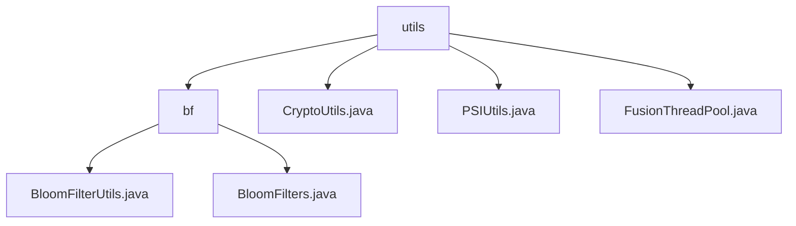

# 基础信息

|      |      |
|------|------|
| 名称 | utils |
| 编码语言 | .java |
| 代码路径 | WeFe/fusion/fusion-core/src/main/java/com/welab/wefe/fusion/core/utils |
| 包名 | docs.fusion.fusion-core.src.main.java.com.welab.wefe.fusion.core.utils |
| 概述说明 | 布隆过滤器模块支持高效操作与持久化，用于大数据去重和快速检索。依赖Java标准IO，含BitSet存储和MD5哈希。提供静态方法简化IO操作，支持误判率初始化。 |

# 说明

## 概述  
该模块核心职责是实现布隆过滤器的高效操作与持久化，并集成密码学工具和线程池管理。布隆过滤器部分支持元素存在性检测和文件存储加载，例如BloomFilterUtils提供静态方法简化IO操作。密码学功能包括RSA密钥生成与签名（如CryptoUtils类），以及数据转换和传输（如PSIUtils类）。线程池管理通过FusionThreadPool实现任务调度。关键数据结构含BitSet存储、MD5/SHA1哈希摘要和RSA密钥对。外部依赖涉及Java标准IO库和密码学组件。

## 主要业务场景  
典型应用包括大数据去重（布隆过滤器）、安全通信（RSA签名）和并行计算（线程池）。完整流程涵盖过滤器初始化、元素操作、文件持久化（例如writeTo/readFrom），以及密钥生成、数据签名和传输（如sendBytes/receiveBytes）。交互模式通过静态方法封装，类似工具类集合。API类型聚焦基础操作（add/contains）、密码学功能（generateKeys/sign）和线程任务提交（如支持CountDownLatch的异步执行）。例如MD5哈希确保数据一致性，线程池按CPU核心数动态扩容。

### 包内部结构视图

该流程图展示了WeFe项目中fusion-core模块下utils工具包的层级结构。根节点utils包含四个子节点：bf目录和三个工具类文件。bf目录下又包含两个布隆过滤器相关的工具类文件。整个结构清晰地呈现了核心工具类的组织方式，其中布隆过滤器相关功能被单独归类在bf子目录中。

# 文件列表

| 名称   | 类型  | 说明 |
|-------|------|-------------|
| [CryptoUtils.java](CryptoUtils.md) | file | CryptoUtils类提供RSA密钥生成、签名及公钥提取功能，支持多种参数输入和CRT优化签名。 |
| [PSIUtils.java](PSIUtils.md) | file | PSIUtils工具类提供文件写入、Socket数据传输（long数组、字节数组、字符串列表等）、大整数转换及SHA1哈希等功能。 |
| [FusionThreadPool.java](FusionThreadPool.md) | file | FusionThreadPool类实现了一个静态线程池，支持执行Runnable任务、提交Callable任务及带计数器的异步任务，并能获取活跃线程数。线程池大小基于处理器核心数动态设置。 |
| [bf](bf/_module.md) | package | BloomFilterUtils类提供文件读写方法简化布隆过滤器持久化。BloomFilters类实现布隆过滤器核心功能，支持多种初始化参数和操作如添加元素、检查存在等，使用BitSet和MD5哈希。 |

