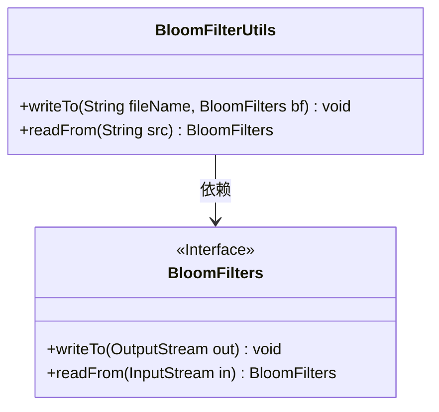
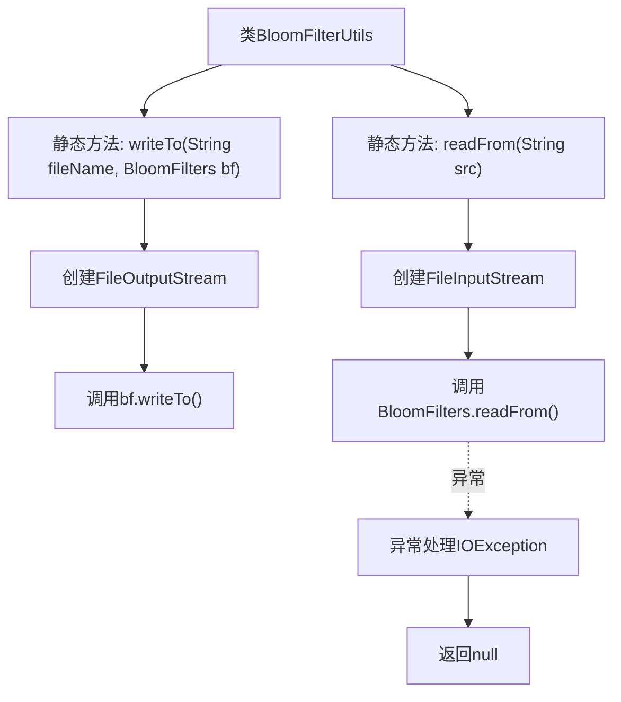

# 基础信息

|      |      |
|------|------|
| 名称 | BloomFilterUtils |
| 编码语言 | .java |
| 代码路径 | WeFe/fusion/fusion-core/src/main/java/com/welab/wefe/fusion/core/utils/bf/BloomFilterUtils.java |
| 包名 | com.welab.wefe.fusion.core.utils.bf |
| 依赖项 | ['java.io.FileInputStream', 'java.io.FileOutputStream', 'java.io.IOException'] |
| 概述说明 | BloomFilterUtils类提供两个方法：writeTo将布隆过滤器写入文件，readFrom从文件读取布隆过滤器。 |

# 说明

BloomFilterUtils类提供了两个静态方法用于处理布隆过滤器的文件操作。writeTo方法将布隆过滤器对象写入指定文件，使用FileOutputStream以覆盖模式写入。readFrom方法从文件中读取布隆过滤器对象，使用FileInputStream进行读取，若发生IO异常会打印堆栈并返回null。这两个方法简化了布隆过滤器的持久化和加载过程。

# 类列表 Class Summary

| 名称   | 类型  | 说明 |
|-------|------|-------------|
| BloomFilterUtils | class | BloomFilterUtils类提供两个静态方法：writeTo将布隆过滤器写入文件，readFrom从文件读取布隆过滤器。 |

## 类 BloomFilterUtils

|      |      |
|------|------|
| 访问范围 | public |
| 类型 | class |
| 名称 | BloomFilterUtils |
| 说明 | BloomFilterUtils类提供两个静态方法：writeTo将布隆过滤器写入文件，readFrom从文件读取布隆过滤器。 |

### UML类图

这段代码展示了一个工具类`BloomFilterUtils`，它提供了两个静态方法用于布隆过滤器的序列化和反序列化操作。`writeTo`方法将布隆过滤器写入指定文件，`readFrom`方法从文件中读取布隆过滤器。该类依赖于`BloomFilters`接口，该接口定义了核心的读写方法。代码结构清晰，但反序列化时未处理IO异常而是直接返回null，可能引发潜在的空指针问题。布隆过滤器是一种空间效率高的概率数据结构，用于测试元素是否属于集合。

### 内部方法调用关系图

该流程图展示了BloomFilterUtils工具类的两个核心方法。writeTo方法负责将布隆过滤器序列化到指定文件，流程包括创建输出流并调用bf的写入方法；readFrom方法从文件反序列化布隆过滤器，涉及创建输入流并调用静态读取方法，异常时打印堆栈并返回null。两个方法均围绕文件IO操作展开，体现了标准的序列化/反序列化处理流程。

### 字段列表 Field List

| 名称  | 类型  | 说明 |
|-------|-------|------|

### 方法列表

| 名称  | 类型  | 说明 |
|-------|-------|------|
| readFrom | BloomFilters | 静态方法从指定路径读取布隆过滤器，异常时返回空。 |
| writeTo | void | Java静态方法，将BloomFilter对象写入指定文件，覆盖模式，可能抛出IO异常。 |

