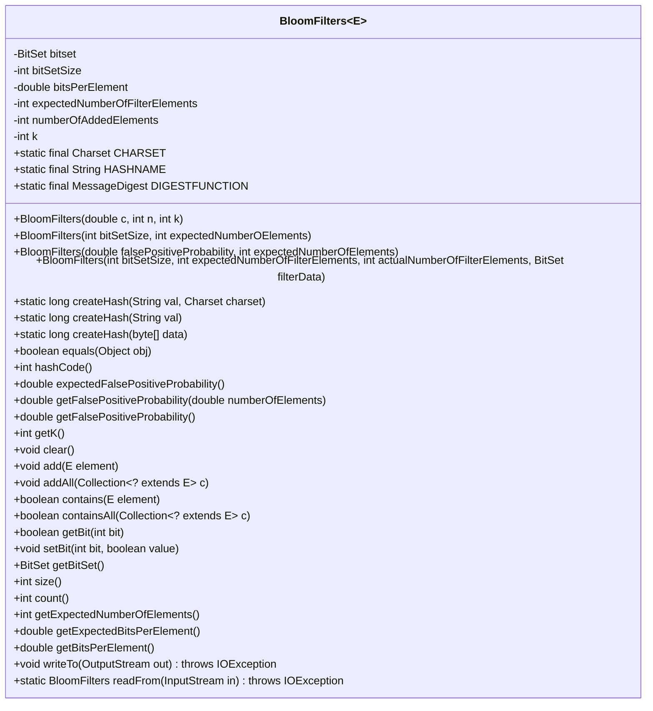

# 基础信息

|      |      |
|------|------|
| 名称 | BloomFilters |
| 编码语言 | .java |
| 代码路径 | WeFe/fusion/fusion-core/src/main/java/com/welab/wefe/fusion/core/utils/bf/BloomFilters.java |
| 包名 | com.welab.wefe.fusion.core.utils.bf |
| 依赖项 | ['com.google.common.base.Preconditions', 'java.io', 'java.nio.charset.Charset', 'java.security.MessageDigest', 'java.security.NoSuchAlgorithmException', 'java.util.BitSet', 'java.util.Collection'] |
| 概述说明 | BloomFilters类是一个可序列化的布隆过滤器实现，使用BitSet存储数据，支持添加元素、检查元素是否存在、计算误判率等功能，并提供多种构造方法以适应不同场景需求。 |

# 说明

这是一个实现布隆过滤器（Bloom Filter）的Java类。布隆过滤器是一种空间效率高的概率型数据结构，用于判断一个元素是否在集合中。该类提供了多种构造函数，支持通过不同参数（如误判率、预期元素数量等）初始化过滤器。核心功能包括添加元素、检查元素是否存在、计算误判率、清空过滤器等。类中使用BitSet存储数据，采用MD5哈希算法生成摘要，并通过序列化接口支持对象持久化。此外，还实现了equals和hashCode方法，并提供了读写操作的实用方法。

# 类列表 Class Summary

| 名称   | 类型  | 说明 |
|-------|------|-------------|
| BloomFilters | class | BloomFilters类是一个可序列化的布隆过滤器实现，使用BitSet存储数据，支持添加元素、检查元素存在性、计算误判率等功能，并提供多种构造方法以适应不同场景需求。 |

## 类 BloomFilters

|      |      |
|------|------|
| 访问范围 | public |
| 类型 | class |
| 名称 | BloomFilters |
| 说明 | BloomFilters类是一个可序列化的布隆过滤器实现，使用BitSet存储数据，支持添加元素、检查元素存在性、计算误判率等功能，并提供多种构造方法以适应不同场景需求。 |

### UML类图

类图描述：BloomFilters<E>是一个泛型类，实现了Serializable接口，用于实现布隆过滤器数据结构。它包含BitSet用于存储元素哈希结果，提供添加元素、检查元素是否存在、计算误判率等核心功能。类中包含多个构造方法，支持通过不同参数（如误判率、预期元素数量等）初始化过滤器。静态方法createHash用于生成哈希值，同时提供了序列化/反序列化支持。该类封装了布隆过滤器所需的所有核心操作和状态管理。

### 内部方法调用关系图

```mermaid
graph TD
    A["类BloomFilters<E>"]
    B["静态属性: serialVersionUID, CHARSET, HASHNAME, DIGESTFUNCTION"]
    C["实例属性: bitset, bitSetSize, bitsPerElement, expectedNumberOfFilterElements, numberOfAddedElements, k"]
    D["构造方法: BloomFilters(double c, int n, int k)"]
    E["构造方法: BloomFilters(int bitSetSize, int expectedNumberOElements)"]
    F["构造方法: BloomFilters(double falsePositiveProbability, int expectedNumberOfElements)"]
    G["构造方法: BloomFilters(int bitSetSize, int expectedNumberOfFilterElements, int actualNumberOfFilterElements, BitSet filterData)"]
    H["静态方法: createHash系列"]
    I["核心方法: add/addAll/contains/containsAll"]
    J["工具方法: clear/getBit/setBit/getBitSet"]
    K["计算类方法: expectedFalsePositiveProbability/getFalsePositiveProbability"]
    L["序列化方法: writeTo/readFrom"]
    M["重写方法: equals/hashCode"]

    A --> B
    A --> C
    A --> D
    A --> E
    A --> F
    A --> G
    A --> H
    A --> I
    A --> J
    A --> K
    A --> L
    A --> M
```

该流程图展示了BloomFilters类的主要结构和功能模块。类包含4个构造方法，分别用不同参数初始化布隆过滤器；核心操作包括元素添加(add/addAll)和存在性检查(contains/containsAll)；支持概率计算、位操作和序列化功能。静态方法createHash提供哈希生成能力，同时重写了equals和hashCode方法。类设计完整涵盖了布隆过滤器所需的所有核心功能。

### 字段列表 Field List

| 名称  | 类型  | 说明 |
|-------|-------|------|
| k | int | 私有整型变量k。 |
| HASHNAME = "MD5" | String | 定义静态常量HASHNAME，值为字符串"MD5"。 |
| DIGESTFUNCTION | MessageDigest | 声明一个静态不可变的MessageDigest对象DIGESTFUNCTION。 |
| serialVersionUID = -2326638072608273135L | long | 定义序列化版本UID为-2326638072608273135L，确保类版本兼容性。 |
| bitsPerElement | double | 私有双精度浮点数变量，表示每个元素的位数。 |
| bitSetSize | int | 私有整型变量bitSetSize，用于表示位集大小。 |
| expectedNumberOfFilterElements | int | 私有整型变量，用于存储预期的过滤器元素数量。 |
| numberOfAddedElements | int | 私有整型变量，记录新增元素数量。 |
| bitset | BitSet | 私有位集合变量bitset。 |
| CHARSET = Charset.forName("UTF-8") | Charset | 定义UTF-8字符集的静态常量CHARSET。 |

### 方法列表

| 名称  | 类型  | 说明 |
|-------|-------|------|
| add | void | 方法add将元素转为字符串，循环k次生成哈希值并取模，设置位集对应位为true，最后增加元素计数。 |
| equals | boolean | 重写equals方法，检查对象非空、类相同、预期元素数、k值、位集大小和位集内容是否一致。 |
| addAll | void | 该方法遍历集合c中的所有元素，逐个调用add方法将它们添加到当前集合中。 |
| hashCode | int | 重写hashCode方法，基于bitset、预期元素数、位集大小和k值计算哈希码。 |
| getFalsePositiveProbability | double | 方法返回误判概率，基于已添加元素数量计算。 |
| createHash | long | 该方法通过字符串和字符集生成哈希值，先转换为字节数组再调用内部哈希函数。 |
| getK | int | 获取整型变量k的值的方法。 |
| createHash | long | 静态方法createHash接收字符串参数val，调用重载方法createHash并传入默认字符集CHARSET，返回长整型哈希值。 |
| getBitSet | BitSet | 获取BitSet对象的方法，直接返回成员变量bitset。 |
| expectedFalsePositiveProbability | double | 该方法计算预期误判概率，调用getFalsePositiveProbability并传入预期元素数量作为参数。 |
| size | int | 该方法返回bitSetSize的值，表示当前位集的大小。 |
| count | int | 方法count返回当前已添加元素的数量。 |
| getExpectedNumberOfElements | int | 方法返回预期过滤器元素数量。 |
| getExpectedBitsPerElement | double | 方法返回当前每个元素的预期比特数。 |
| getBitsPerElement | double | 该方法计算每个元素的平均比特数，公式为比特集大小除以元素数量。 |
| writeTo | void | 将位图大小、预期元素数量和位集数据写入输出流。 |
| readFrom | BloomFilters | 从输入流读取数据构建BloomFilter，包括位集大小、预期元素数和数据字节数组，异常时抛出IOException。 |
| getBit | boolean | 方法getBit检查bitset中指定bit位的值并返回布尔结果。 |
| containsAll | boolean | 检查集合是否包含给定集合的所有元素，若全部包含返回true，否则返回false。 |
| createHash | long | 静态方法createHash生成数据哈希值：同步调用摘要函数处理输入字节数组，取前4字节转为长整型返回。 |
| clear | void | 清空位集并重置元素计数。 |
| getFalsePositiveProbability | double | 计算布隆过滤器误判概率，公式为(1 - e^(-k * n / m)) ^ k，其中n为元素数量，m为位集大小，k为哈希函数数量。 |
| contains | boolean | 检查元素是否存在于布隆过滤器中，通过多次哈希计算验证位集状态，存在则返回真，否则返回假。 |
| setBit | void | 该方法用于设置指定位的值，参数bit指定位置，value为布尔值表示设置状态。 |

