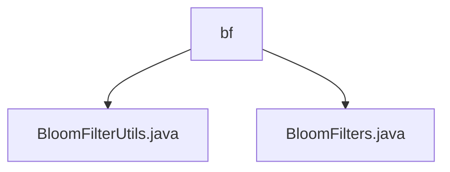

# 基础信息

|      |      |
|------|------|
| 名称 | bf |
| 编码语言 | .java |
| 代码路径 | WeFe/fusion/fusion-core/src/main/java/com/welab/wefe/fusion/core/utils/bf |
| 包名 | docs.fusion.fusion-core.src.main.java.com.welab.wefe.fusion.core.utils.bf |
| 概述说明 | BloomFilterUtils类提供文件读写方法简化布隆过滤器持久化。BloomFilters类实现布隆过滤器核心功能，支持多种初始化参数和操作如添加元素、检查存在等，使用BitSet和MD5哈希。 |

# 说明

## 概述  
该模块核心职责是实现布隆过滤器的高效操作与持久化，支持元素存在性检测和文件存储加载。接口规范包括写入文件（覆盖模式）和读取文件（异常返回null），例如BloomFilterUtils提供静态方法简化IO操作。关键数据结构为BitSet存储和MD5哈希摘要。外部依赖仅涉及Java标准IO库。例如通过误判率和预期元素量初始化过滤器。

## 主要业务场景  
典型应用包括大数据去重和快速检索，类似预检缓存机制。完整流程涵盖初始化、元素添加/查询、文件持久化（例如writeTo/readFrom）。交互模式通过静态方法封装，如BloomFilters类支持多种构造参数。API类型聚焦于基础操作（add/contains）和序列化，例如MD5哈希确保数据一致性。

### 包内部结构视图

该流程图展示了WeFe项目中与布隆过滤器相关的工具类文件结构。bf作为父节点，包含两个子节点：BloomFilterUtils.java和BloomFilters.java，这两个Java文件都位于fusion-core模块的布隆过滤器工具包路径下，分别提供布隆过滤器的不同功能实现。

# 文件列表

| 名称   | 类型  | 说明 |
|-------|------|-------------|
| [BloomFilterUtils.java](BloomFilterUtils.md) | file | BloomFilterUtils类提供两个方法：writeTo将布隆过滤器写入文件，readFrom从文件读取布隆过滤器。 |
| [BloomFilters.java](BloomFilters.md) | file | BloomFilters类是一个可序列化的布隆过滤器实现，使用BitSet存储数据，支持添加元素、检查元素是否存在、计算误判率等功能，并提供多种构造方法以适应不同场景需求。 |

