# 基础信息

|      |      |
|------|------|
| 名称 | wefe |
| 编码语言 | .java |
| 代码路径 | WeFe/fusion/fusion-service/src/main/java/com/welab/wefe |
| 包名 | docs.fusion.fusion-service.src.main.java.com.welab.wefe |
| 概述说明 | 联邦学习平台核心系统，含控制、数据、任务模块，支持初始化、数据管理、任务调度全流程。分层架构设计，统一接口规范，关键数据结构和多服务组件集成。 |

# 说明

## 概述  
该模块是联邦学习平台的核心管理系统，采用分层架构设计，集成系统控制、数据管理、任务调度和隐私计算功能。核心职责包括：1)通过分层存储系统（MySQL/MergeTree）实现数据持久化；2)基于PSI（隐私集合求交）算法保障跨机构数据安全对齐；3)提供全生命周期管理工具集（布隆过滤器/主键生成等）。接口规范统一采用JPA注解和RESTful风格，例如AbstractApi基类派生各类API，@Query实现扩展查询。关键数据结构涵盖分页结果集、加密业务实体（如GlobalConfigMysqlModel）和PSI执行参数（e/N/d）。外部依赖包括Spring Data JPA、RSA加密组件、连接池管理（如HikariCP）和多种数据库驱动（MySQL/Hive/Impala）。

## 主要业务场景  
模块支持联邦学习全流程管理，典型工作流为：1)系统初始化（生成RSA密钥/校验memberName）；2)数据准备（DatasetApi管理CSV/Excel解析）；3)安全计算（PsiClientActuator执行加密分片）；4)结果回调（TaskResultManager动态建表存储）。交互模式融合生产者-消费者模型（批量处理10,000行数据）和状态机驱动（TaskStatus管理7种状态）。功能完整性体现在：加密校验（≤5字段组合）、线程安全操作（ConcurrentHashMap管理任务）和异常处理链（StatusCodeWithException）。集成案例覆盖从基础配置（DataSourceConfig多数据源）到复杂业务（RSA-PSI算法切换），类似分布式ETL控制台。

### 包内部结构视图

```mermaid
graph TD
    wefe --> data
    data --> fusion
    fusion --> service
    service --> api
    service --> repo
    service --> database
    service --> utils
    service --> enums
    service --> actuator
    service --> manager
    service --> service
    service --> scheduled
    service --> dto
    service --> operation
    service --> task
    service --> listener
    service --> config
    service --> FusionService.java
    api --> system
    api --> account
    api --> partner
    api --> bloomfilter
    api --> thirdparty
    api --> file
    api --> dataset
    api --> operation
    api --> task
    api --> datasource
    system --> IsInitializedApi.java
    system --> ResetRsaKeyApi.java
    system --> OptionsApi.java
    system --> GlobalConfigUpdateApi.java
    system --> GetGlobalConfigApi.java
    system --> TaskOverviewApi.java
    system --> InitializeApi.java
    system --> ConfigApi.java
    account --> SsoLoginApi.java
    partner --> PagingApi.java
    partner --> UpdateApi.java
    partner --> DeleteApi.java
    partner --> AddApi.java
    partner --> CheckApi.java
    bloomfilter --> QueryApi.java
    bloomfilter --> DetailAndPreviewApi.java
    bloomfilter --> DeleteApi.java
    bloomfilter --> AddApi.java
    bloomfilter --> DetailApi.java
    bloomfilter --> GetBloomFilterStateApi.java
    bloomfilter --> PreviewApi.java
    thirdparty --> CallbackApi.java
    thirdparty --> RemoteCheckApi.java
    file --> MergeApi.java
    file --> UploadApi.java
    dataset --> GetDataSetStateApi.java
    dataset --> QueryApi.java
    dataset --> DetailAndPreviewApi.java
    dataset --> UpdateApi.java
    dataset --> DeleteApi.java
    dataset --> AddApi.java
    dataset --> DetailApi.java
    dataset --> GetHeadersApi.java
    dataset --> PreviewApi.java
    operation --> LogQueryApi.java
    task --> ReceiveApi.java
    task --> InfoApi.java
    task --> PagingApi.java
    task --> UpdateApi.java
    task --> DeleteApi.java
    task --> AddApi.java
    task --> DetailApi.java
    task --> TaskStatusApi.java
    task --> StopTaskApi.java
    task --> HandleApi.java
    datasource --> OverviewApi.java
    datasource --> QueryApi.java
    datasource --> UpdateApi.java
    datasource --> DeleteApi.java
    datasource --> AddApi.java
    datasource --> TestDBConnectApi.java
    repo --> impl
    repo --> Storage.java
    repo --> AbstractStorage.java
    impl --> MysqlStorage.java
    database --> repository
    database --> entity
    database --> DataSourceConfig.java
    repository --> DataSetRepository.java
    repository --> base
    repository --> DataSourceRepository.java
    repository --> BloomFilterRepository.java
    repository --> OperationLogRepository.java
    repository --> GlobalConfigRepository.java
    repository --> GlobalSettingRepository.java
    repository --> PartnerRepository.java
    repository --> TaskRepository.java
    repository --> FieldInfoRepository.java
    repository --> AccountRepository.java
    repository --> TaskResultRepository.java
    repository --> VerificationCodeRepository.java
    base --> BaseRepositoryFactoryBean.java
    base --> BaseRepositoryImpl.java
    base --> BaseRepository.java
    entity --> AbstractBaseMySqlModel.java
    entity --> TaskMySqlModel.java
    entity --> DataSetMySqlModel.java
    entity --> TaskResultMySqlModel.java
    entity --> GlobalSettingMySqlModel.java
    entity --> DataSetColumnOutputModel.java
    entity --> GlobalConfigMysqlModel.java
    entity --> BloomFilterMySqlModel.java
    entity --> PartnerMySqlModel.java
    entity --> OperationLogMysqlModel.java
    entity --> VerificationCodeMysqlModel.java
    entity --> FieldInfoMySqlModel.java
    entity --> AccountMysqlModel.java
    entity --> DataSourceMySqlModel.java
    entity --> AbstractMySqlModel.java
    utils --> bf
    utils --> primarykey
    utils --> dataresouce
    utils --> unique
    utils --> ByteUtils.java
    utils --> AbstractDataSetReader.java
    utils --> CsvDataSetReader.java
    utils --> ExcelDataSetReader.java
    utils --> FileSecurityChecker.java
    utils --> SocketUtils.java
    utils --> FusionUtils.java
    bf --> BloomFilterUtils.java
    bf --> BloomFilters.java
    bf --> BitArray.java
    primarykey --> PrimaryKeyUtils.java
    primarykey --> FieldInfo.java
    dataresouce --> DataResouceHelper.java
    unique --> DataSetBloomUniqueFilter.java
    unique --> AbstractDataSetUniqueFilter.java
    unique --> ContainResult.java
    unique --> DataSetMemoryUniqueFilter.java
    enums --> RoleType.java
    enums --> DBType.java
    enums --> Options.java
    enums --> TaskStatus.java
    enums --> DataResourceType.java
    enums --> DataResourceSource.java
    enums --> AlgorithmType.java
    enums --> CallbackType.java
    enums --> Progress.java
    enums --> ActionType.java
    enums --> PSIActuatorRole.java
    enums --> PSIActuatorStatus.java
    actuator --> rsapsi
    actuator --> AbstractActuator.java
    rsapsi --> PsiClientActuator.java
    rsapsi --> AbstractPsiActuator.java
    rsapsi --> PsiServerActuator.java
    manager --> TaskResultManager.java
    manager --> ActuatorManager.java
    manager --> JdbcManager.java
    service --> bloomfilter
    service --> globalconfig
    service --> dataset
    service --> TaskService.java
    service --> SystemInitializeService.java
    service --> PartnerService.java
    service --> FusionStorageService.java
    service --> AccountService.java
    service --> AbstractService.java
    service --> DataStorageService.java
    service --> FieldInfoService.java
    service --> TaskResultService.java
    service --> CallbackService.java
    service --> CacheObjects.java
    service --> PrivacyDatabaseEncryptService.java
    service --> DataSourceService.java
    service --> GetHeadersService.java
    service --> ThirdPartyService.java
    service --> OperationLogService.java
    bloomfilter --> BloomFilterAddServiceDataRowConsumer.java
    bloomfilter --> BloomFilterService.java
    bloomfilter --> BloomFilterAddService.java
    bloomfilter --> GetBloomFilterStateService.java
    globalconfig --> GlobalConfigService.java
    globalconfig --> MailServerModel.java
    globalconfig --> BaseGlobalConfigService.java
    dataset --> DataSetAddService.java
    dataset --> GetDataSetStateService.java
    dataset --> DataSetAddServiceDataRowConsumer.java
    dataset --> DataSetService.java
    dataset --> DataSetStorageHelper.java
    scheduled --> AccountScheduledService.java
    dto --> vo
    dto --> entity
    dto --> base
    vo --> AccountInputModel.java
    vo --> AccountOutputModel.java
    entity --> bloomfilter
    entity --> globalconfig
    entity --> dataset
    entity --> DataSourceOverviewOutput.java
    entity --> TaskOverviewOutput.java
    entity --> OperationLogOutputModel.java
    entity --> PartnerOutputModel.java
    entity --> AbstractOutputModel.java
    entity --> TaskOutput.java
    bloomfilter --> BloomfilterOutputModel.java
    bloomfilter --> BloomfilterDetailOutputModel.java
    globalconfig --> GlobalConfigInput.java
    globalconfig --> MemberInfoModel.java
    globalconfig --> FusionConfigModel.java
    dataset --> DataSetOutputModel.java
    dataset --> DataSetPreviewOutputModel.java
    dataset --> DataSetDetailOutputModel.java
    dataset --> DataSetStateOutputModel.java
    base --> PagingOutput.java
    base --> PagingInput.java
    operation --> FusionApiLogger.java
    task --> PsiClientTask.java
    task --> AbstractTask.java
    task --> PsiServerTask.java
    task --> AbstractPsiTask.java
    listener --> AutoPrivacyDatabaseEncryptListener.java
    config --> Config.java
```

该流程图展示了WeFe/fusion/fusion-service项目的完整目录结构，从根目录wefe开始，逐级展开至最底层的Java文件。主要包含api、service、database、utils等核心模块，其中api模块下细分system、account等子模块，service模块包含业务逻辑实现，database模块处理数据持久化，utils提供各类工具类。整个结构层次清晰，模块化程度高，便于维护和扩展。

# 文件列表

| 名称   | 类型  | 说明 |
|-------|------|-------------|
| [data](data/_module.md) | package | 联邦学习平台核心系统，含控制、数据、任务模块，支持初始化、数据管理、任务调度全流程。分层架构设计，统一接口规范，关键数据结构和多服务组件集成。 |

