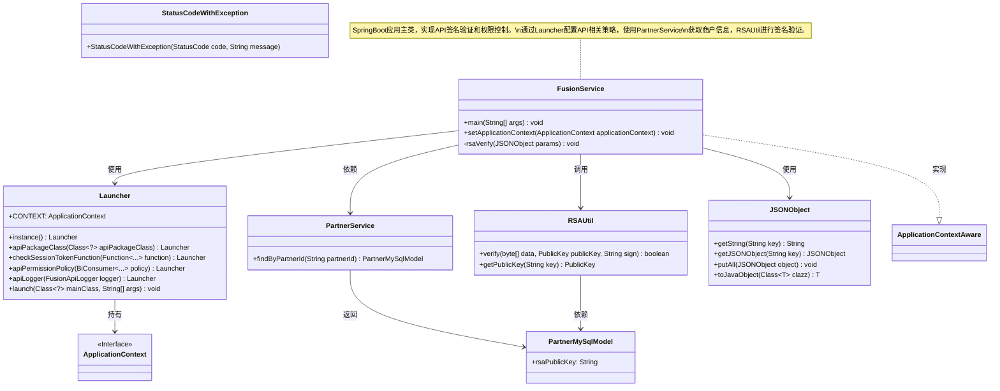
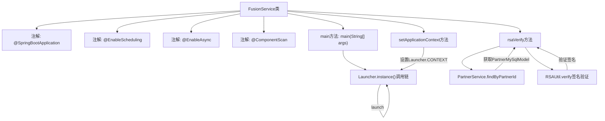
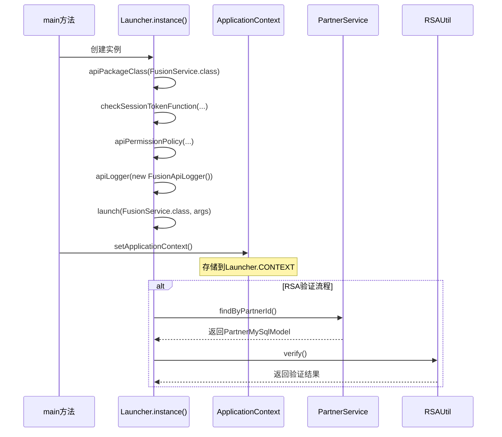

# 基础信息

|      |      |
|------|------|
| 名称 | FusionService |
| 编码语言 | .java |
| 代码路径 | WeFe/fusion/fusion-service/src/main/java/com/welab/wefe/data/fusion/service/FusionService.java |
| 包名 | com.welab.wefe.data.fusion.service |
| 依赖项 | ['com.alibaba.fastjson.JSONObject', 'com.welab.wefe.common.StatusCode', 'com.welab.wefe.common.exception.StatusCodeWithException', 'com.welab.wefe.common.util.RSAUtil', 'com.welab.wefe.common.web.Launcher', 'com.welab.wefe.common.web.config.ApiBeanNameGenerator', 'com.welab.wefe.common.web.dto.SignedApiInput', 'com.welab.wefe.common.web.util.CurrentAccountUtil', 'com.welab.wefe.data.fusion.service.database.entity.PartnerMySqlModel', 'com.welab.wefe.data.fusion.service.operation.FusionApiLogger', 'com.welab.wefe.data.fusion.service.service.PartnerService', 'org.springframework.beans.BeansException', 'org.springframework.boot.autoconfigure.SpringBootApplication', 'org.springframework.context.ApplicationContext', 'org.springframework.context.ApplicationContextAware', 'org.springframework.context.annotation.ComponentScan', 'org.springframework.scheduling.annotation.EnableAsync', 'org.springframework.scheduling.annotation.EnableScheduling'] |
| 概述说明 | SpringBoot应用集成调度与异步任务，自定义组件扫描路径，实现API权限校验及RSA签名验证，通过Launcher启动并管理应用上下文。 |

# 说明

这是一个Spring Boot应用的主类FusionService，使用@SpringBootApplication标注并启用了定时任务和异步功能。它通过@ComponentScan指定了自定义的Bean命名生成器和基础扫描包。类实现了ApplicationContextAware接口以获取应用上下文。main方法通过Launcher启动应用，配置了API包路径、会话令牌检查、权限策略和日志记录。类中还包含RSA签名验证逻辑，通过合作伙伴服务查找并验证请求参数的签名有效性，失败时抛出异常。

# 类列表 Class Summary

| 名称   | 类型  | 说明 |
|-------|------|-------------|
| FusionService | class | FusionService是SpringBoot应用，启用定时和异步任务，自定义组件扫描。主方法通过Launcher启动API服务，设置权限校验和日志。实现RSA签名验证，检查成员有效性及数据签名。 |

## 类 FusionService

|      |      |
|------|------|
| 访问范围 | @SpringBootApplication;@EnableScheduling;@EnableAsync;@ComponentScan(;        nameGenerator = ApiBeanNameGenerator.class,;        basePackageClasses = {FusionService.class, Launcher.class};);public |
| 类型 | class |
| 名称 | FusionService |
| 说明 | FusionService是SpringBoot应用，启用定时和异步任务，自定义组件扫描。主方法通过Launcher启动API服务，设置权限校验和日志。实现RSA签名验证，检查成员有效性及数据签名。 |

### UML类图

这段代码是一个SpringBoot应用的入口类，主要实现了API签名验证和权限控制功能。类图中展示了FusionService作为主类与Launcher、PartnerService、RSAUtil等组件的交互关系。FusionService通过Launcher配置API策略，使用PartnerService获取商户信息，并调用RSAUtil进行RSA签名验证。整个流程涉及多个组件的协作，包括参数处理、商户信息查询和加密验证等步骤。

### 内部方法调用关系图

流程图展示了FusionService的核心结构，包含SpringBoot启动配置、Launcher初始化流程和RSA签名验证逻辑。时序图详细描述了main方法执行时Launcher的链式调用过程，以及后续的上下文设置和安全验证交互。代码实现了基于SpringBoot的API服务框架，集成会话验证、权限策略和日志记录功能，其中RSA签名验证通过PartnerService获取密钥对请求数据进行安全校验。

### 字段列表 Field List

| 名称  | 类型  | 说明 |
|-------|-------|------|

### 方法列表

| 名称  | 类型  | 说明 |
|-------|-------|------|
| main | void | Java主方法配置Launcher实例，设置API包类、会话检查、权限策略和日志，启动FusionService服务。 |
| setApplicationContext | void | 该方法将传入的Spring应用上下文赋值给Launcher类的静态变量CONTEXT。 |
| rsaVerify | void | 方法rsaVerify验证RSA签名：检查成员ID有效性，使用公钥验证数据签名，失败则抛出异常，成功则合并数据。 |

