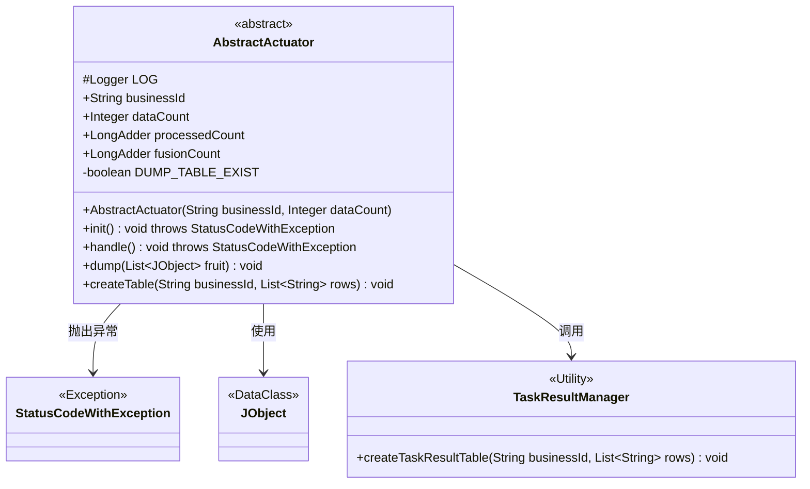
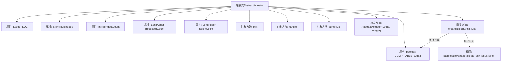

# 基础信息

|      |      |
|------|------|
| 名称 | AbstractActuator |
| 编码语言 | .java |
| 代码路径 | WeFe/fusion/fusion-service/src/main/java/com/welab/wefe/data/fusion/service/actuator/AbstractActuator.java |
| 包名 | com.welab.wefe.data.fusion.service.actuator |
| 依赖项 | ['com.welab.wefe.common.exception.StatusCodeWithException', 'com.welab.wefe.common.util.JObject', 'com.welab.wefe.data.fusion.service.manager.TaskResultManager', 'org.slf4j.Logger', 'org.slf4j.LoggerFactory', 'java.util.List', 'java.util.concurrent.atomic.LongAdder'] |
| 概述说明 | 抽象类AbstractActuator实现AutoCloseable，包含业务ID、数据计数等字段，提供初始化、执行、数据入库等抽象方法，支持同步创建表功能。 |

# 说明

AbstractActuator是一个抽象类，实现了AutoCloseable接口。它包含以下关键属性和方法：businessId和dataCount作为公共属性，processedCount和fusionCount使用LongAdder进行计数。提供了抽象方法init（初始化执行器）、handle（执行器处理方法）和dump（数据入库方法）。构造函数接收businessId和dataCount参数。私有变量DUMP_TABLE_EXIST标记表是否存在，createTable方法用于同步创建表（仅当表不存在时），内部调用TaskResultManager.createTaskResultTable。类中还包含一个受保护的Logger实例用于日志记录。

# 类列表 Class Summary

| 名称   | 类型  | 说明 |
|-------|------|-------------|
| AbstractActuator | class | 抽象类AbstractActuator实现AutoCloseable，包含业务ID、数据计数等字段，提供初始化、执行、数据入库等抽象方法，支持同步创建表。 |

## 类 AbstractActuator

|      |      |
|------|------|
| 访问范围 | public abstract |
| 类型 | class |
| 名称 | AbstractActuator |
| 说明 | 抽象类AbstractActuator实现AutoCloseable，包含业务ID、数据计数等字段，提供初始化、执行、数据入库等抽象方法，支持同步创建表。 |

### UML类图

这段类图描述了一个抽象执行器类AbstractActuator，它实现了AutoCloseable接口，包含业务ID、数据量计数等字段，以及初始化、处理、数据转储等抽象方法。该类通过TaskResultManager创建结果表，并可能抛出StatusCodeWithException异常。图中清晰展示了类之间的依赖关系，包括异常处理、工具类调用和数据对象使用等关键交互。

### 内部方法调用关系图

该流程图展示了AbstractActuator抽象类的完整结构，包含5个成员变量、3个抽象方法和2个具体方法。关键路径是createTable方法的同步控制流程：首先检查DUMP_TABLE_EXIST标志位，当表不存在时调用TaskResultManager创建表并更新标志位。所有抽象方法需由子类实现，构造方法用于初始化核心业务参数，流程图清晰呈现了类成员间的层级关系和条件逻辑。

### 字段列表 Field List

| 名称  | 类型  | 说明 |
|-------|-------|------|
| businessId | String | 定义了一个公共字符串变量businessId。 |
| DUMP_TABLE_EXIST = false | boolean | 私有布尔变量DUMP_TABLE_EXIST初始值为false，用于判断表是否存在。 |
| LOG = LoggerFactory.getLogger(getClass()) | Logger | 类中定义受保护静态日志对象LOG，用于记录当前类日志。 |
| dataCount | Integer | 声明一个名为dataCount的公共整型变量。 |
| fusionCount = new LongAdder() | LongAdder | 定义了一个名为fusionCount的LongAdder类型变量，用于高并发计数。 |
| processedCount = new LongAdder() | LongAdder | 定义一个LongAdder类型的变量processedCount，用于高并发下的累加计数。 |

### 方法列表

| 名称  | 类型  | 说明 |
|-------|-------|------|
| handle | void | 抽象方法handle，可能抛出StatusCodeWithException异常。 |
| init | void | 抽象方法init，可能抛出StatusCodeWithException异常。 |
| dump | void | 抽象方法dump，接收JObject列表参数fruit，无返回值。 |
| createTable | void | 同步方法createTable检查表是否存在，若不存在则创建表并更新状态。 |

