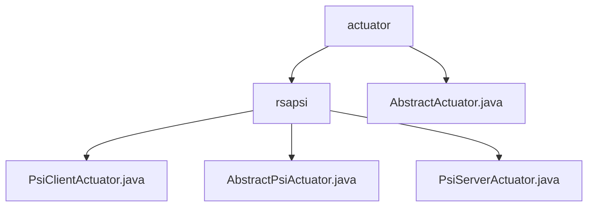

# 基础信息

|      |      |
|------|------|
| 名称 | actuator |
| 编码语言 | .java |
| 代码路径 | WeFe/fusion/fusion-service/src/main/java/com/welab/wefe/data/fusion/service/actuator |
| 包名 | docs.fusion.fusion-service.src.main.java.com.welab.wefe.data.fusion.service.actuator |
| 概述说明 | PsiClientActuator和PsiServerActuator构成PSI双端模块，采用RSA加密和布隆过滤器实现安全数据对齐。客户端加密比对，服务端处理请求，支持跨机构数据匹配如金融风控。AbstractActuator是抽象类，含初始化、处理和入库方法，使用LongAdder计数。 |

# 说明

## 概述  
模块核心职责为通过双端执行器（PsiClientActuator/PsiServerActuator）实现隐私保护集合求交（PSI），采用RSA加密与布隆过滤器技术保障数据安全对齐，类似安全多方计算网关。关键数据结构包括线程池配置、加密参数（e/N/d）、状态标识及缓存Map，依赖基础Java网络库和加密组件。例如客户端分页加密查询与服务端多线程签名处理。

AbstractActuator作为执行器基类，通过businessId/dataCount管理任务元数据，processedCount/fusionCount实现原子计数，提供初始化（init）、处理（handle）、入库（dump）的标准化生命周期。例如通过TaskResultManager同步创建结果表。

## 主要业务场景  
完整流程为客户端数据分片→RSA加密→布隆过滤器比对→服务端签名返回交集，采用状态机管理交互过程。典型应用于跨机构安全匹配（如金融黑名单比对），支持HTTP过滤器下载与Socket长连接数据对齐。例如大容量数据集分片处理场景。

AbstractActuator规范了执行器通用模式：初始化→原子计数处理→结果持久化，通过createTable确保表结构存在。适用于需要分阶段统计和可靠存储的批处理任务，类似ETL管道设计。

### 包内部结构视图

该流程图展示了WeFe数据融合服务中执行器(actuator)模块的层级结构。顶层为actuator目录，包含AbstractActuator抽象类和rsapsi子目录。rsapsi目录下包含三个PSI协议相关的执行器类：PsiClientActuator、AbstractPsiActuator和PsiServerActuator，体现了PSI协议在数据融合中的客户端-服务器实现模式。

# 文件列表

| 名称   | 类型  | 说明 |
|-------|------|-------------|
| [AbstractActuator.java](AbstractActuator.md) | file | 抽象类AbstractActuator实现AutoCloseable，包含业务ID、数据计数等字段，提供初始化、执行、数据入库等抽象方法，支持同步创建表功能。 |
| [rsapsi](rsapsi/_module.md) | package | PsiClientActuator是PSI客户端执行器，处理数据加密和比对，含线程池和加密参数。AbstractPsiActuator是抽象基类，管理PSI任务属性和结果处理。PsiServerActuator是服务端执行器，处理请求和加密操作，支持多线程和状态管理。 |

