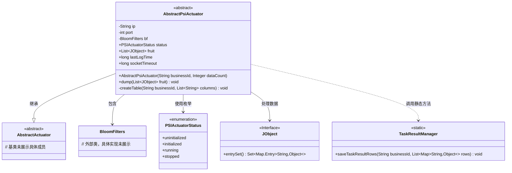
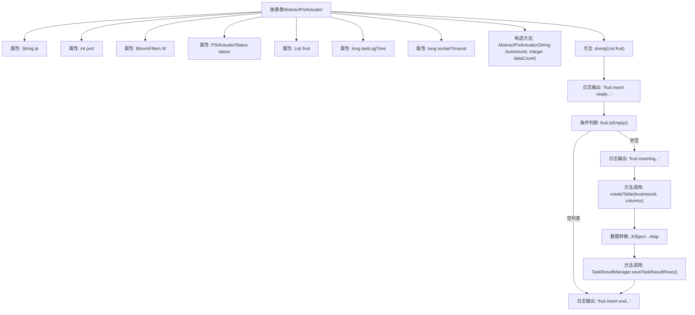

# 基础信息

|      |      |
|------|------|
| 名称 | AbstractPsiActuator |
| 编码语言 | .java |
| 代码路径 | WeFe/fusion/fusion-service/src/main/java/com/welab/wefe/data/fusion/service/actuator/rsapsi/AbstractPsiActuator.java |
| 包名 | com.welab.wefe.data.fusion.service.actuator.rsapsi |
| 依赖项 | ['com.welab.wefe.common.util.JObject', 'com.welab.wefe.data.fusion.service.actuator.AbstractActuator', 'com.welab.wefe.data.fusion.service.enums.PSIActuatorStatus', 'com.welab.wefe.data.fusion.service.manager.TaskResultManager', 'com.welab.wefe.data.fusion.service.utils.bf.BloomFilters', 'java.util.ArrayList', 'java.util.LinkedHashMap', 'java.util.List', 'java.util.Map', 'java.util.function.Function', 'java.util.stream.Collectors'] |
| 概述说明 | 抽象类AbstractPsiActuator继承AbstractActuator，包含IP、端口、布隆过滤器等属性，状态默认为未初始化。提供dump方法处理JObject列表，格式化后存储结果。 |

# 说明

AbstractPsiActuator是一个抽象类，继承自AbstractActuator，用于处理PSI执行器相关操作。类中包含IP地址、端口号、布隆过滤器、状态标识、结果列表和最后日志时间等属性。构造函数接收业务ID和数据量参数。dump方法负责处理结果数据，包括检查数据是否为空、创建数据表、格式化数据为Map列表，并通过TaskResultManager保存结果。整个过程伴随日志记录，状态通过volatile变量确保线程可见性。

# 类列表 Class Summary

| 名称   | 类型  | 说明 |
|-------|------|-------------|
| AbstractPsiActuator | class | 抽象类AbstractPsiActuator继承AbstractActuator，包含IP、端口、布隆过滤器等属性，状态默认为未初始化。提供dump方法处理JObject列表，格式化为Map后存储。 |

## 类 AbstractPsiActuator

|      |      |
|------|------|
| 访问范围 | public abstract |
| 类型 | class |
| 名称 | AbstractPsiActuator |
| 说明 | 抽象类AbstractPsiActuator继承AbstractActuator，包含IP、端口、布隆过滤器等属性，状态默认为未初始化。提供dump方法处理JObject列表，格式化为Map后存储。 |

### UML类图

这段类图描述了PSI执行器的抽象类结构，核心是`AbstractPsiActuator`继承自`AbstractActuator`，包含布隆过滤器、状态枚举等组件。该类通过`dump`方法处理`JObject`类型数据，最终调用`TaskResultManager`保存结果。状态管理采用`volatile`变量保证线程安全，数据处理涉及流式转换和表结构创建，体现了数据标准化和持久化的完整流程。

### 内部方法调用关系图

流程图描述了AbstractPsiActuator类的数据转储流程：首先检查输入数据是否为空，若不为空则创建数据表结构，接着将JObject格式数据转换为Map格式，最后通过TaskResultManager保存结果。整个过程包含4个日志节点和1个条件分支，清晰地展现了从数据准备到持久化的完整处理链条。

### 字段列表 Field List

| 名称  | 类型  | 说明 |
|-------|-------|------|
| port | int | 受保护的整型端口变量。 |
| status = PSIActuatorStatus.uninitialized | PSIActuatorStatus | 公共易变变量status，初始值为未初始化，类型为PSIActuatorStatus。 |
| fruit = new ArrayList<>() | List<JObject> | 声明一个名为fruit的列表变量，存储JObject对象，初始化为空ArrayList。 |
| bf | BloomFilters | 保护成员变量bf，类型为布隆过滤器。 |
| ip | String | 声明一个受保护的字符串变量ip。 |
| lastLogTime = System.currentTimeMillis() | long | 声明一个volatile修饰的long变量lastLogTime，初始值为当前系统时间毫秒数。 |
| socketTimeout = 30 * 60 * 1000 | long | socketTimeout设置为30分钟（1800000毫秒）。 |

### 方法列表

| 名称  | 类型  | 说明 |
|-------|-------|------|
| dump | void | 方法dump接收水果列表，若为空则返回。否则创建表并将水果数据转为Map格式后保存，记录日志。 |

