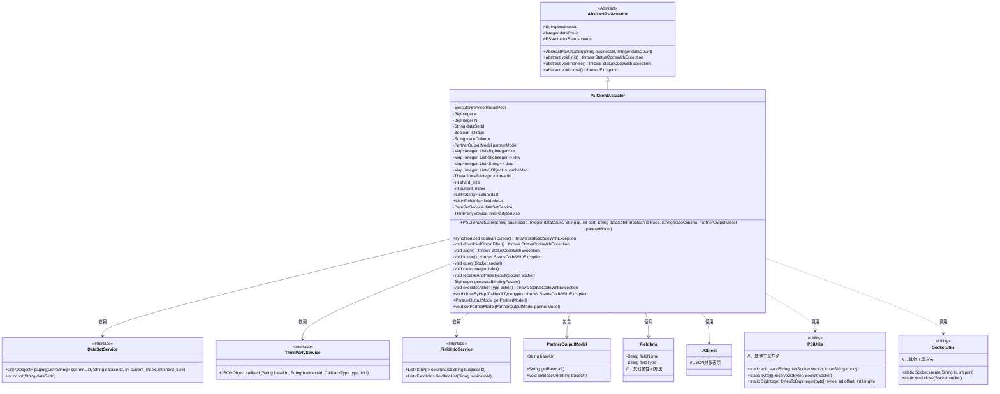
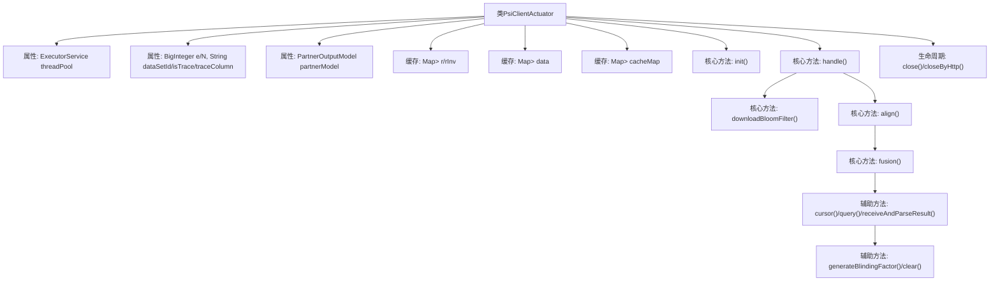
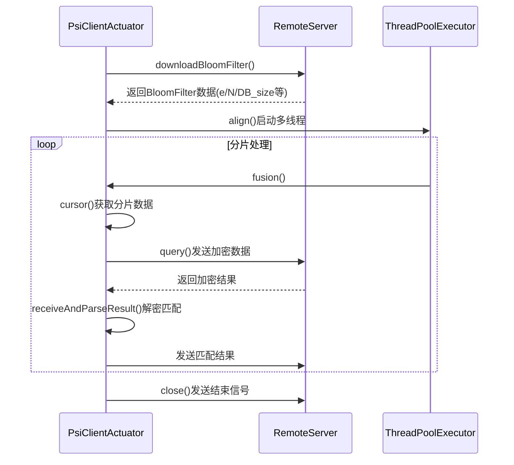

# 基础信息

|      |      |
|------|------|
| 名称 | PsiClientActuator |
| 编码语言 | .java |
| 代码路径 | WeFe/fusion/fusion-service/src/main/java/com/welab/wefe/data/fusion/service/actuator/rsapsi/PsiClientActuator.java |
| 包名 | com.welab.wefe.data.fusion.service.actuator.rsapsi |
| 依赖项 | ['com.alibaba.fastjson.JSONObject', 'com.google.common.collect.Lists', 'com.welab.wefe.common.StatusCode', 'com.welab.wefe.common.exception.StatusCodeWithException', 'com.welab.wefe.common.util.Base64Util', 'com.welab.wefe.common.util.JObject', 'com.welab.wefe.common.web.Launcher', 'com.welab.wefe.data.fusion.service.dto.entity.PartnerOutputModel', 'com.welab.wefe.data.fusion.service.enums.ActionType', 'com.welab.wefe.data.fusion.service.enums.CallbackType', 'com.welab.wefe.data.fusion.service.enums.PSIActuatorStatus', 'com.welab.wefe.data.fusion.service.service.FieldInfoService', 'com.welab.wefe.data.fusion.service.service.ThirdPartyService', 'com.welab.wefe.data.fusion.service.service.dataset.DataSetService', 'com.welab.wefe.data.fusion.service.utils.FusionUtils', 'com.welab.wefe.data.fusion.service.utils.SocketUtils', 'com.welab.wefe.data.fusion.service.utils.bf.BitArray', 'com.welab.wefe.data.fusion.service.utils.bf.BloomFilters', 'com.welab.wefe.data.fusion.service.utils.primarykey.FieldInfo', 'com.welab.wefe.data.fusion.service.utils.primarykey.PrimaryKeyUtils', 'com.welab.wefe.fusion.core.utils.PSIUtils', 'org.apache.commons.collections4.CollectionUtils', 'java.io.DataInputStream', 'java.io.IOException', 'java.math.BigInteger', 'java.net.Socket', 'java.security.SecureRandom', 'java.util.ArrayList', 'java.util.HashMap', 'java.util.List', 'java.util.Map', 'java.util.concurrent'] |
| 概述说明 | PsiClientActuator类实现PSI协议客户端逻辑，包含数据分页获取、加密、对齐及结果解析功能。使用线程池处理数据分片，支持BloomFilter下载与数据融合，通过Socket通信完成协同计算。关键属性包括线程池、加密参数、数据集ID及缓存映射。核心方法为cursor()分页查询、align()数据对齐及fusion()加密融合。 |

# 说明

PsiClientActuator是一个用于隐私保护集合求交（PSI）的客户端执行器，继承自AbstractPsiActuator。它通过线程池处理数据分片加密和比对任务，主要功能包括下载服务端的布隆过滤器、数据分页获取、加密查询和结果解析。核心组件包含线程池配置、加密参数（e/N）、数据集标识、追踪字段及合作伙伴模型。执行流程分为初始化、布隆过滤器下载、数据对齐三个阶段，通过Socket通信实现与服务端交互。内部维护多个缓存Map存储中间数据，支持分片处理和大数据集操作，包含异常处理和状态管理机制，最终通过回调通知结果。

# 类列表 Class Summary

| 名称   | 类型  | 说明 |
|-------|------|-------------|
| PsiClientActuator | class | PsiClientActuator类实现PSI协议客户端逻辑，包含数据分页加密、布隆过滤器下载、数据对齐功能，使用线程池处理并发任务，支持追踪字段和回调通知。 |

## 类 PsiClientActuator

|      |      |
|------|------|
| 访问范围 | public |
| 类型 | class |
| 名称 | PsiClientActuator |
| 说明 | PsiClientActuator类实现PSI协议客户端逻辑，包含数据分页加密、布隆过滤器下载、数据对齐功能，使用线程池处理并发任务，支持追踪字段和回调通知。 |

### UML类图

类图描述：PsiClientActuator是AbstractPsiActuator的实现类，负责PSI（Private Set Intersection）协议的客户端执行逻辑。它通过线程池处理数据分片加密，使用Socket与服务器通信，依赖DataSetService获取数据集，通过ThirdPartyService进行回调通知。类中包含多个缓存Map用于存储中间计算结果，核心方法包括数据下载(downloadBloomFilter)、对齐(align)和融合(fusion)等操作。

### 内部方法调用关系图

该流程图展示了PsiClientActuator类的核心结构和执行流程。作为PSI（私有集合交集）协议的客户端实现，它通过线程池分片处理数据，主要包含BloomFilter下载、数据加密对齐、结果解密匹配三个阶段。时序图详细描述了客户端与服务器的交互过程，包括初始化连接、分片数据加密传输、结果解密验证等关键步骤，体现了多线程分片处理和加密协议执行的完整生命周期。类结构包含线程池管理、加密参数存储、数据分片缓存等核心组件，通过状态机控制执行流程。

### 字段列表 Field List

| 名称  | 类型  | 说明 |
|-------|-------|------|
| partnerModel | PartnerOutputModel | 私有成员变量partnerModel，类型为PartnerOutputModel。 |
| isTrace | Boolean | 私有布尔类型变量isTrace，用于追踪状态。 |
| shard_size = 2000 | int | 分片大小设为2000。 |
| threadId = new ThreadLocal<>() | ThreadLocal<Integer> | 定义线程局部变量threadId，存储每个线程独有的整数值。 |
| dataSetService = Launcher.CONTEXT.getBean(DataSetService.class) | DataSetService | 从Launcher.CONTEXT获取DataSetService实例并赋值给私有常量dataSetService。 |
| e | BigInteger | 私有的大整数变量e。 |
| fieldInfoList | List<FieldInfo> | 声明一个名为fieldInfoList的公共列表，存储FieldInfo类型的元素。 |
| current_index = 0 | int | 定义整型变量current_index并初始化为0。 |
| data = new HashMap<>() | Map<Integer, List<String>> | 声明一个HashMap变量data，键为Integer，值为String列表。 |
| rInv = new HashMap<>() | Map<Integer, List<BigInteger>> | 声明一个私有Map变量rInv，键为Integer，值为BigInteger列表，初始化为HashMap。 |
| N | BigInteger | 声明一个私有的大整数变量N。 |
| dataSetId | String | 数据集ID的私有字符串变量。 |
| cacheMap = new HashMap<>() | Map<Integer, List<JObject>> | 私有哈希映射，键为整数，值为JObject列表。 |
| traceColumn | String | 私有字符串类型变量traceColumn。 |
| threadPool = new ThreadPoolExecutor(            Runtime.getRuntime().availableProcessors(),            Runtime.getRuntime().availableProcessors() * 2,            100L,            TimeUnit.MILLISECONDS,            new LinkedBlockingQueue<>()) | ExecutorService | 创建线程池，核心线程数为CPU核数，最大线程数为核数2倍，非核心线程空闲100毫秒后回收，任务队列无界。 |
| r = new HashMap<>() | Map<Integer, List<BigInteger>> | 声明一个私有Map变量r，键为Integer，值为BigInteger列表，初始化为HashMap实例。 |
| thirdPartyService = Launcher.CONTEXT.getBean(ThirdPartyService.class) | ThirdPartyService | 获取Launcher上下文中的ThirdPartyService实例并赋值给私有常量thirdPartyService。 |
| columnList | List<String> | 声明一个名为columnList的公共字符串列表变量。 |

### 方法列表

| 名称  | 类型  | 说明 |
|-------|-------|------|
| cursor | boolean | 同步方法cursor分页查询数据集，记录耗时，缓存结果并更新线程ID。返回是否获取到数据。 |
| fusion | void | 方法fusion检查状态后建立socket连接，执行查询并接收结果。状态不符则抛出异常。 |
| downloadBloomFilter | void | 该方法用于下载布隆过滤器数据。通过Socket连接服务器，发送下载请求后接收数据，包括公钥参数e和N、元素个数DB_size、位数bitSetSize及位数组data，最终构建BloomFilters对象。若连接或下载失败，抛出异常并记录错误日志。 |
| main | void | Java代码示例：创建到127.0.0.1:9090的Socket连接，设置重试3次、间隔1秒，发送包含download的字符串列表。 |
| align | void | 方法align()执行数据对齐和加密：计算批次数量，使用线程池并行处理数据融合，等待所有线程完成，记录耗时并更新状态为成功。异常时记录错误日志。 |
| receiveAndParseResult | void | 接收并解析socket数据，提取索引和数据，处理并筛选结果后发送至服务器，记录处理计数并清理缓存。 |
| generateBlindingFactor | BigInteger | 生成随机盲化因子，确保非零非一且与N互质。 |
| query | void | 方法query处理Socket查询：获取线程索引和缓存数据，生成主键和盲化因子，计算加密值并存入列表，记录执行时间，最后发送处理后的数据列表。 |
| clear | void | 清除指定索引的缓存、数据、映射关系和线程ID，记录日志。 |
| execute | void | 方法execute根据action类型执行不同操作：download时调用downloadBloomFilter，align时调用align，否则抛出异常。最后更新lastLogTime为当前时间。 |
| close | void | 方法close()在非成功状态时通过HTTP停止回调，创建socket连接并发送结束动作和状态信息后关闭socket。 |
| closeByHttp | void | 方法closeByHttp通过第三方服务回调关闭HTTP连接，记录日志信息。若partnerModel非空，调用回调并输出URL和响应。 |
| init | void | 初始化方法：获取字段列表，补充追踪字段，查找主键字段，计算分片大小，检查数据集行数并记录日志。 |
| handle | void | 方法重写handle，设置状态为running，依次执行download和align操作。 |
| getPartnerModel | PartnerOutputModel | 获取合作伙伴模型的方法，返回PartnerOutputModel类型对象。 |
| setPartnerModel | void | 设置合作伙伴模型对象。 |

